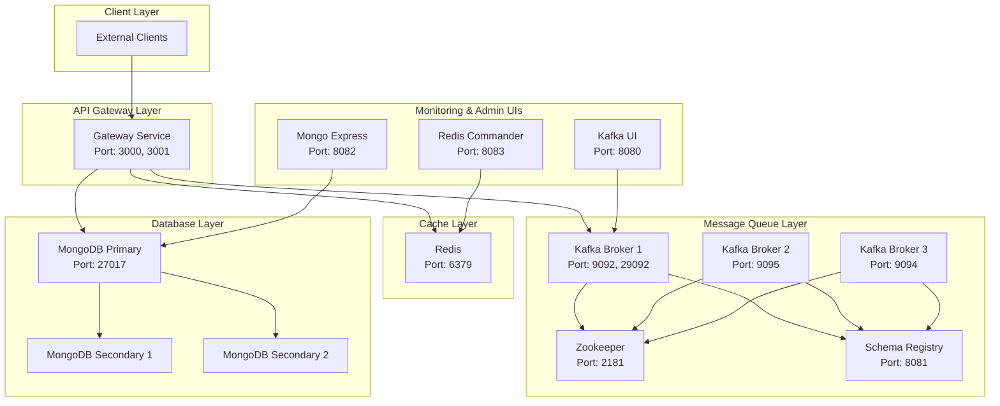
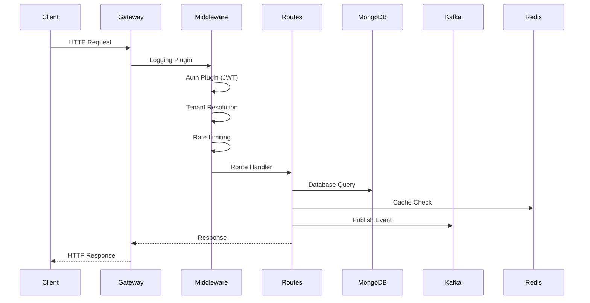

# CAAS Phase 1 - Deep Dive Analysis

**Generated:** 2026-02-04

## 📊 System Architecture Overview



## 📁 File Structure Analysis

### Current Structure (Before Cleanup)
```
c:\me\caas\
├── .env                        # ✅ Keep - Root environment config
├── .gitignore                  # ✅ Keep
├── .dockerignore               # ✅ Keep
├── docker-compose.yml          # ✅ Keep - Main compose file
├── start.ps1                   # ✅ Keep - Startup script
├── stop.ps1                    # ✅ Keep - Stop script
├── test-system.ps1             # 🔄 Move to tests/
├── README.md                   # ✅ Keep
│
├── DEPLOYMENT_SUMMARY.md       # 🗑️ Empty - Delete
├── SYSTEM_OVERVIEW.md          # 🔄 Move to docs/
├── SYSTEM_STATUS.md            # 🔄 Move to docs/
├── TESTING_GUIDE.md            # 🔄 Move to docs/
│
├── init/mongodb/               # ✅ Keep - Required for Docker
├── services/                   # ✅ Keep - Main services
│   ├── gateway/
│   │   ├── node_modules/       # 🗑️ Delete - Not needed for Docker
│   │   ├── .env                # 🗑️ Delete - Uses compose env
│   │   └── ...
│   ├── kafka-service/          # ✅ Keep - Library code
│   └── mongodb-service/        # ✅ Keep - Library code
│
├── docs/                       # ✅ Keep - Documentation
├── tasks/                      # ✅ Keep - Task tracking
│
├── local/                      # 🔄 Review - Old development files
├── deepDive/                   # 🔄 Move to docs/architecture/
├── flowdiagram/                # 🔄 Move to docs/diagrams/
├── rnd/                        # 🔄 Move to docs/research/
├── schemas/                    # 🔄 Move to docs/schemas/
└── roadmaps/                   # 🔄 Move to docs/roadmaps/
```

## 🔍 Service Deep Dive

### 1. Gateway Service (`services/gateway/`)

**Purpose:** API Gateway - Entry point for all external requests

**Key Files:**
| File | Role | Description |
|------|------|-------------|
| `src/main.ts` | Entry Point | Starts Fastify server, initializes Kafka consumer |
| `src/app.ts` | App Builder | Configures Fastify with plugins, middleware, routes |
| `src/config/` | Configuration | Environment validation with Zod |
| `src/routes/` | API Routes | v1 routes for auth, webhooks, tenants |
| `src/middleware/` | Middleware | Auth, logging, rate-limit, tenant resolution |
| `src/plugins/` | Fastify Plugins | CORS, JWT, Redis, Swagger |
| `src/consumers/` | Kafka Consumers | Webhook consumer for async events |

**Flow Diagram:**


### 2. MongoDB Service (`services/mongodb-service/`)

**Purpose:** Database abstraction layer with multi-tenancy support

**Key Files:**
| File | Role | Description |
|------|------|-------------|
| `src/index.ts` | Library Export | Main exports for other services |
| `src/connections/` | Connection Pool | MongoDB connection management |
| `src/repositories/` | Data Access | Repository pattern implementation |
| `src/config/` | Configuration | MongoDB connection settings |
| `src/seeds/` | Seed Data | Initial data setup scripts |

**Note:** This is a **library**, not a running service. It's imported by Gateway.

### 3. Kafka Service (`services/kafka-service/`)

**Purpose:** Kafka producer/consumer library

**Key Files:**
| File | Role | Description |
|------|------|-------------|
| `src/index.ts` | Library Export | Main exports for Kafka operations |
| `src/client/` | Kafka Client | KafkaJS client configuration |
| `src/topics/` | Topic Management | Topic definitions and configurations |
| `src/schemas/` | Event Schemas | Avro/JSON schemas for events |
| `src/config/` | Configuration | Broker settings, SSL, etc. |

**Note:** This is a **library**, not a running service. It's imported by Gateway.

## 📊 Docker Services Analysis

### Phase 1 Services (14 containers)

| Service | Image | Ports | Health Check | Role |
|---------|-------|-------|--------------|------|
| mongodb-primary | mongo:7.0 | 27017 | mongosh ping | Primary database |
| mongodb-secondary-1 | mongo:7.0 | - | - | Replica member |
| mongodb-secondary-2 | mongo:7.0 | - | - | Replica member |
| mongodb-init | mongo:7.0 | - | Exits | Init replica set |
| redis | redis:7-alpine | 6379 | redis-cli ping | Cache |
| zookeeper | cp-zookeeper:7.5.0 | 2181 | srvr command | Kafka coordination |
| kafka-1 | cp-kafka:7.5.0 | 9092, 29092 | kafka-broker-api-versions | Message broker |
| kafka-2 | cp-kafka:7.5.0 | 9095 | - | Message broker |
| kafka-3 | cp-kafka:7.5.0 | 9094 | - | Message broker |
| kafka-init | cp-kafka:7.5.0 | - | Exits | Create topics |
| schema-registry | cp-schema-registry:7.5.0 | 8081 | curl | Schema management |
| gateway | custom build | 3000, 3001 | wget (issue) | API Gateway |
| kafka-ui | kafka-ui:latest | 8080 | - | Kafka admin |
| mongo-express | mongo-express:latest | 8082 | - | MongoDB admin |
| redis-commander | redis-commander:latest | 8083 | - | Redis admin |

## 🔧 Issues & Fixes

### Issue 1: Gateway Health Check
**Problem:** Health check uses `wget --spider` which doesn't properly detect JSON response
**Fix:** Change to node-based health check or use curl

### Issue 2: Local node_modules
**Problem:** 226 packages in local filesystem, not needed for Docker
**Fix:** Delete local node_modules, add to .gitignore, .dockerignore

### Issue 3: Scattered Documentation
**Problem:** MD files scattered in root directory
**Fix:** Move to appropriate docs/ subdirectories

### Issue 4: Duplicate Environment Files
**Problem:** .env exists in root AND services/gateway/
**Fix:** Remove service-level .env, use docker-compose environment only

## 📍 Access Points Summary

| Service | URL | Credentials |
|---------|-----|-------------|
| Gateway API | http://localhost:3000 | - |
| Gateway Metrics | http://localhost:3001 | - |
| API Documentation | http://localhost:3000/documentation | - |
| Kafka UI | http://localhost:8080 | - |
| MongoDB Express | http://localhost:8082 | admin / admin123 |
| Redis Commander | http://localhost:8083 | - |
| MongoDB | mongodb://localhost:27017 | caas_admin / caas_secret_2026 |
| Redis | redis://localhost:6379 | caas_redis_2026 |

## 🚀 Commands

```powershell
# Start all services
.\start.ps1

# Stop all services
.\stop.ps1

# View logs
docker compose logs -f gateway

# Restart specific service
docker compose restart gateway

# Check status
docker compose ps
```
