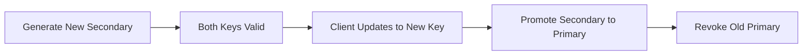

# Auth Security - Client Authentication System

> **Parent Roadmap**: [Auth & Security](../../roadmaps/3_AuthAutorizeSecurity.md)

---

## Overview

Authentication implementation for SAAS client companies connecting to CAAS.

---

## 1. API Key Architecture

### Key Structure
```
API Key Format: caas_{environment}_{random_32_chars}
Example:        caas_prod_a1b2c3d4e5f6g7h8i9j0k1l2m3n4o5p6

Components:
- Prefix: caas_ (identifies as CAAS key)
- Environment: prod/stag/dev
- Random: 32 character secure random string
```

### Key Pair System
```typescript
interface ApiKeyPair {
  primaryKey: string;      // Active key
  secondaryKey: string;    // For rotation
  primaryCreated: Date;
  secondaryCreated: Date;
  lastRotated: Date;
}
```

---

## 2. Key Generation

```typescript
import crypto from 'crypto';

function generateApiKey(environment: string): string {
  const random = crypto.randomBytes(24).toString('base64url');
  return `caas_${environment}_${random}`;
}

function hashApiKey(apiKey: string): string {
  return crypto
    .createHash('sha256')
    .update(apiKey)
    .digest('hex');
}

// Storage: Only store hash, never plaintext
await db.apiKeys.create({
  clientId: client.id,
  keyHash: hashApiKey(apiKey),
  environment: 'prod',
  permissions: ['chat', 'voice', 'file'],
  createdAt: new Date()
});
```

---

## 3. Key Validation

```typescript
async function validateApiKey(apiKey: string): Promise<ClientContext> {
  // 1. Check format
  if (!apiKey.startsWith('caas_')) {
    throw new InvalidApiKeyError();
  }
  
  // 2. Hash and lookup
  const hash = hashApiKey(apiKey);
  
  // 3. Check cache first
  const cached = await redis.get(`apikey:${hash}`);
  if (cached) {
    return JSON.parse(cached);
  }
  
  // 4. Database lookup
  const keyRecord = await db.apiKeys.findOne({ keyHash: hash });
  if (!keyRecord) {
    throw new InvalidApiKeyError();
  }
  
  // 5. Check if revoked
  if (keyRecord.revokedAt) {
    throw new RevokedApiKeyError();
  }
  
  // 6. Build context and cache
  const context = {
    clientId: keyRecord.clientId,
    tenantId: keyRecord.tenantId,
    permissions: keyRecord.permissions,
    environment: keyRecord.environment
  };
  
  await redis.setex(`apikey:${hash}`, 300, JSON.stringify(context));
  
  return context;
}
```

---

## 4. Key Rotation

### Rotation Flow


### Implementation
```typescript
async function rotateApiKey(clientId: string): Promise<ApiKeyPair> {
  const client = await db.clients.findById(clientId);
  
  // Generate new key
  const newKey = generateApiKey(client.environment);
  const newHash = hashApiKey(newKey);
  
  // Promote current secondary to primary
  // Set new key as secondary
  await db.apiKeys.update(clientId, {
    primaryKeyHash: client.secondaryKeyHash,
    secondaryKeyHash: newHash,
    lastRotated: new Date()
  });
  
  // Invalidate cache
  await redis.del(`apikey:${client.primaryKeyHash}`);
  
  // Return new key (only time plaintext is available)
  return { secondaryKey: newKey };
}
```

---

## 5. OAuth 2.0 Client Credentials

```typescript
// For server-to-server authentication
app.post('/oauth/token', async (req, res) => {
  const { grant_type, client_id, client_secret } = req.body;
  
  if (grant_type !== 'client_credentials') {
    return res.status(400).json({ error: 'unsupported_grant_type' });
  }
  
  const client = await validateClientCredentials(client_id, client_secret);
  
  const accessToken = await generateAccessToken({
    sub: client.id,
    type: 'client',
    scope: client.scopes
  });
  
  res.json({
    access_token: accessToken,
    token_type: 'Bearer',
    expires_in: 3600
  });
});
```

---

## 6. Security Best Practices

- [ ] Never log API keys
- [ ] Hash before storage
- [ ] Rotate keys every 90 days
- [ ] Support key pairs for zero-downtime rotation
- [ ] Rate limit key validation attempts
- [ ] Alert on unusual key usage patterns

---

## Related Documents
- [API Key Security R&D](../../rnd/api-key-security.md)
- [Authentication Flow](../../flowdiagram/authentication-flow.md)
