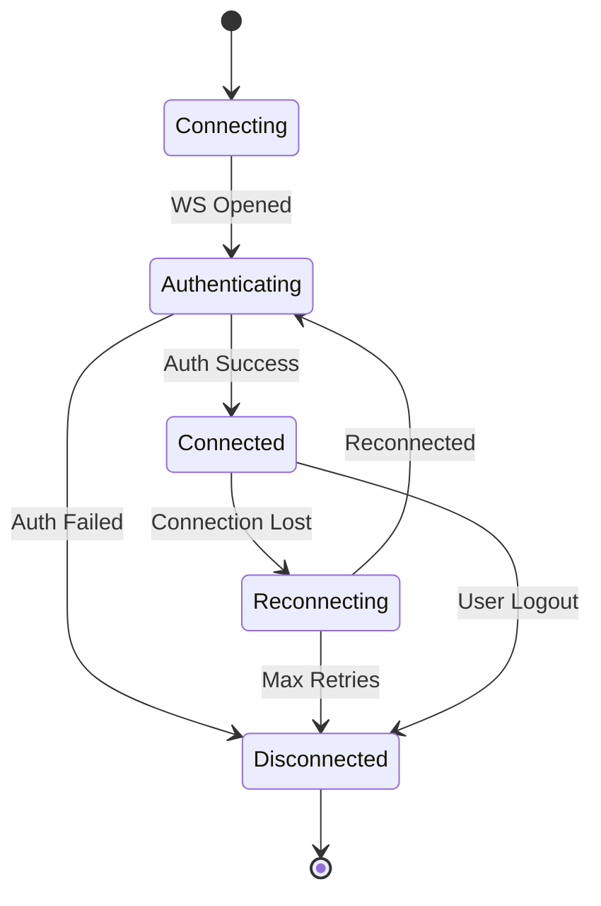

# Socket Service - Connection Management

> **Parent Roadmap**: [Socket Service](../../roadmaps/5_sockets.md)

---

## Overview

Managing WebSocket connection lifecycle, authentication, and multi-device support.

---

## 1. Connection Lifecycle



---

## 2. Connection Handshake

```typescript
// Client connection with auth
const socket = io('wss://socket.caas.io', {
  auth: {
    token: userAccessToken
  },
  transports: ['websocket'],
  reconnection: true,
  reconnectionAttempts: 10,
  reconnectionDelay: 1000,
  reconnectionDelayMax: 30000
});

// Server-side validation
io.use(async (socket, next) => {
  try {
    const token = socket.handshake.auth.token;
    const user = await validateJWT(token);
    
    socket.userId = user.id;
    socket.tenantId = user.tenantId;
    socket.deviceId = socket.handshake.query.deviceId;
    
    next();
  } catch (error) {
    next(new Error('Authentication failed'));
  }
});
```

---

## 3. Connection Registry

```typescript
interface ConnectionEntry {
  socketId: string;
  userId: string;
  tenantId: string;
  deviceId: string;
  serverId: string;
  connectedAt: Date;
  lastActivity: Date;
}

class ConnectionRegistry {
  async register(socket: Socket): Promise<void> {
    const entry: ConnectionEntry = {
      socketId: socket.id,
      userId: socket.userId,
      tenantId: socket.tenantId,
      deviceId: socket.deviceId,
      serverId: process.env.SERVER_ID,
      connectedAt: new Date(),
      lastActivity: new Date()
    };
    
    // Store in Redis
    await redis.hset(`conn:${socket.userId}`, socket.deviceId, JSON.stringify(entry));
    await redis.sadd(`server:${process.env.SERVER_ID}:sockets`, socket.id);
  }
  
  async unregister(socket: Socket): Promise<void> {
    await redis.hdel(`conn:${socket.userId}`, socket.deviceId);
    await redis.srem(`server:${process.env.SERVER_ID}:sockets`, socket.id);
  }
  
  async getUserConnections(userId: string): Promise<ConnectionEntry[]> {
    const connections = await redis.hgetall(`conn:${userId}`);
    return Object.values(connections).map(c => JSON.parse(c));
  }
}
```

---

## 4. Multi-Device Support

```typescript
// Sync state across devices
async function syncToUserDevices(userId: string, event: string, data: any) {
  const connections = await registry.getUserConnections(userId);
  
  for (const conn of connections) {
    if (conn.serverId === currentServerId) {
      io.to(conn.socketId).emit(event, data);
    } else {
      await redis.publish(`server:${conn.serverId}`, JSON.stringify({
        type: 'emit',
        socketId: conn.socketId,
        event,
        data
      }));
    }
  }
}

// Device limit enforcement
const MAX_DEVICES = 5;

async function checkDeviceLimit(userId: string): Promise<boolean> {
  const connections = await registry.getUserConnections(userId);
  return connections.length < MAX_DEVICES;
}
```

---

## 5. Heartbeat & Health

```typescript
// Ping/Pong for connection health
io.engine.on('connection', (rawSocket) => {
  rawSocket.on('heartbeat', () => {
    rawSocket.emit('heartbeat');
  });
});

// Activity tracking
socket.on('*', (event) => {
  registry.updateActivity(socket.id);
});

// Clean up stale connections
setInterval(async () => {
  const stale = await registry.findStaleConnections(5 * 60 * 1000);
  for (const conn of stale) {
    io.to(conn.socketId).disconnect();
  }
}, 60000);
```

---

## 6. Graceful Disconnection

```typescript
socket.on('disconnect', async (reason) => {
  // Unregister connection
  await registry.unregister(socket);
  
  // Leave all rooms
  socket.rooms.forEach(room => socket.leave(room));
  
  // Update presence
  await updatePresence(socket.userId, 'offline');
  
  // Cleanup pending operations
  await cleanupPendingMessages(socket.id);
  
  logger.info('Socket disconnected', {
    socketId: socket.id,
    userId: socket.userId,
    reason
  });
});
```

---

## Related Documents
- [Message Routing](./message-routing.md)
- [Socket Cluster Architecture](../../flowdiagram/socket-cluster-architecture.md)
