# 🎯 CAAS Platform - Complete Visual Guide
> **Chat-As-A-Service: The Complete Picture for Everyone**
> 
> This document explains EVERY feature of the CAAS platform using visual diagrams that anyone can understand!

---

## 📖 Table of Contents

1. [What is CAAS?](#1-what-is-caas)
2. [The Big Picture](#2-the-big-picture)
3. [Who Uses CAAS?](#3-who-uses-caas)
4. [How SAAS Companies Join CAAS](#4-how-saas-companies-join-caas)
5. [How End Users Connect](#5-how-end-users-connect)
6. [All Chat Features](#6-all-chat-features)
7. [Security & Protection](#7-security--protection)
8. [Behind the Scenes - Technical Infrastructure](#8-behind-the-scenes---technical-infrastructure)
9. [Developer Tools](#9-developer-tools)
10. [Billing & Pricing](#10-billing--pricing)
11. [Monitoring & Analytics](#11-monitoring--analytics)
12. [Complete Data Flow](#12-complete-data-flow)

---

# 1. What is CAAS?

## The Simple Explanation

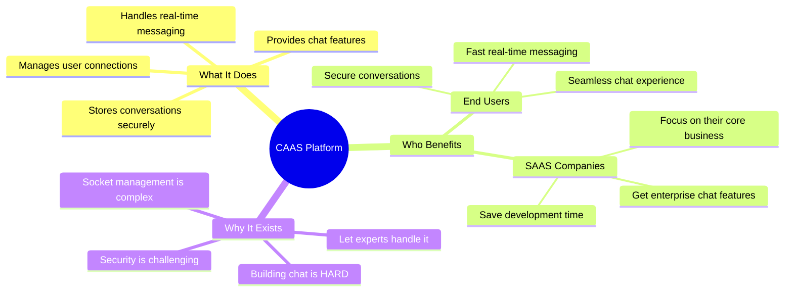
```mermaid
mindmap
  root((CAAS Platform))
    What It Does
      Provides chat features
      Handles real-time messaging
      Manages user connections
      Stores conversations securely
    
    Who Benefits
      SAAS Companies
        Save development time
        Focus on their core business
        Get enterprise chat features
      End Users
        Seamless chat experience
        Fast real-time messaging
        Secure conversations
    
    Why It Exists
      Building chat is HARD
      Socket management is complex
      Security is challenging
      Let experts handle it
```

## The Problem We Solve

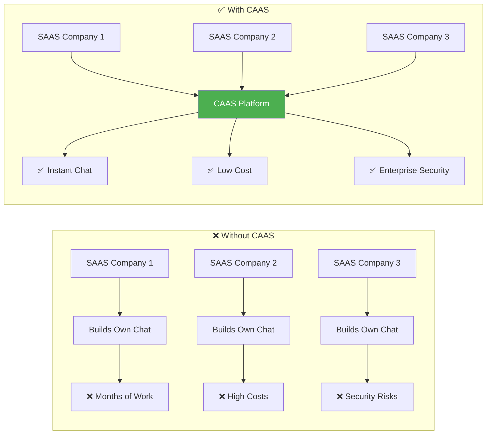
```mermaid
flowchart LR
    subgraph "❌ Without CAAS"
        A1[SAAS Company 1] --> B1[Builds Own Chat]
        A2[SAAS Company 2] --> B2[Builds Own Chat]
        A3[SAAS Company 3] --> B3[Builds Own Chat]
        B1 --> C1[❌ Months of Work]
        B2 --> C2[❌ High Costs]
        B3 --> C3[❌ Security Risks]
    end
    
    subgraph "✅ With CAAS"
        D1[SAAS Company 1] --> E[CAAS Platform]
        D2[SAAS Company 2] --> E
        D3[SAAS Company 3] --> E
        E --> F1[✅ Instant Chat]
        E --> F2[✅ Low Cost]
        E --> F3[✅ Enterprise Security]
    end
    
    style E fill:#4CAF50,color:#fff
```

---

# 2. The Big Picture

## Complete Platform Overview

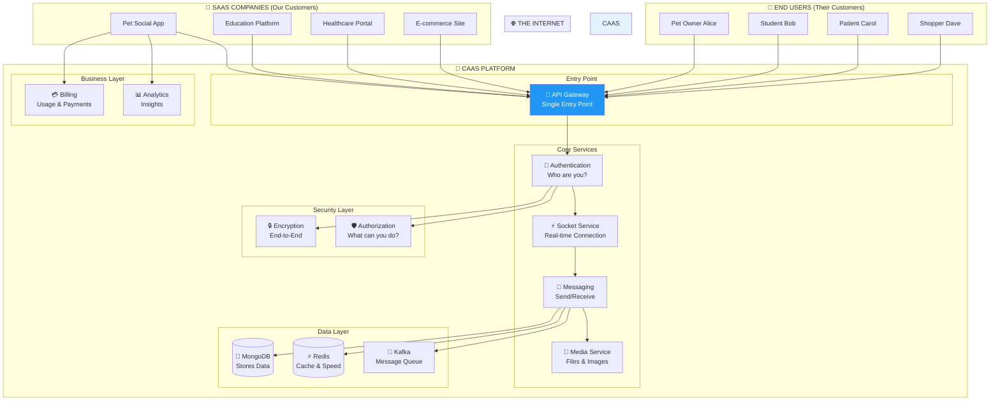
```mermaid
flowchart TB
    subgraph "🌐 THE INTERNET"
        direction TB
    end
    
    subgraph "🏢 SAAS COMPANIES (Our Customers)"
        S1[Pet Social App]
        S2[Education Platform]
        S3[Healthcare Portal]
        S4[E-commerce Site]
    end
    
    subgraph "👥 END USERS (Their Customers)"
        U1[Pet Owner Alice]
        U2[Student Bob]
        U3[Patient Carol]
        U4[Shopper Dave]
    end
    
    subgraph "🌟 CAAS PLATFORM"
        direction TB
        
        subgraph "Entry Point"
            GW[🚪 API Gateway<br/>Single Entry Point]
        end
        
        subgraph "Core Services"
            AUTH[🔐 Authentication<br/>Who are you?]
            SOCKET[⚡ Socket Service<br/>Real-time Connection]
            MSG[💬 Messaging<br/>Send/Receive]
            MEDIA[📁 Media Service<br/>Files & Images]
        end
        
        subgraph "Security Layer"
            CRYPTO[🔒 Encryption<br/>End-to-End]
            AUTHZ[🛡️ Authorization<br/>What can you do?]
        end
        
        subgraph "Data Layer"
            MONGO[(💾 MongoDB<br/>Stores Data)]
            REDIS[(⚡ Redis<br/>Cache & Speed)]
            KAFKA[📨 Kafka<br/>Message Queue]
        end
        
        subgraph "Business Layer"
            BILLING[💳 Billing<br/>Usage & Payments]
            ANALYTICS[📊 Analytics<br/>Insights]
        end
    end
    
    S1 & S2 & S3 & S4 --> GW
    U1 & U2 & U3 & U4 --> GW
    
    GW --> AUTH
    AUTH --> SOCKET
    SOCKET --> MSG
    MSG --> MEDIA
    
    AUTH --> CRYPTO
    AUTH --> AUTHZ
    
    MSG --> MONGO
    MSG --> REDIS
    MSG --> KAFKA
    
    S1 --> BILLING
    S1 --> ANALYTICS
    
    style GW fill:#2196F3,color:#fff
    style CAAS fill:#e3f2fd
```

---

# 3. Who Uses CAAS?

## User Types Explained

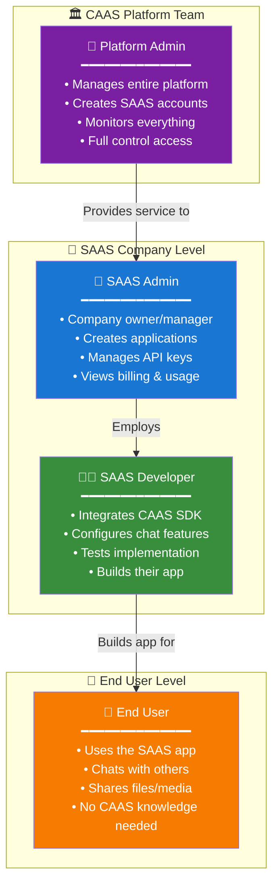
```mermaid
flowchart TB
    subgraph "🏛️ CAAS Platform Team"
        ADMIN[👑 Platform Admin<br/>━━━━━━━━━━━━━━<br/>• Manages entire platform<br/>• Creates SAAS accounts<br/>• Monitors everything<br/>• Full control access]
    end
    
    subgraph "🏢 SAAS Company Level"
        SAAS_ADMIN[🏢 SAAS Admin<br/>━━━━━━━━━━━━━━<br/>• Company owner/manager<br/>• Creates applications<br/>• Manages API keys<br/>• Views billing & usage]
        
        DEVELOPER[👨‍💻 SAAS Developer<br/>━━━━━━━━━━━━━━<br/>• Integrates CAAS SDK<br/>• Configures chat features<br/>• Tests implementation<br/>• Builds their app]
    end
    
    subgraph "👥 End User Level"
        END_USER[👤 End User<br/>━━━━━━━━━━━━━━<br/>• Uses the SAAS app<br/>• Chats with others<br/>• Shares files/media<br/>• No CAAS knowledge needed]
    end
    
    ADMIN -->|Provides service to| SAAS_ADMIN
    SAAS_ADMIN -->|Employs| DEVELOPER
    DEVELOPER -->|Builds app for| END_USER
    
    style ADMIN fill:#7B1FA2,color:#fff
    style SAAS_ADMIN fill:#1976D2,color:#fff
    style DEVELOPER fill:#388E3C,color:#fff
    style END_USER fill:#F57C00,color:#fff
```

## User Journey Map

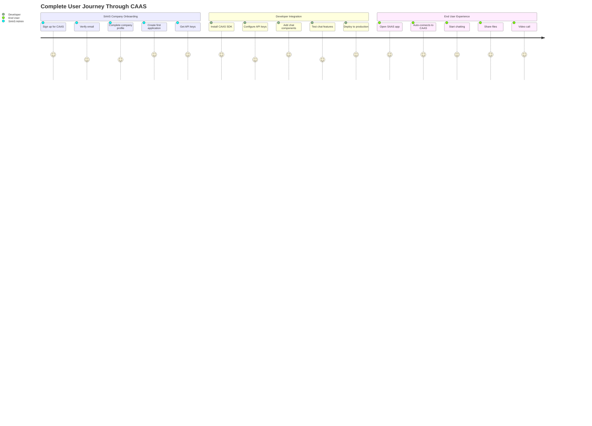
```mermaid
journey
    title Complete User Journey Through CAAS
    
    section SAAS Company Onboarding
      Sign up for CAAS: 5: SAAS Admin
      Verify email: 4: SAAS Admin
      Complete company profile: 4: SAAS Admin
      Create first application: 5: SAAS Admin
      Get API keys: 5: SAAS Admin
    
    section Developer Integration
      Install CAAS SDK: 5: Developer
      Configure API keys: 4: Developer
      Add chat components: 5: Developer
      Test chat features: 4: Developer
      Deploy to production: 5: Developer
    
    section End User Experience
      Open SAAS app: 5: End User
      Auto-connects to CAAS: 5: End User
      Start chatting: 5: End User
      Share files: 5: End User
      Video call: 5: End User
```

---

# 4. How SAAS Companies Join CAAS

## Complete Onboarding Flow

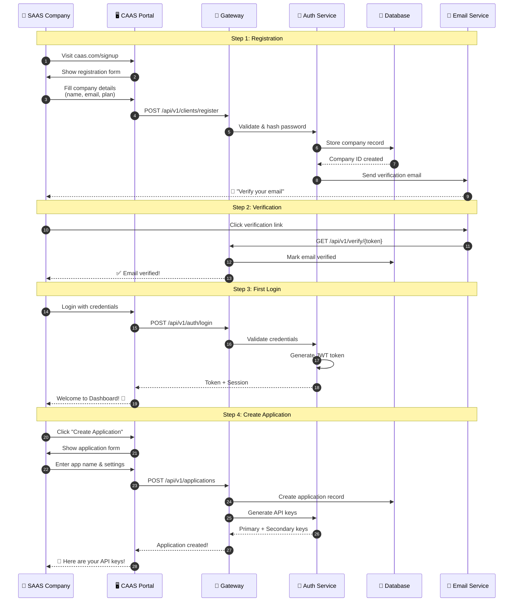
```mermaid
sequenceDiagram
    autonumber
    participant SC as 🏢 SAAS Company
    participant WEB as 🖥️ CAAS Portal
    participant GW as 🚪 Gateway
    participant AUTH as 🔐 Auth Service
    participant DB as 💾 Database
    participant EMAIL as 📧 Email Service
    
    Note over SC,EMAIL: Step 1: Registration
    SC->>WEB: Visit caas.com/signup
    WEB->>SC: Show registration form
    SC->>WEB: Fill company details<br/>(name, email, plan)
    WEB->>GW: POST /api/v1/clients/register
    GW->>AUTH: Validate & hash password
    AUTH->>DB: Store company record
    DB-->>AUTH: Company ID created
    AUTH->>EMAIL: Send verification email
    EMAIL-->>SC: 📨 "Verify your email"
    
    Note over SC,EMAIL: Step 2: Verification
    SC->>EMAIL: Click verification link
    EMAIL->>GW: GET /api/v1/verify/{token}
    GW->>DB: Mark email verified
    GW-->>SC: ✅ Email verified!
    
    Note over SC,EMAIL: Step 3: First Login
    SC->>WEB: Login with credentials
    WEB->>GW: POST /api/v1/auth/login
    GW->>AUTH: Validate credentials
    AUTH->>AUTH: Generate JWT token
    AUTH-->>WEB: Token + Session
    WEB-->>SC: Welcome to Dashboard! 🎉
    
    Note over SC,EMAIL: Step 4: Create Application
    SC->>WEB: Click "Create Application"
    WEB->>SC: Show application form
    SC->>WEB: Enter app name & settings
    WEB->>GW: POST /api/v1/applications
    GW->>DB: Create application record
    GW->>AUTH: Generate API keys
    AUTH-->>GW: Primary + Secondary keys
    GW-->>WEB: Application created!
    WEB-->>SC: 🔑 Here are your API keys!
```

## What SAAS Companies Get

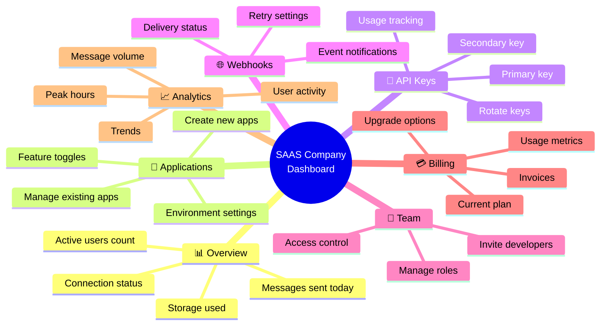
```mermaid
mindmap
  root((SAAS Company<br/>Dashboard))
    📊 Overview
      Active users count
      Messages sent today
      Storage used
      Connection status
    
    📱 Applications
      Create new apps
      Manage existing apps
      Environment settings
      Feature toggles
    
    🔑 API Keys
      Primary key
      Secondary key
      Rotate keys
      Usage tracking
    
    🌐 Webhooks
      Event notifications
      Delivery status
      Retry settings
    
    👥 Team
      Invite developers
      Manage roles
      Access control
    
    💳 Billing
      Current plan
      Usage metrics
      Invoices
      Upgrade options
    
    📈 Analytics
      User activity
      Message volume
      Peak hours
      Trends
```

---

# 5. How End Users Connect

## The Connection Flow

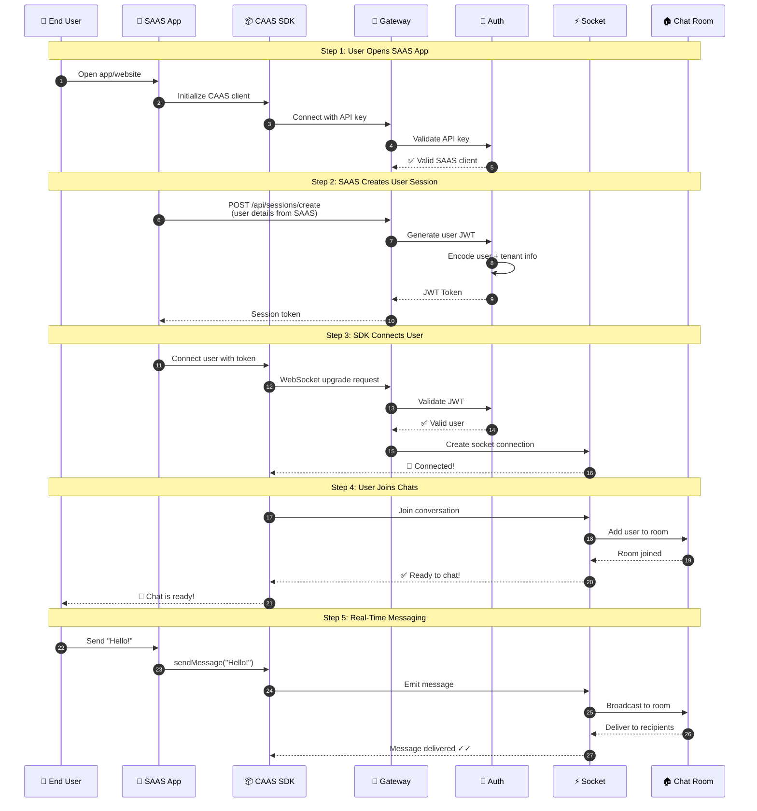
```mermaid
sequenceDiagram
    autonumber
    participant USER as 👤 End User
    participant APP as 📱 SAAS App
    participant SDK as 📦 CAAS SDK
    participant GW as 🚪 Gateway
    participant AUTH as 🔐 Auth
    participant SOCKET as ⚡ Socket
    participant ROOM as 🏠 Chat Room
    
    Note over USER,ROOM: Step 1: User Opens SAAS App
    USER->>APP: Open app/website
    APP->>SDK: Initialize CAAS client
    SDK->>GW: Connect with API key
    GW->>AUTH: Validate API key
    AUTH-->>GW: ✅ Valid SAAS client
    
    Note over USER,ROOM: Step 2: SAAS Creates User Session
    APP->>GW: POST /api/sessions/create<br/>(user details from SAAS)
    GW->>AUTH: Generate user JWT
    AUTH->>AUTH: Encode user + tenant info
    AUTH-->>GW: JWT Token
    GW-->>APP: Session token
    
    Note over USER,ROOM: Step 3: SDK Connects User
    APP->>SDK: Connect user with token
    SDK->>GW: WebSocket upgrade request
    GW->>AUTH: Validate JWT
    AUTH-->>GW: ✅ Valid user
    GW->>SOCKET: Create socket connection
    SOCKET-->>SDK: 🔌 Connected!
    
    Note over USER,ROOM: Step 4: User Joins Chats
    SDK->>SOCKET: Join conversation
    SOCKET->>ROOM: Add user to room
    ROOM-->>SOCKET: Room joined
    SOCKET-->>SDK: ✅ Ready to chat!
    SDK-->>USER: 💬 Chat is ready!
    
    Note over USER,ROOM: Step 5: Real-Time Messaging
    USER->>APP: Send "Hello!"
    APP->>SDK: sendMessage("Hello!")
    SDK->>SOCKET: Emit message
    SOCKET->>ROOM: Broadcast to room
    ROOM-->>SOCKET: Deliver to recipients
    SOCKET-->>SDK: Message delivered ✓✓
```

## Connection States

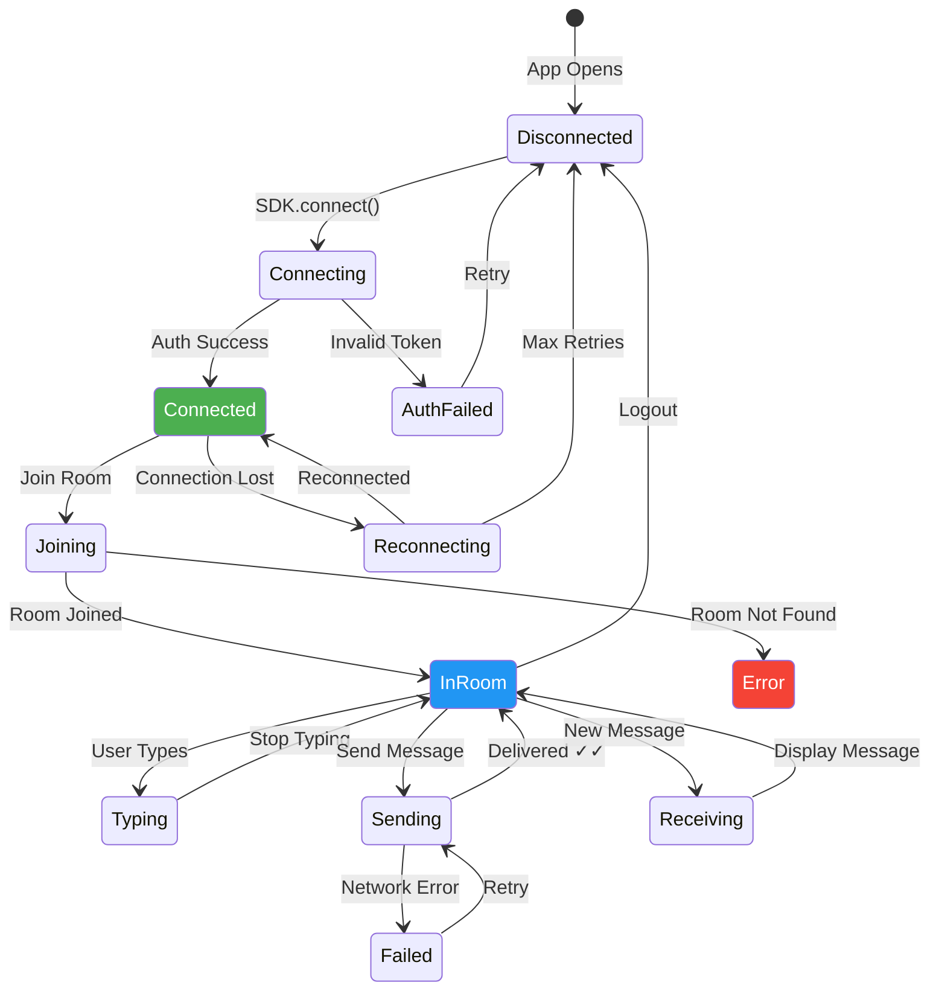
```mermaid
stateDiagram-v2
    [*] --> Disconnected: App Opens
    
    Disconnected --> Connecting: SDK.connect()
    Connecting --> Connected: Auth Success
    Connecting --> AuthFailed: Invalid Token
    AuthFailed --> Disconnected: Retry
    
    Connected --> Joining: Join Room
    Joining --> InRoom: Room Joined
    Joining --> Error: Room Not Found
    
    InRoom --> Typing: User Types
    Typing --> InRoom: Stop Typing
    
    InRoom --> Sending: Send Message
    Sending --> InRoom: Delivered ✓✓
    Sending --> Failed: Network Error
    Failed --> Sending: Retry
    
    InRoom --> Receiving: New Message
    Receiving --> InRoom: Display Message
    
    Connected --> Reconnecting: Connection Lost
    Reconnecting --> Connected: Reconnected
    Reconnecting --> Disconnected: Max Retries
    
    InRoom --> Disconnected: Logout
    
    style Connected fill:#4CAF50,color:#fff
    style InRoom fill:#2196F3,color:#fff
    style Error fill:#f44336,color:#fff
```

---

# 6. All Chat Features

## Complete Feature Map

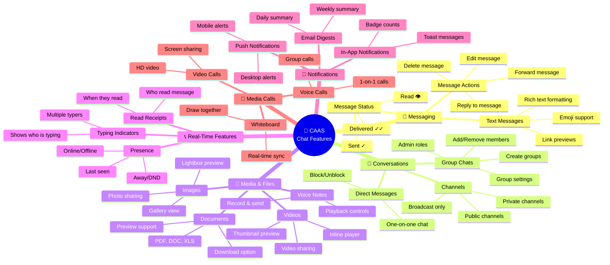
```mermaid
mindmap
  root((💬 CAAS<br/>Chat Features))
    
    📝 Messaging
      Text Messages
        Rich text formatting
        Emoji support
        Link previews
      Message Actions
        Edit message
        Delete message
        Reply to message
        Forward message
      Message Status
        Sent ✓
        Delivered ✓✓
        Read 👁️
    
    👥 Conversations
      Direct Messages
        One-on-one chat
        Block/Unblock
      Group Chats
        Create groups
        Add/Remove members
        Admin roles
        Group settings
      Channels
        Public channels
        Private channels
        Broadcast only
    
    📁 Media & Files
      Images
        Photo sharing
        Gallery view
        Lightbox preview
      Videos
        Video sharing
        Inline player
        Thumbnail preview
      Documents
        PDF, DOC, XLS
        Download option
        Preview support
      Voice Notes
        Record & send
        Playback controls
    
    📞 Real-Time Features
      Typing Indicators
        Shows who is typing
        Multiple typers
      Presence
        Online/Offline
        Away/DND
        Last seen
      Read Receipts
        Who read message
        When they read
    
    🔔 Notifications
      Push Notifications
        Mobile alerts
        Desktop alerts
      In-App Notifications
        Badge counts
        Toast messages
      Email Digests
        Daily summary
        Weekly summary
    
    🎥 Media Calls
      Voice Calls
        1-on-1 calls
        Group calls
      Video Calls
        HD video
        Screen sharing
      Whiteboard
        Draw together
        Real-time sync
```

## How Messages Flow

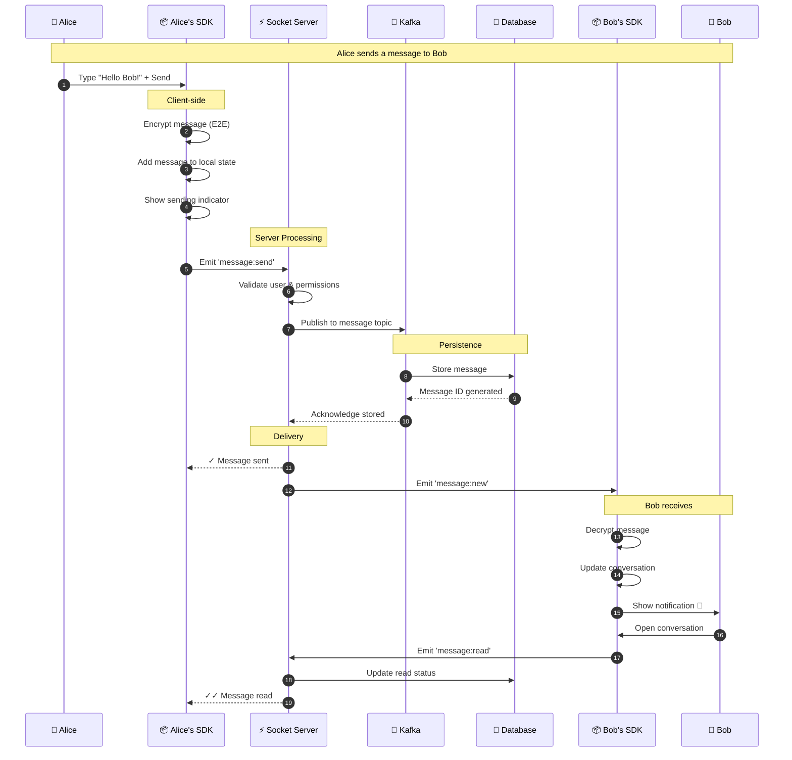
```mermaid
sequenceDiagram
    autonumber
    participant A as 👤 Alice
    participant SDK_A as 📦 Alice's SDK
    participant SOCKET as ⚡ Socket Server
    participant KAFKA as 📨 Kafka
    participant DB as 💾 Database
    participant SDK_B as 📦 Bob's SDK
    participant B as 👤 Bob
    
    Note over A,B: Alice sends a message to Bob
    
    A->>SDK_A: Type "Hello Bob!" + Send
    
    Note over SDK_A: Client-side
    SDK_A->>SDK_A: Encrypt message (E2E)
    SDK_A->>SDK_A: Add message to local state
    SDK_A->>SDK_A: Show sending indicator
    
    Note over SOCKET: Server Processing
    SDK_A->>SOCKET: Emit 'message:send'
    SOCKET->>SOCKET: Validate user & permissions
    SOCKET->>KAFKA: Publish to message topic
    
    Note over KAFKA,DB: Persistence
    KAFKA->>DB: Store message
    DB-->>KAFKA: Message ID generated
    KAFKA-->>SOCKET: Acknowledge stored
    
    Note over SOCKET: Delivery
    SOCKET-->>SDK_A: ✓ Message sent
    SOCKET->>SDK_B: Emit 'message:new'
    
    Note over SDK_B,B: Bob receives
    SDK_B->>SDK_B: Decrypt message
    SDK_B->>SDK_B: Update conversation
    SDK_B->>B: Show notification 🔔
    
    B->>SDK_B: Open conversation
    SDK_B->>SOCKET: Emit 'message:read'
    SOCKET->>DB: Update read status
    SOCKET-->>SDK_A: ✓✓ Message read
```

## Typing Indicators Flow

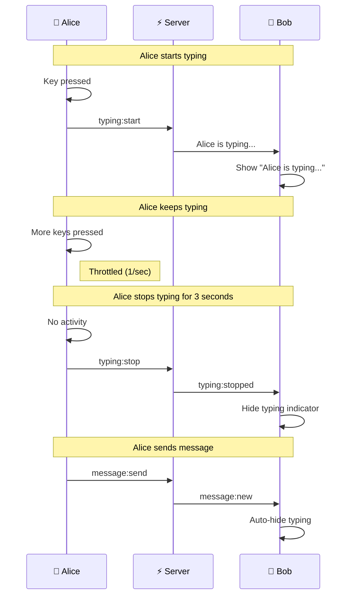
```mermaid
sequenceDiagram
    participant A as 👤 Alice
    participant SERVER as ⚡ Server
    participant B as 👤 Bob
    
    Note over A,B: Alice starts typing
    A->>A: Key pressed
    A->>SERVER: typing:start
    SERVER->>B: Alice is typing...
    B->>B: Show "Alice is typing..."
    
    Note over A,B: Alice keeps typing
    A->>A: More keys pressed
    Note right of A: Throttled (1/sec)
    
    Note over A,B: Alice stops typing for 3 seconds
    A->>A: No activity
    A->>SERVER: typing:stop
    SERVER->>B: typing:stopped
    B->>B: Hide typing indicator
    
    Note over A,B: Alice sends message
    A->>SERVER: message:send
    SERVER->>B: message:new
    B->>B: Auto-hide typing
```

## Group Chat Features

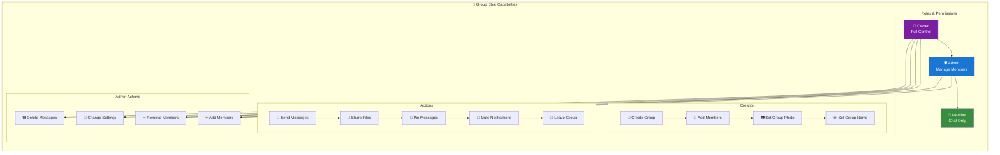
```mermaid
flowchart TB
    subgraph "👥 Group Chat Capabilities"
        direction TB
        
        subgraph "Creation"
            C1[📝 Create Group]
            C2[👥 Add Members]
            C3[📷 Set Group Photo]
            C4[✏️ Set Group Name]
        end
        
        subgraph "Roles & Permissions"
            R1[👑 Owner<br/>Full Control]
            R2[🛡️ Admin<br/>Manage Members]
            R3[👤 Member<br/>Chat Only]
        end
        
        subgraph "Actions"
            A1[💬 Send Messages]
            A2[📁 Share Files]
            A3[📌 Pin Messages]
            A4[🔔 Mute Notifications]
            A5[🚪 Leave Group]
        end
        
        subgraph "Admin Actions"
            AD1[➕ Add Members]
            AD2[➖ Remove Members]
            AD3[🔧 Change Settings]
            AD4[🗑️ Delete Messages]
        end
    end
    
    C1 --> C2 --> C3 --> C4
    R1 --> R2 --> R3
    A1 --> A2 --> A3 --> A4 --> A5
    
    R1 --> AD1 & AD2 & AD3 & AD4
    R2 --> AD1 & AD2
    
    style R1 fill:#7B1FA2,color:#fff
    style R2 fill:#1976D2,color:#fff
    style R3 fill:#388E3C,color:#fff
```

---

# 7. Security & Protection

## Security Layers

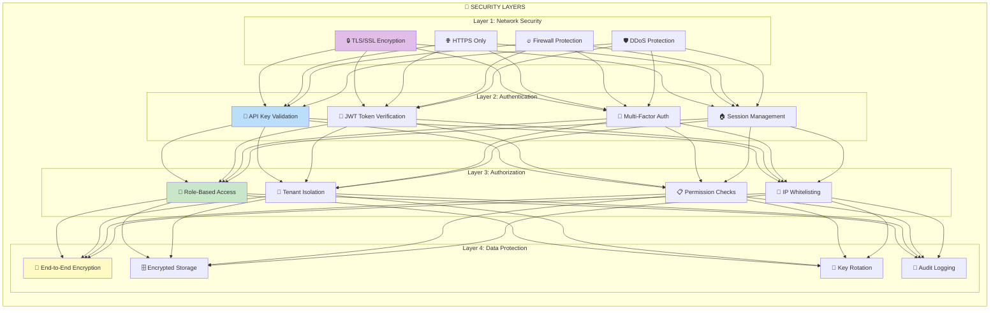
```mermaid
flowchart TB
    subgraph "🔐 SECURITY LAYERS"
        direction TB
        
        subgraph "Layer 1: Network Security"
            L1A[🔒 TLS/SSL Encryption]
            L1B[🌐 HTTPS Only]
            L1C[🔥 Firewall Protection]
            L1D[🛡️ DDoS Protection]
        end
        
        subgraph "Layer 2: Authentication"
            L2A[🔑 API Key Validation]
            L2B[🎫 JWT Token Verification]
            L2C[📱 Multi-Factor Auth]
            L2D[🏠 Session Management]
        end
        
        subgraph "Layer 3: Authorization"
            L3A[👤 Role-Based Access]
            L3B[🏢 Tenant Isolation]
            L3C[📋 Permission Checks]
            L3D[🚫 IP Whitelisting]
        end
        
        subgraph "Layer 4: Data Protection"
            L4A[🔐 End-to-End Encryption]
            L4B[🗄️ Encrypted Storage]
            L4C[🔄 Key Rotation]
            L4D[📝 Audit Logging]
        end
    end
    
    L1A & L1B & L1C & L1D --> L2A & L2B & L2C & L2D
    L2A & L2B & L2C & L2D --> L3A & L3B & L3C & L3D
    L3A & L3B & L3C & L3D --> L4A & L4B & L4C & L4D
    
    style L1A fill:#e1bee7
    style L2A fill:#bbdefb
    style L3A fill:#c8e6c9
    style L4A fill:#fff9c4
```

## Authentication Flow

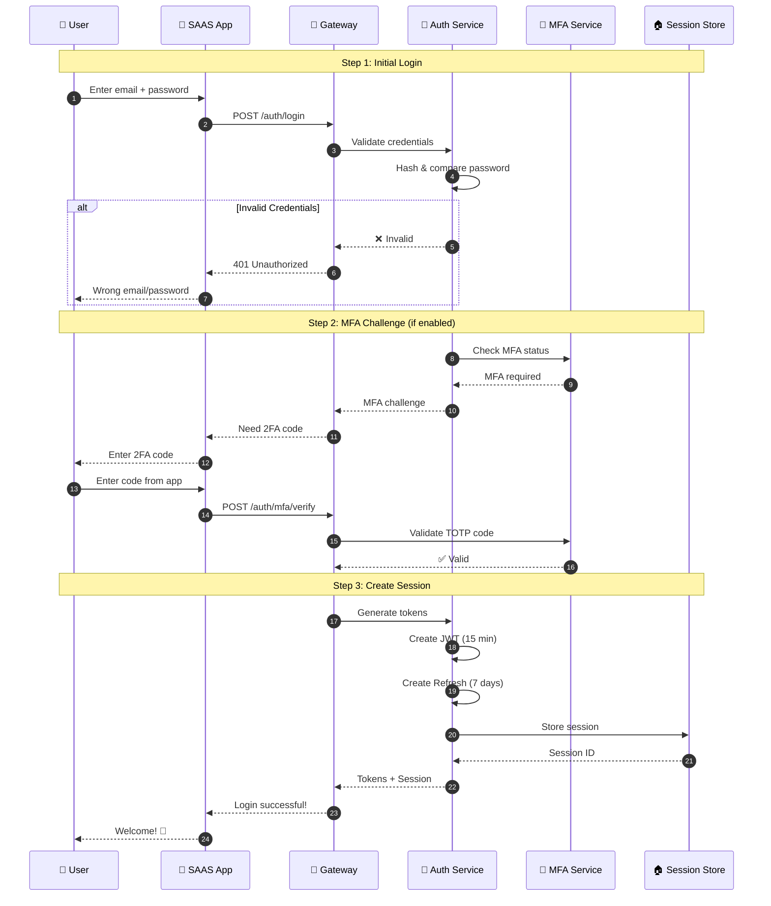
```mermaid
sequenceDiagram
    autonumber
    participant USER as 👤 User
    participant APP as 📱 SAAS App
    participant GW as 🚪 Gateway
    participant AUTH as 🔐 Auth Service
    participant MFA as 📱 MFA Service
    participant SESSION as 🏠 Session Store
    
    Note over USER,SESSION: Step 1: Initial Login
    USER->>APP: Enter email + password
    APP->>GW: POST /auth/login
    GW->>AUTH: Validate credentials
    AUTH->>AUTH: Hash & compare password
    
    alt Invalid Credentials
        AUTH-->>GW: ❌ Invalid
        GW-->>APP: 401 Unauthorized
        APP-->>USER: Wrong email/password
    end
    
    Note over USER,SESSION: Step 2: MFA Challenge (if enabled)
    AUTH->>MFA: Check MFA status
    MFA-->>AUTH: MFA required
    AUTH-->>GW: MFA challenge
    GW-->>APP: Need 2FA code
    APP-->>USER: Enter 2FA code
    
    USER->>APP: Enter code from app
    APP->>GW: POST /auth/mfa/verify
    GW->>MFA: Validate TOTP code
    MFA-->>GW: ✅ Valid
    
    Note over USER,SESSION: Step 3: Create Session
    GW->>AUTH: Generate tokens
    AUTH->>AUTH: Create JWT (15 min)
    AUTH->>AUTH: Create Refresh (7 days)
    AUTH->>SESSION: Store session
    SESSION-->>AUTH: Session ID
    AUTH-->>GW: Tokens + Session
    GW-->>APP: Login successful!
    APP-->>USER: Welcome! 🎉
```

## End-to-End Encryption Explained

```mermaid
flowchart LR
    subgraph "👤 Alice's Device"
        A1[📝 Type Message<br/>"Hello Bob!"]
        A2[🔑 Her Private Key]
        A3[🔐 Encrypt with<br/>Bob's Public Key]
        A4[📤 Send Encrypted<br/>aX7#mK9$...]
    end
    
    subgraph "☁️ CAAS Servers"
        S1[📨 Receive<br/>aX7#mK9$...]
        S2[💾 Store Encrypted<br/>Cannot Read!]
        S3[📤 Deliver to Bob]
    end
    
    subgraph "👤 Bob's Device"
        B1[📥 Receive<br/>aX7#mK9$...]
        B2[🔑 His Private Key]
        B3[🔓 Decrypt Message]
        B4[📖 Read<br/>"Hello Bob!"]
    end
    
    A1 --> A3
    A2 --> A3
    A3 --> A4
    A4 --> S1
    S1 --> S2
    S2 --> S3
    S3 --> B1
    B1 --> B3
    B2 --> B3
    B3 --> B4
    
    style A3 fill:#4CAF50,color:#fff
    style S2 fill:#2196F3,color:#fff
    style B3 fill:#4CAF50,color:#fff
```

## Multi-Tenant Isolation

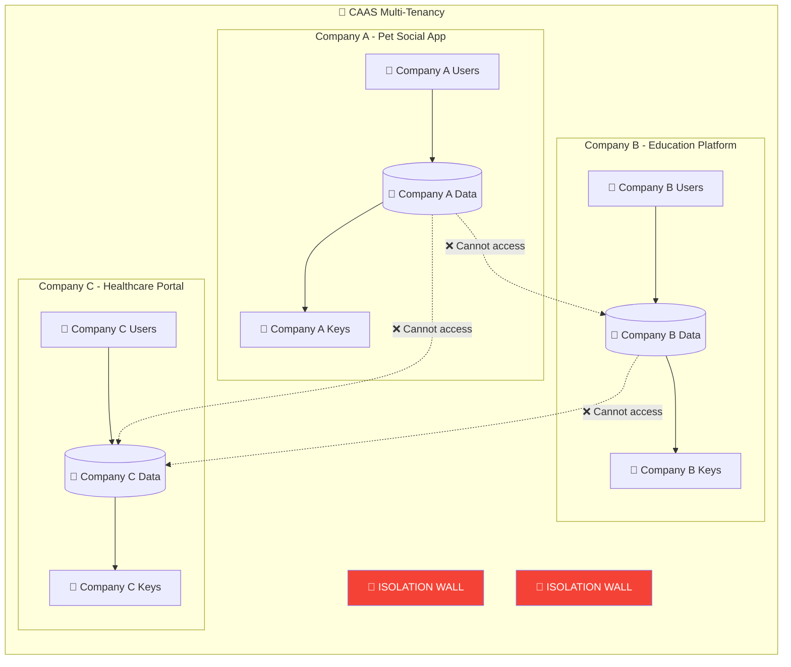
```mermaid
flowchart TB
    subgraph "🏢 CAAS Multi-Tenancy"
        direction TB
        
        subgraph "Company A - Pet Social App"
            A_USERS[👥 Company A Users]
            A_DATA[(💾 Company A Data)]
            A_KEYS[🔑 Company A Keys]
        end
        
        subgraph "Company B - Education Platform"
            B_USERS[👥 Company B Users]
            B_DATA[(💾 Company B Data)]
            B_KEYS[🔑 Company B Keys]
        end
        
        subgraph "Company C - Healthcare Portal"
            C_USERS[👥 Company C Users]
            C_DATA[(💾 Company C Data)]
            C_KEYS[🔑 Company C Keys]
        end
        
        WALL1[🧱 ISOLATION WALL]
        WALL2[🧱 ISOLATION WALL]
    end
    
    A_USERS --> A_DATA
    A_DATA --> A_KEYS
    
    B_USERS --> B_DATA
    B_DATA --> B_KEYS
    
    C_USERS --> C_DATA
    C_DATA --> C_KEYS
    
    A_DATA -.❌ Cannot access.-> B_DATA
    B_DATA -.❌ Cannot access.-> C_DATA
    A_DATA -.❌ Cannot access.-> C_DATA
    
    style WALL1 fill:#f44336,color:#fff
    style WALL2 fill:#f44336,color:#fff
```

---

# 8. Behind the Scenes - Technical Infrastructure

## Complete System Architecture

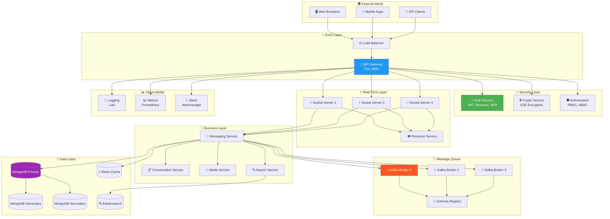
```mermaid
flowchart TB
    subgraph "🌍 External World"
        WEB[🖥️ Web Browsers]
        MOBILE[📱 Mobile Apps]
        API_CLIENT[🔌 API Clients]
    end
    
    subgraph "🚪 Entry Layer"
        LB[⚖️ Load Balancer]
        GW[🚪 API Gateway<br/>Port 3000]
    end
    
    subgraph "🔐 Security Layer"
        AUTH[🔐 Auth Service<br/>JWT, Sessions, MFA]
        CRYPTO[🔒 Crypto Service<br/>E2E Encryption]
        AUTHZ[🛡️ Authorization<br/>RBAC, ABAC]
    end
    
    subgraph "⚡ Real-Time Layer"
        SOCKET1[⚡ Socket Server 1]
        SOCKET2[⚡ Socket Server 2]
        SOCKET3[⚡ Socket Server 3]
        PRESENCE[👁️ Presence Service]
    end
    
    subgraph "💬 Business Layer"
        MSG[💬 Messaging Service]
        CONV[📋 Conversation Service]
        MEDIA[📁 Media Service]
        SEARCH[🔍 Search Service]
    end
    
    subgraph "📨 Message Queue"
        direction LR
        K1[📨 Kafka Broker 1]
        K2[📨 Kafka Broker 2]
        K3[📨 Kafka Broker 3]
        SR[📜 Schema Registry]
    end
    
    subgraph "💾 Data Layer"
        direction LR
        M1[(MongoDB Primary)]
        M2[(MongoDB Secondary)]
        M3[(MongoDB Secondary)]
        REDIS[(⚡ Redis Cache)]
        ES[(🔍 Elasticsearch)]
    end
    
    subgraph "📊 Observability"
        LOGS[📝 Logging<br/>Loki]
        METRICS[📊 Metrics<br/>Prometheus]
        ALERTS[🔔 Alerts<br/>Alertmanager]
    end
    
    WEB & MOBILE & API_CLIENT --> LB
    LB --> GW
    
    GW --> AUTH & CRYPTO & AUTHZ
    GW --> SOCKET1 & SOCKET2 & SOCKET3
    
    SOCKET1 & SOCKET2 & SOCKET3 --> PRESENCE
    SOCKET1 & SOCKET2 & SOCKET3 --> MSG
    
    MSG --> CONV & MEDIA & SEARCH
    
    MSG --> K1 & K2 & K3
    K1 & K2 & K3 --> SR
    
    MSG --> M1
    M1 --> M2 & M3
    MSG --> REDIS
    SEARCH --> ES
    
    GW --> LOGS & METRICS & ALERTS
    
    style GW fill:#2196F3,color:#fff
    style AUTH fill:#4CAF50,color:#fff
    style K1 fill:#FF5722,color:#fff
    style M1 fill:#9C27B0,color:#fff
```

## Docker Container Map

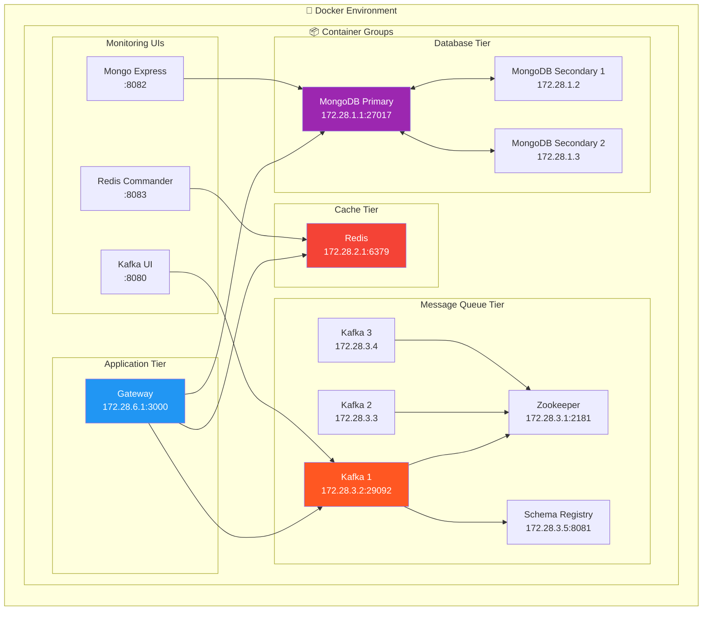
```mermaid
flowchart TB
    subgraph "🐳 Docker Environment"
        direction TB
        
        subgraph "📦 Container Groups"
            subgraph "Database Tier"
                MP[MongoDB Primary<br/>172.28.1.1:27017]
                MS1[MongoDB Secondary 1<br/>172.28.1.2]
                MS2[MongoDB Secondary 2<br/>172.28.1.3]
            end
            
            subgraph "Cache Tier"
                REDIS[Redis<br/>172.28.2.1:6379]
            end
            
            subgraph "Message Queue Tier"
                ZK[Zookeeper<br/>172.28.3.1:2181]
                K1[Kafka 1<br/>172.28.3.2:29092]
                K2[Kafka 2<br/>172.28.3.3]
                K3[Kafka 3<br/>172.28.3.4]
                SR[Schema Registry<br/>172.28.3.5:8081]
            end
            
            subgraph "Application Tier"
                GW[Gateway<br/>172.28.6.1:3000]
            end
            
            subgraph "Monitoring UIs"
                KUI[Kafka UI<br/>:8080]
                MEX[Mongo Express<br/>:8082]
                RCMD[Redis Commander<br/>:8083]
            end
        end
    end
    
    MP <--> MS1 & MS2
    K1 & K2 & K3 --> ZK
    K1 --> SR
    
    GW --> MP & REDIS & K1
    KUI --> K1
    MEX --> MP
    RCMD --> REDIS
    
    style MP fill:#9C27B0,color:#fff
    style REDIS fill:#f44336,color:#fff
    style K1 fill:#FF5722,color:#fff
    style GW fill:#2196F3,color:#fff
```

## Service Startup Order

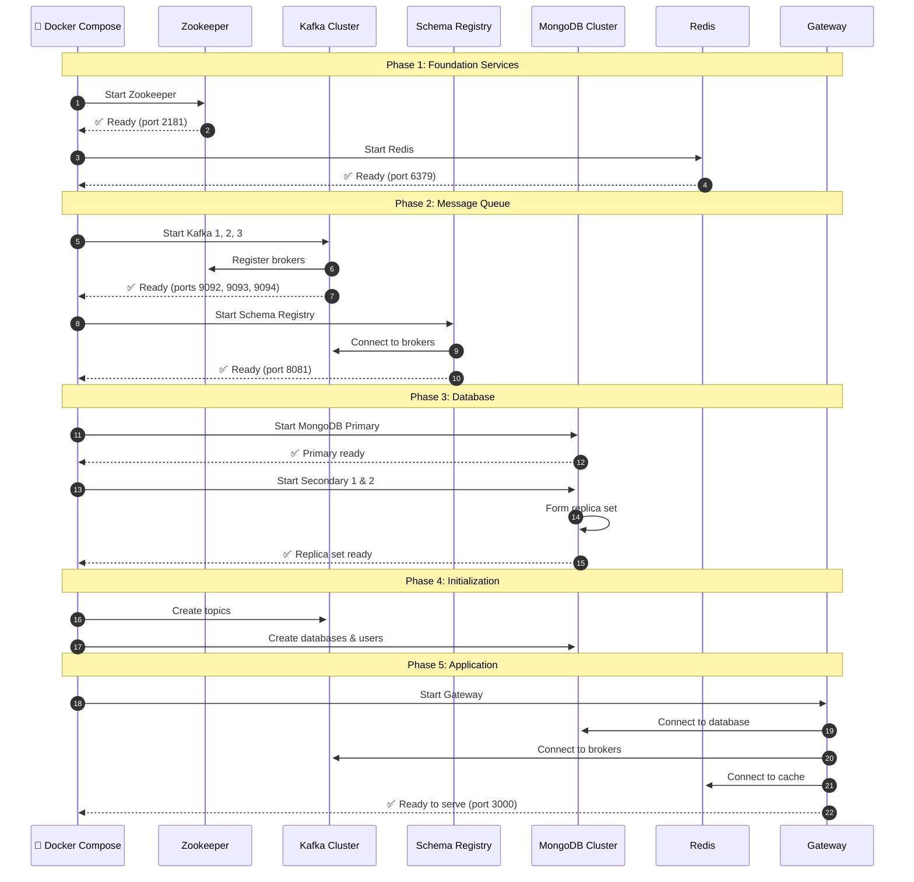
```mermaid
sequenceDiagram
    autonumber
    participant DC as 🐳 Docker Compose
    participant ZK as Zookeeper
    participant KAFKA as Kafka Cluster
    participant SR as Schema Registry
    participant MONGO as MongoDB Cluster
    participant REDIS as Redis
    participant GW as Gateway
    
    Note over DC,GW: Phase 1: Foundation Services
    DC->>ZK: Start Zookeeper
    activate ZK
    ZK-->>DC: ✅ Ready (port 2181)
    
    DC->>REDIS: Start Redis
    activate REDIS
    REDIS-->>DC: ✅ Ready (port 6379)
    
    Note over DC,GW: Phase 2: Message Queue
    DC->>KAFKA: Start Kafka 1, 2, 3
    activate KAFKA
    KAFKA->>ZK: Register brokers
    KAFKA-->>DC: ✅ Ready (ports 9092, 9093, 9094)
    
    DC->>SR: Start Schema Registry
    activate SR
    SR->>KAFKA: Connect to brokers
    SR-->>DC: ✅ Ready (port 8081)
    
    Note over DC,GW: Phase 3: Database
    DC->>MONGO: Start MongoDB Primary
    activate MONGO
    MONGO-->>DC: ✅ Primary ready
    DC->>MONGO: Start Secondary 1 & 2
    MONGO->>MONGO: Form replica set
    MONGO-->>DC: ✅ Replica set ready
    
    Note over DC,GW: Phase 4: Initialization
    DC->>KAFKA: Create topics
    DC->>MONGO: Create databases & users
    
    Note over DC,GW: Phase 5: Application
    DC->>GW: Start Gateway
    activate GW
    GW->>MONGO: Connect to database
    GW->>KAFKA: Connect to brokers
    GW->>REDIS: Connect to cache
    GW-->>DC: ✅ Ready to serve (port 3000)
```

## How Data is Stored

```mermaid
erDiagram
    SAAS_CLIENTS ||--o{ APPLICATIONS : has
    SAAS_CLIENTS ||--o{ API_KEYS : has
    SAAS_CLIENTS ||--o{ SUBSCRIPTIONS : has
    
    APPLICATIONS ||--o{ USERS : contains
    
    USERS ||--o{ CONVERSATIONS : participates
    USERS ||--o{ USER_DEVICES : has
    USERS ||--o{ USER_RELATIONSHIPS : has
    
    CONVERSATIONS ||--o{ MESSAGES : contains
    CONVERSATIONS ||--o{ CONVERSATION_MEMBERS : has
    
    MESSAGES ||--o{ REACTIONS : has
    MESSAGES ||--o{ READ_RECEIPTS : has
    
    USERS ||--o{ FILES : uploads
    USERS ||--o{ ENCRYPTION_KEYS : owns
    
    SAAS_CLIENTS {
        string id PK
        string name
        string email
        string plan
        date created_at
    }
    
    APPLICATIONS {
        string id PK
        string client_id FK
        string name
        string environment
        boolean active
    }
    
    USERS {
        string id PK
        string tenant_id FK
        string external_id
        string display_name
        string avatar_url
        date last_seen
    }
    
    CONVERSATIONS {
        string id PK
        string tenant_id
        string type
        string name
        date updated_at
    }
    
    MESSAGES {
        string id PK
        string conversation_id FK
        string sender_id FK
        string content_encrypted
        string type
        date sent_at
    }
```

---

# 9. Developer Tools

## SDK Integration Flow

```mermaid
flowchart TB
    subgraph "🛠️ Developer Integration Journey"
        direction TB
        
        subgraph "Step 1: Installation"
            I1[npm install @caas/sdk]
            I2[npm install @caas/react]
        end
        
        subgraph "Step 2: Configuration"
            C1[Add API Key to .env]
            C2[Initialize CAAS Client]
            C3[Wrap app in Provider]
        end
        
        subgraph "Step 3: Add Components"
            A1[&lt;ChatList /&gt;]
            A2[&lt;ChatWindow /&gt;]
            A3[&lt;MessageInput /&gt;]
            A4[&lt;UserPresence /&gt;]
        end
        
        subgraph "Step 4: Custom Logic"
            L1[Listen to events]
            L2[Send messages]
            L3[Manage conversations]
        end
        
        subgraph "Step 5: Deploy"
            D1[Test in development]
            D2[Switch to production keys]
            D3[Deploy application]
        end
    end
    
    I1 --> I2 --> C1 --> C2 --> C3
    C3 --> A1 --> A2 --> A3 --> A4
    A4 --> L1 --> L2 --> L3
    L3 --> D1 --> D2 --> D3
    
    style I1 fill:#e3f2fd
    style C1 fill:#e8f5e9
    style A1 fill:#fff3e0
    style L1 fill:#fce4ec
    style D1 fill:#f3e5f5
```

## SDK Code Example Flow

```mermaid
sequenceDiagram
    autonumber
    participant DEV as 👨‍💻 Developer
    participant CODE as 📝 Code
    participant SDK as 📦 SDK
    participant CAAS as ☁️ CAAS
    
    Note over DEV,CAAS: Step 1: Initialize
    DEV->>CODE: Write initialization code
    CODE->>SDK: new CAASClient({ apiKey })
    SDK->>CAAS: Validate API key
    CAAS-->>SDK: ✅ Authenticated
    
    Note over DEV,CAAS: Step 2: Connect User
    DEV->>CODE: client.connect(userToken)
    CODE->>SDK: Establish connection
    SDK->>CAAS: WebSocket connect
    CAAS-->>SDK: ✅ Connected
    
    Note over DEV,CAAS: Step 3: Listen to Events
    DEV->>CODE: client.on('message', handler)
    CODE->>SDK: Register event handler
    SDK->>SDK: Store handler
    
    Note over DEV,CAAS: Step 4: Send Message
    DEV->>CODE: client.messages.send({...})
    CODE->>SDK: Prepare message
    SDK->>CAAS: Send via socket
    CAAS->>CAAS: Process & deliver
    CAAS-->>SDK: ✅ Delivered
    SDK-->>CODE: Success callback
    
    Note over DEV,CAAS: Step 5: Receive Message
    CAAS->>SDK: Push new message
    SDK->>CODE: Trigger 'message' event
    CODE->>DEV: Handler executed
```

## UI Components Available

```mermaid
mindmap
  root((📦 CAAS UI<br/>Components))
    
    🏗️ Core Providers
      CaasProvider
        Context setup
        Configuration
      ThemeProvider
        Light/Dark mode
        Custom themes
      LocalizationProvider
        Multi-language
        RTL support
    
    💬 Chat Components
      ChatList
        Conversation list
        Search & filter
        Unread badges
      ChatWindow
        Message history
        Infinite scroll
        Real-time updates
      MessageInput
        Text input
        File upload
        Emoji picker
      MessageBubble
        Text message
        Image message
        File message
        System message
    
    👤 User Components
      Avatar
        User photo
        Presence dot
        Initials fallback
      UserProfile
        Profile card
        Status display
      PresenceIndicator
        Online/Offline
        Away/DND
    
    🔔 Notification Components
      NotificationBell
        Badge count
        Dropdown
      NotificationList
        All notifications
        Mark as read
      Toast
        Success/Error
        Action buttons
    
    🎨 Base Components
      Button
      Input
      Modal
      Loader
      Badge
```

---

# 10. Billing & Pricing

## Pricing Tiers

```mermaid
flowchart LR
    subgraph "💳 CAAS PRICING PLANS"
        direction TB
        
        subgraph "🆓 FREE"
            F1[1,000 monthly users]
            F2[10,000 messages]
            F3[1 GB storage]
            F4[Community support]
            F5[$0/month]
        end
        
        subgraph "⭐ STARTER"
            S1[10,000 monthly users]
            S2[100,000 messages]
            S3[10 GB storage]
            S4[Email support]
            S5[$49/month]
        end
        
        subgraph "🚀 PRO"
            P1[100,000 monthly users]
            P2[1M messages]
            P3[100 GB storage]
            P4[Priority support]
            P5[Custom domain]
            P6[$299/month]
        end
        
        subgraph "🏢 ENTERPRISE"
            E1[Unlimited users]
            E2[Unlimited messages]
            E3[Unlimited storage]
            E4[24/7 support]
            E5[SLA guarantee]
            E6[Custom contract]
        end
    end
    
    F5 --> S5 --> P5 --> E6
    
    style F1 fill:#e3f2fd
    style S1 fill:#e8f5e9
    style P1 fill:#fff3e0
    style E1 fill:#f3e5f5
```

## Usage Metering Flow

```mermaid
flowchart TB
    subgraph "📊 How We Track Usage"
        direction TB
        
        subgraph "Usage Events"
            E1[👤 New User Connected]
            E2[💬 Message Sent]
            E3[📁 File Uploaded]
            E4[📞 Call Started]
        end
        
        subgraph "Metering Service"
            M1[📥 Receive Event]
            M2[🔢 Increment Counter]
            M3[💾 Store Usage Record]
            M4[⏰ Aggregate Hourly]
        end
        
        subgraph "Billing Calculation"
            B1[📊 Sum Monthly Usage]
            B2[📋 Compare to Plan Limits]
            B3[💰 Calculate Overage]
            B4[📄 Generate Invoice]
        end
        
        subgraph "Notifications"
            N1[📧 80% Usage Warning]
            N2[📧 100% Limit Reached]
            N3[📧 Invoice Ready]
        end
    end
    
    E1 & E2 & E3 & E4 --> M1
    M1 --> M2 --> M3 --> M4
    M4 --> B1 --> B2 --> B3 --> B4
    B2 --> N1 & N2
    B4 --> N3
    
    style M1 fill:#2196F3,color:#fff
    style B1 fill:#4CAF50,color:#fff
    style N1 fill:#FF9800,color:#fff
```

## Invoice Generation

```mermaid
sequenceDiagram
    autonumber
    participant METER as 📊 Metering
    participant BILLING as 💳 Billing Service
    participant STRIPE as 💰 Stripe
    participant CLIENT as 🏢 SAAS Client
    
    Note over METER,CLIENT: End of Billing Period
    
    METER->>BILLING: Monthly usage summary
    BILLING->>BILLING: Calculate charges
    
    Note over BILLING: Base Plan: $299<br/>Extra Users: 50,000 × $0.001 = $50<br/>Extra Messages: 200,000 × $0.0001 = $20<br/>Extra Storage: 20 GB × $0.50 = $10<br/>Total: $379
    
    BILLING->>BILLING: Apply discounts/credits
    BILLING->>BILLING: Add taxes
    BILLING->>BILLING: Create invoice
    
    BILLING->>STRIPE: Create payment intent
    STRIPE->>STRIPE: Charge payment method
    STRIPE-->>BILLING: Payment successful
    
    BILLING->>BILLING: Mark invoice paid
    BILLING->>CLIENT: 📧 Invoice + Receipt
    
    CLIENT->>CLIENT: Download PDF invoice
```

---

# 11. Monitoring & Analytics

## What We Monitor

```mermaid
mindmap
  root((📊 Monitoring<br/>Dashboard))
    
    📈 Performance
      Response Times
        API latency
        Socket latency
        Database queries
      Throughput
        Requests/second
        Messages/second
        Connections/second
      Errors
        Error rate
        Error types
        Stack traces
    
    💾 Resources
      CPU Usage
        Per service
        Trends
      Memory
        Heap usage
        Cache size
      Disk
        Storage used
        Write speed
      Network
        Bandwidth
        Connections
    
    👥 Business Metrics
      Active Users
        Real-time count
        Daily/Monthly
      Messages
        Sent today
        Delivery rate
      Conversations
        Active chats
        New today
      Media
        Files uploaded
        Storage used
    
    🔔 Alerts
      Critical
        Service down
        High error rate
      Warning
        High latency
        Disk 80%
      Info
        New deployments
        Config changes
```

## Analytics Dashboard

```mermaid
flowchart TB
    subgraph "📊 SAAS Client Analytics Dashboard"
        direction TB
        
        subgraph "Overview Cards"
            C1[👥 Active Users<br/>1,234]
            C2[💬 Messages Today<br/>45,678]
            C3[📁 Files Shared<br/>890]
            C4[📈 Engagement<br/>78%]
        end
        
        subgraph "Charts"
            CH1[📈 User Growth<br/>Line Chart]
            CH2[📊 Message Volume<br/>Bar Chart]
            CH3[🥧 User Devices<br/>Pie Chart]
            CH4[🌍 User Locations<br/>Map]
        end
        
        subgraph "Tables"
            T1[📋 Top Conversations]
            T2[👥 Most Active Users]
            T3[🔥 Peak Hours]
        end
        
        subgraph "Real-Time Feed"
            F1[⚡ Live Activity]
            F2[🔔 Recent Events]
        end
    end
    
    C1 & C2 & C3 & C4 --> CH1 & CH2 & CH3 & CH4
    CH1 & CH2 & CH3 & CH4 --> T1 & T2 & T3
    T1 & T2 & T3 --> F1 & F2
```

## Alert Flow

```mermaid
sequenceDiagram
    autonumber
    participant SVC as ⚡ Service
    participant METRICS as 📊 Prometheus
    participant ALERT as 🔔 Alertmanager
    participant SLACK as 💬 Slack
    participant EMAIL as 📧 Email
    participant ONCALL as 📱 On-Call
    
    Note over SVC,ONCALL: Normal Operation
    SVC->>METRICS: Send metrics
    METRICS->>METRICS: Store & evaluate rules
    
    Note over SVC,ONCALL: Issue Detected!
    SVC->>METRICS: Error rate spike!
    METRICS->>METRICS: Threshold breached
    METRICS->>ALERT: Fire alert
    
    ALERT->>ALERT: Group similar alerts
    ALERT->>ALERT: Check severity
    
    alt Critical (P1)
        ALERT->>ONCALL: 📱 Page on-call engineer
        ALERT->>SLACK: #incidents channel
        ALERT->>EMAIL: Incident report
    else Warning (P2)
        ALERT->>SLACK: #alerts channel
        ALERT->>EMAIL: Alert notification
    else Info (P3)
        ALERT->>SLACK: #monitoring channel
    end
    
    Note over SVC,ONCALL: Issue Resolved
    SVC->>METRICS: Metrics normal
    METRICS->>ALERT: Alert resolved
    ALERT->>SLACK: ✅ Resolved notification
```

---

# 12. Complete Data Flow

## End-to-End Message Journey

```mermaid
flowchart TB
    subgraph "👤 SENDER (Alice)"
        A1[📝 Type Message]
        A2[🔐 Encrypt Message]
        A3[📤 Send via SDK]
    end
    
    subgraph "🌐 NETWORK"
        N1[🔒 TLS Encrypted]
        N2[⚖️ Load Balancer]
    end
    
    subgraph "🚪 GATEWAY"
        G1[📥 Receive Request]
        G2[🔐 Validate JWT]
        G3[🛡️ Check Permissions]
        G4[📊 Rate Limit Check]
    end
    
    subgraph "⚡ SOCKET SERVER"
        S1[📩 Process Message]
        S2[🏷️ Add Metadata]
        S3[📋 Validate Content]
    end
    
    subgraph "📨 KAFKA"
        K1[📥 Receive Event]
        K2[📋 Partition by Conversation]
        K3[💾 Persist Message]
        K4[📤 Notify Consumers]
    end
    
    subgraph "💾 DATABASE"
        D1[💾 Store in MongoDB]
        D2[🔍 Index for Search]
        D3[📊 Update Analytics]
    end
    
    subgraph "⚡ DELIVERY"
        R1[🔍 Find Recipients]
        R2[📍 Locate Socket Connections]
        R3[📤 Push to Recipients]
    end
    
    subgraph "👤 RECEIVER (Bob)"
        B1[📥 Receive via Socket]
        B2[🔓 Decrypt Message]
        B3[🔔 Show Notification]
        B4[📖 Display Message]
    end
    
    A1 --> A2 --> A3 --> N1 --> N2 --> G1
    G1 --> G2 --> G3 --> G4 --> S1
    S1 --> S2 --> S3 --> K1
    K1 --> K2 --> K3 --> K4
    K4 --> D1 & R1
    D1 --> D2 --> D3
    R1 --> R2 --> R3 --> B1
    B1 --> B2 --> B3 --> B4
    
    style A2 fill:#4CAF50,color:#fff
    style G2 fill:#2196F3,color:#fff
    style K3 fill:#FF5722,color:#fff
    style B2 fill:#4CAF50,color:#fff
```

## Complete Platform Ecosystem

```mermaid
flowchart TB
    subgraph "🌍 CAAS ECOSYSTEM"
        direction TB
        
        subgraph "Customers"
            C1[🏢 SAAS Company 1]
            C2[🏢 SAAS Company 2]
            C3[🏢 SAAS Company N]
        end
        
        subgraph "Their End Users"
            U1[👥 Thousands of Users]
            U2[👥 Thousands of Users]
            U3[👥 Thousands of Users]
        end
        
        subgraph "Integration Layer"
            SDK[📦 JavaScript SDK]
            UI[🎨 React Components]
            API[🔌 REST API]
            WS[⚡ WebSocket]
        end
        
        subgraph "CAAS Core Platform"
            GW[🚪 API Gateway]
            
            subgraph "Services"
                AUTH[🔐 Authentication]
                SOCKET[⚡ Real-Time]
                MSG[💬 Messaging]
                MEDIA[📁 Media]
                CRYPTO[🔒 Encryption]
            end
            
            subgraph "Data"
                MONGO[(💾 MongoDB)]
                REDIS[(⚡ Redis)]
                KAFKA[📨 Kafka]
                ES[(🔍 Search)]
            end
            
            subgraph "Operations"
                BILLING[💳 Billing]
                ANALYTICS[📊 Analytics]
                MONITOR[🔔 Monitoring]
            end
        end
        
        subgraph "Admin Portal"
            ADMIN[🖥️ Admin Dashboard]
        end
    end
    
    C1 --> U1
    C2 --> U2
    C3 --> U3
    
    C1 & C2 & C3 --> SDK & UI & API
    U1 & U2 & U3 --> SDK & UI & WS
    
    SDK & UI & API & WS --> GW
    GW --> AUTH & SOCKET & MSG & MEDIA & CRYPTO
    AUTH & SOCKET & MSG & MEDIA --> MONGO & REDIS & KAFKA
    MSG --> ES
    
    GW --> BILLING & ANALYTICS & MONITOR
    
    C1 & C2 & C3 --> ADMIN
    
    style GW fill:#2196F3,color:#fff
    style AUTH fill:#4CAF50,color:#fff
    style MONGO fill:#9C27B0,color:#fff
    style KAFKA fill:#FF5722,color:#fff
```

---

# 📚 Summary

## What CAAS Provides

```mermaid
pie title "CAAS Value Distribution"
    "Time Saved" : 25
    "Cost Reduction" : 20
    "Security" : 20
    "Scalability" : 15
    "Features" : 12
    "Support" : 8
```

## Key Takeaways

```mermaid
flowchart LR
    subgraph "🎯 CAAS in a Nutshell"
        A[🏢 Your Company] --> B[📦 Install SDK]
        B --> C[🔑 Add API Key]
        C --> D[🎨 Add Components]
        D --> E[🚀 Launch Chat!]
    end
    
    style A fill:#e3f2fd
    style B fill:#e8f5e9
    style C fill:#fff3e0
    style D fill:#fce4ec
    style E fill:#c8e6c9
```

---

> **Document Version:** 1.0.0  
> **Last Updated:** 2026-02-05  
> **Generated for:** Non-Technical Stakeholders, Business Users, and Everyone Curious About CAAS!
