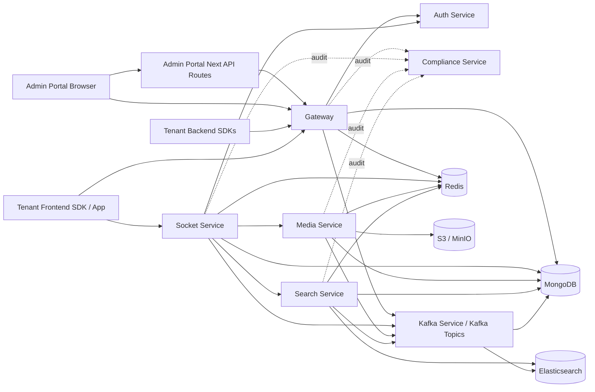
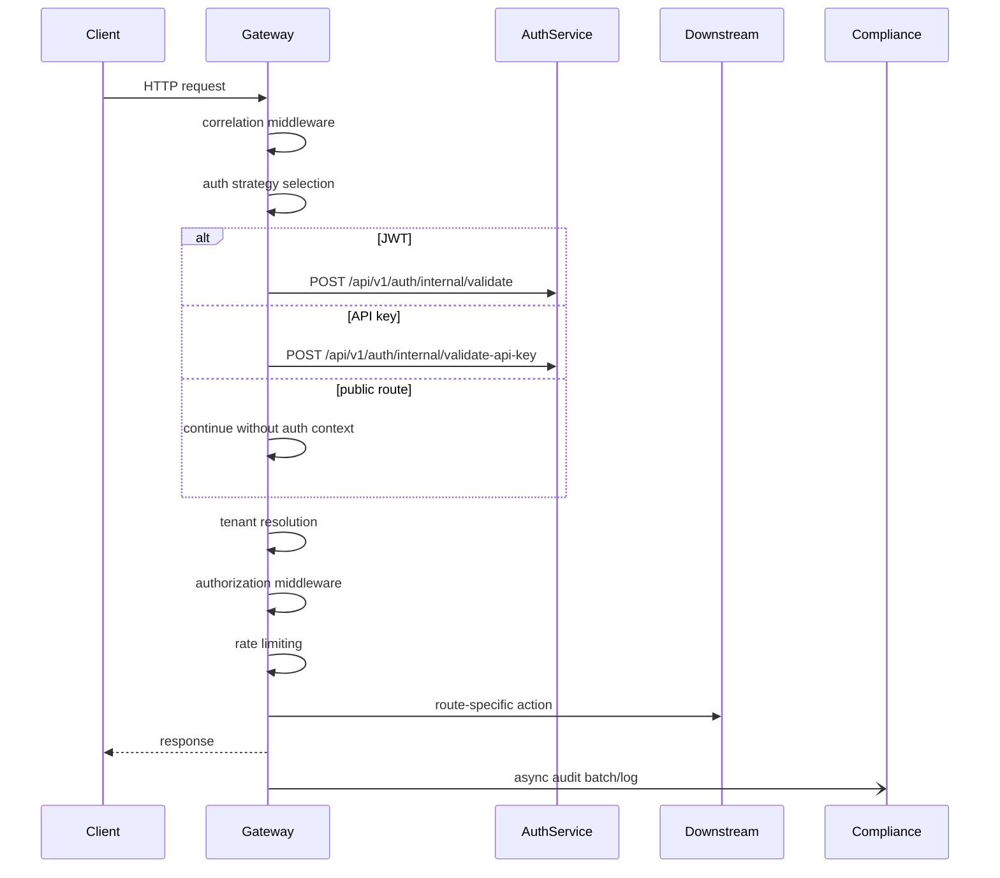
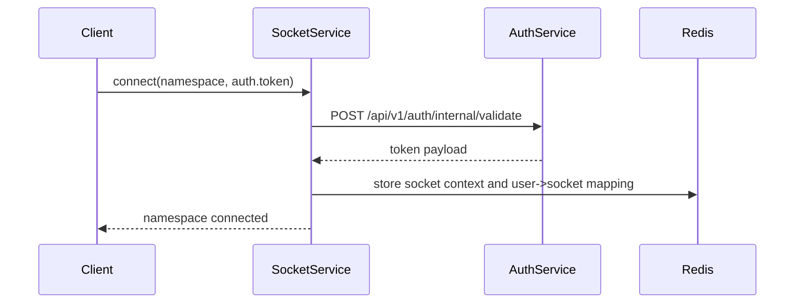

# Current Request Architecture

This document maps the real request paths that are currently implemented in this repo.

It is based on:

- `docs/DOCUMENTATION_INDEX.md` for the old module map
- `tasks/phases/*` for phase intent
- the mounted route and socket registrations under `services/*`
- the actual callers under `apps/admin-portal` and `apps/sdks`

It does not treat unmounted route files as live API surface.

## 1. What Is Actually Live

The current external request surface is split into three real entry patterns:

| Entry pattern | Main callers | Transport | Runtime owner |
|---|---|---|---|
| Admin portal auth bootstrap | `apps/admin-portal` Next route handlers | HTTP | `admin-portal` -> `gateway` -> `auth-service` |
| Tenant admin APIs | `apps/admin-portal/src/lib/api/*` | HTTP | `gateway` |
| Tenant end-user runtime | frontend and backend SDKs, tenant apps | HTTP + Socket.IO | `gateway` for session bootstrap, `socket-service` for realtime |

There are also standalone service-local HTTP servers:

| Service | Exposed directly | Current app caller found | Notes |
|---|---|---|---|
| `auth-service` | Yes | Indirect via gateway and admin portal proxy routes | Real downstream authority for JWT, sessions, API keys, tenant admin login |
| `media-service` | Yes | No current app caller found | Current socket media client expects different paths than the mounted media routes |
| `search-service` | Yes | No current app caller found | Current socket search client expects different paths and methods than the mounted search routes |
| `compliance-service` | Yes | Indirect only | Used by gateway, auth, socket, media, search for audit logging |

Not live at the gateway today:

- conversation and message HTTP routes are present in files but are not mounted in `services/gateway/src/routes/v1/index.ts`
- gateway-level search and media route files exist but are not mounted in `services/gateway/src/routes/v1/index.ts`

That means current messaging is socket-first, not HTTP-first.

## 2. System-Wide Request Graph

## 3. Gateway Request Pipeline

Every mounted gateway HTTP request follows this shape:

Cross-cutting runtime behavior in `gateway`:

- correlation ID is added first
- audit/compliance logging is added on every non-health request
- auth strategies support JWT, API key, and SDK auth
- tenant context is derived after auth
- authorization runs before the route handler
- rate limiting runs after authorization
- gateway sometimes answers directly from MongoDB instead of proxying

## 4. Tenant Admin HTTP Request Catalog

### 4.1 Admin portal bootstrap requests

These requests start in the Next.js app and are proxied server-side before cookies are set/cleared.

| User action | Browser path | Downstream path | End-to-end flow |
|---|---|---|---|
| Register tenant admin and first project | `POST /api/auth/register` | `gateway /api/v1/auth/client/register` -> `auth-service /api/v1/auth/client/register` | Admin portal route proxies request to gateway, gateway proxies to auth-service, auth-service persists client, tenant, project, API key inventory |
| Login tenant admin | `POST /api/auth/login` | `gateway /api/v1/auth/client/login` -> `auth-service /api/v1/auth/client/login` | Auth-service validates admin credentials, issues access and refresh tokens, admin portal stores cookies |
| Refresh tenant admin session | `POST /api/auth/refresh` | `gateway /api/v1/auth/client/refresh` -> `auth-service /api/v1/auth/client/refresh` | Admin portal reads refresh cookie, gateway proxies to auth-service, response updates cookies |
| Logout tenant admin | `POST /api/auth/logout` | none | Current implementation clears cookies in the admin portal only; it does not call gateway or auth-service |

### 4.2 Tenant admin management APIs through gateway

These are the live gateway HTTP requests used by the admin app after login.

| User action | Public path | Auth mode | Real request trace |
|---|---|---|---|
| Get current tenant record | `GET /api/v1/tenant` | JWT | Browser -> gateway -> tenant resolver -> Mongo `caas_platform.clients` lookup -> response |
| Update tenant settings | `PUT /api/v1/tenant/settings` | JWT | Browser -> gateway -> Mongo `caas_platform.clients.updateOne` -> response |
| Get tenant usage | `GET /api/v1/tenant/usage` | JWT | Browser -> gateway -> `DashboardStatsService` -> Mongo tenant DB + platform media collection aggregation -> response |
| List projects | `GET /api/v1/auth/client/projects` | JWT | Browser -> gateway -> auth middleware resolves client context -> gateway auth client -> auth-service management route -> Mongo platform records |
| Create project | `POST /api/v1/auth/client/projects` | JWT | Browser -> gateway -> auth-service management route -> Mongo platform records |
| Update project | `PATCH /api/v1/auth/client/projects/:project_id` | JWT | Browser -> gateway -> auth-service management route -> Mongo platform records |
| Archive project | `POST /api/v1/auth/client/projects/:project_id/archive` | JWT | Browser -> gateway -> auth-service management route -> Mongo platform records |
| Select active project | `POST /api/v1/auth/client/projects/select` | JWT | Browser -> gateway -> auth-service management route -> active project stored in auth-side client record |
| Get client API key inventory | `GET /api/v1/auth/client/api-keys` | JWT | Browser -> gateway -> auth-service management route -> auth-side API key inventory |
| Rotate secondary API key | `POST /api/v1/auth/client/api-keys/rotate` | JWT | Browser -> gateway -> auth-service -> rotate key material -> response |
| Promote secondary API key | `POST /api/v1/auth/client/api-keys/promote` | JWT | Browser -> gateway -> auth-service -> swap primary/secondary role -> response |
| Revoke API key by type | `POST /api/v1/auth/client/api-keys/revoke` | JWT | Browser -> gateway -> auth-service -> revoke selected key -> response |
| Get IP whitelist | `GET /api/v1/auth/client/ip-whitelist` | JWT | Browser -> gateway -> auth-service management route -> client security settings read |
| Add IP whitelist entry | `POST /api/v1/auth/client/ip-whitelist` | JWT | Browser -> gateway -> auth-service management route -> client security settings update |
| Remove IP whitelist entry | `DELETE /api/v1/auth/client/ip-whitelist/:ip` | JWT | Browser -> gateway -> auth-service management route -> client security settings update |
| Get origin whitelist | `GET /api/v1/auth/client/origin-whitelist` | JWT | Browser -> gateway -> auth-service management route -> client security settings read |
| Add origin whitelist entry | `POST /api/v1/auth/client/origin-whitelist` | JWT | Browser -> gateway -> auth-service management route -> client security settings update |
| Remove origin whitelist entry | `DELETE /api/v1/auth/client/origin-whitelist/:origin` | JWT | Browser -> gateway -> auth-service management route -> client security settings update |
| Get dashboard cards | `GET /api/v1/admin/dashboard` | JWT | Browser -> gateway -> `DashboardStatsService` -> Mongo tenant DB + analytics DB -> response |
| Get capability manifest | `GET /api/v1/admin/capabilities` | JWT | Browser -> gateway -> local env-driven manifest -> response |
| Get monitoring dashboard | `GET /api/v1/admin/monitoring` | JWT | Browser -> gateway -> Mongo stats + compliance audit log aggregation + gateway dependency health checks + external service `/health` probes |
| Get compliance summary | `GET /api/v1/admin/compliance` | JWT | Browser -> gateway -> Mongo `caas_compliance.audit_logs` aggregation |
| Get security summary | `GET /api/v1/admin/security` | JWT | Browser -> gateway -> Mongo `caas_compliance.audit_logs` aggregation |
| Get privacy summary | `GET /api/v1/admin/privacy` | JWT | Browser -> gateway -> static blocked/degraded placeholder response |
| Query tenant audit trail | `GET /api/v1/audit/query` | JWT | Browser -> gateway -> Mongo `caas_compliance.audit_logs.find/count` -> response |
| Verify audit event hash-chain linkage | `POST /api/v1/audit/verify` | JWT | Browser -> gateway -> Mongo `caas_compliance.audit_logs.findOne` + previous-hash check |
| Export tenant audit trail | `GET /api/v1/audit/export` | JWT | Browser -> gateway -> Mongo `caas_compliance.audit_logs.find` -> JSON or CSV |
| Query authorization audit logs | `GET /api/v1/admin/audit/authorization` | JWT | Browser -> gateway -> Mongo `caas_compliance.audit_logs.find/count` -> response |
| Get authorization audit stats | `GET /api/v1/admin/audit/authorization/stats` | JWT | Browser -> gateway -> Mongo `caas_compliance.audit_logs.countDocuments` |
| Export authorization audit logs | `GET /api/v1/admin/audit/authorization/export` | JWT | Browser -> gateway -> Mongo `caas_compliance.audit_logs.find` -> JSON or CSV |
| Create webhook config | `POST /api/v1/webhooks` | JWT | Browser -> gateway -> `WebhookService` in-memory store |
| List webhook configs | `GET /api/v1/webhooks` | JWT | Browser -> gateway -> `WebhookService` in-memory store |
| Delete webhook config | `DELETE /api/v1/webhooks/:id` | JWT | Browser -> gateway -> `WebhookService` in-memory store |
| Get webhook delivery logs | `GET /api/v1/webhooks/:id/logs` | JWT | Browser -> gateway -> mock in-memory log list |
| List current user sessions | `GET /api/v1/sessions` | JWT | Browser -> gateway -> session store -> response |
| Revoke one session | `DELETE /api/v1/sessions/:id` | JWT | Browser -> gateway -> revocation service + socket device sync + audit log |
| Revoke all other sessions | `DELETE /api/v1/sessions/others` | JWT | Browser -> gateway -> revocation service + socket broadcast + audit log |
| Revoke all sessions | `DELETE /api/v1/sessions/all` | JWT | Browser -> gateway -> revocation service + socket invalidation + audit log |

### 4.3 Additional mounted gateway routes that are live but not primary admin-portal paths

| Public path | Real current behavior |
|---|---|
| `POST /api/v1/auth/sdk/token` | Legacy gateway wrapper that calls auth-service SDK session creation using `app_secret` as API key |
| `POST /api/v1/auth/logout` | Local gateway refresh-token revoke helper only; does not call auth-service |
| `GET /api/v1/auth/api-keys` | Gateway-local in-memory API key list for authenticated user tenant |
| `POST /api/v1/auth/api-keys` | Gateway-local in-memory API key creation |
| `DELETE /api/v1/auth/api-keys/:id` | Gateway-local in-memory API key delete |
| `GET /api/v1/ping` | Simple mounted test route |

### 4.4 Mounted but path-drifted admin and MFA routes

These are real mounted paths created by the current prefix composition, even though several app helpers appear to expect shorter paths.

| Actual mounted path | Why it looks odd | Real request trace |
|---|---|---|
| `POST /api/v1/mfa/mfa/challenge` | route file includes `/mfa/*` while mounted under `/api/v1/mfa` | gateway -> Redis challenge record |
| `POST /api/v1/mfa/mfa/verify` | same double prefix | gateway -> tenant Mongo user record + MFA enforcement + audit log |
| `POST /api/v1/mfa/mfa/backup` | same double prefix | gateway -> tenant Mongo backup code consume + MFA enforcement + audit log |
| `GET /api/v1/mfa/mfa/status` | same double prefix | gateway -> tenant Mongo user record + trusted-device check |
| `GET /api/v1/admin/admin/users/:userId/sessions` | subroute already includes `/admin/*` and is mounted under `/admin` | gateway -> session store |
| `DELETE /api/v1/admin/admin/sessions/:id` | same double prefix | gateway -> revocation service + socket invalidation + audit log |
| `DELETE /api/v1/admin/admin/users/:userId/sessions` | same double prefix | gateway -> revocation service + socket invalidation + audit log |
| `GET /api/v1/admin/admin/sessions/active` | same double prefix | gateway -> Redis session key scan + session store |
| `GET /api/v1/admin/admin/tenant/mfa` | same double prefix | gateway -> Mongo tenant record |
| `PUT /api/v1/admin/admin/tenant/mfa` | same double prefix | gateway -> Mongo tenant record update + audit log |
| `GET /api/v1/admin/admin/users/mfa-status` | same double prefix | gateway -> tenant Mongo users query |
| `POST /api/v1/admin/admin/users/:userId/mfa/enforce` | same double prefix | gateway -> tenant Mongo user update + audit log |
| `POST /api/v1/admin/admin/mfa/enforce-all` | same double prefix | gateway -> tenant Mongo bulk update + audit log |

## 5. Backend SDK HTTP Catalog

All current SDK implementations in `apps/sdks/backend/*` and the web core in `apps/sdks/frontend/sdk-web-core` converge on the same gateway session bootstrap surface.

| SDK request | Public path | Auth mode | End-to-end flow |
|---|---|---|---|
| Health probe | `GET /api/v1/sdk/health` | API key optional for callers, gateway reports auth-client health | SDK -> gateway -> local auth-client circuit-breaker state |
| Capability discovery | `GET /api/v1/sdk/capabilities` | API key required | SDK -> gateway auth middleware -> auth-service internal API key validation -> capability manifest response |
| Create end-user session | `POST /api/v1/sdk/session` | API key required | SDK -> gateway auth middleware -> auth-service internal API key validation -> gateway header/project-scope validation -> auth-service `POST /api/v1/auth/sdk/session` -> token issue |
| Refresh end-user session | `POST /api/v1/sdk/refresh` | refresh token | SDK -> gateway -> auth-service `POST /api/v1/auth/refresh` |
| Logout end-user session | `POST /api/v1/sdk/logout` | Bearer token | SDK -> gateway -> auth-service `POST /api/v1/auth/logout` |

Practical outcome:

- the backend SDKs are currently bootstrap libraries, not full messaging clients
- the frontend web SDK is bootstrap plus socket orchestration
- successful session creation returns access and refresh tokens that are then used against `socket-service`

## 6. Tenant End-User Socket Catalog

### 6.1 Common socket connection flow

All namespaces use the same connection pattern.

Shared socket side effects:

- token validation is delegated to `auth-service`
- socket context is cached in Redis
- connection counts and tenant connection counts are tracked in Redis
- compliance client is initialized for the process

### 6.2 `/chat` namespace

| End-user request | Event | Real current trace |
|---|---|---|
| Join conversation room | `joinRoom` | Client -> socket-service -> Redis room join rate limiter -> Mongo/Redis room authorization -> room state stored in Redis |
| Leave conversation room | `leaveRoom` | Client -> socket-service -> room leave -> typing state cleanup in Redis |
| Send text message | `sendMessage` | Client -> socket-service -> membership check -> Redis rate limit + spam/flood checks -> Mongo/Redis authorization -> realtime emit to room -> Kafka publish for persistence |
| Mark one message delivered | `message_delivered` | Client -> socket-service -> Redis delivery receipt store -> emit `delivery_receipt` to room |
| Mark many messages delivered | `messages_delivered` | Client -> socket-service -> Redis delivery receipt batch update -> emit latest `delivery_receipt` |
| Query delivery status | `delivery_status` | Client -> socket-service -> Redis delivery receipt lookup |
| Start typing | `typing_start` | Client -> socket-service -> room membership check -> typing rate limit -> Redis typing state -> emit `user_typing` |
| Stop typing | `typing_stop` | Client -> socket-service -> Redis typing state clear |
| Query typing users | `typing_query` | Client -> socket-service -> Redis typing state lookup |
| Mark one message read | `message_read` | Client -> socket-service -> room membership check -> Redis read receipt + unread counter update -> emit `read_receipt` and `unread_count` |
| Mark many messages read | `messages_read` | Client -> socket-service -> Redis read receipt batch update -> unread counter reset -> emits |
| Mark conversation read to watermark | `conversation_read` | Client -> socket-service -> Redis read watermark update -> unread counter reset -> emits |
| Query unread counters | `unread_query` | Client -> socket-service -> Redis unread map lookup |
| Kick user | `moderate:kick` | Client -> socket-service -> moderation service -> room state update -> emit `moderation:kicked` |
| Ban user | `moderate:ban` | Client -> socket-service -> moderation service -> room state update -> emit `moderation:banned` |
| Unban user | `moderate:unban` | Client -> socket-service -> moderation service |
| Mute user | `moderate:mute` | Client -> socket-service -> moderation service -> emit `moderation:muted` |
| Unmute user | `moderate:unmute` | Client -> socket-service -> moderation service -> emit `moderation:unmuted` |

Current async message persistence path after `sendMessage`:

1. socket-service emits the message to the room immediately
2. socket-service publishes a Kafka message envelope
3. Kafka persistence consumer persists message and conversation timestamps into MongoDB
4. search-service Kafka indexer subscribes to message topics and writes search documents into Elasticsearch

### 6.3 `/presence` namespace

| End-user request | Event | Real current trace |
|---|---|---|
| Set own presence | `presence_update` | Client -> socket-service -> `PresenceManager` -> Redis presence store |
| Subscribe to one user presence | `presence_subscribe` string form | Client -> socket-service -> `PresenceManager` subscription -> immediate current presence emit if available |
| Subscribe to many users presence | `presence_subscribe` object form | Client -> socket-service -> presence authorizer -> Redis subscriber store -> bulk status lookup |
| Unsubscribe from one user | `presence_unsubscribe` string form | Client -> socket-service -> `PresenceManager` unsubscribe |
| Unsubscribe from many users | `presence_unsubscribe` object form | Client -> socket-service -> `PresenceSubscriber` unsubscribe |
| Query active subscriptions | `presence_subscriptions_query` | Client -> socket-service -> Redis subscription lookup |

Server-driven presence emits include:

- `presence_update_for_subscribed_user`
- notifier-driven presence events to user rooms and subscribed rooms

### 6.4 `/webrtc` namespace

| End-user request | Event | Real current trace |
|---|---|---|
| Get ICE servers | `webrtc:get-ice-servers` | Client -> socket-service -> ICE server provider |
| Send SDP offer | `webrtc:offer` | Client -> socket-service -> signaling validation -> relay to target user socket |
| Send SDP answer | `webrtc:answer` | Client -> socket-service -> signaling validation -> relay to target user socket |
| Send ICE candidate | `webrtc:ice-candidate` | Client -> socket-service -> signaling validation -> relay to target user socket |
| Initiate call | `call:initiate` | Client -> socket-service -> call manager -> Redis call state -> caller joins call room -> callee gets `call:incoming` |
| Answer call | `call:answer` | Client -> socket-service -> call manager -> callee joins call room -> caller gets `call:answered` |
| Reject call | `call:reject` | Client -> socket-service -> call manager -> caller gets `call:rejected` |
| Hang up call | `call:hangup` | Client -> socket-service -> call terminator -> room leave -> call history persistence |
| Start screen share | `screen:start` | Client -> socket-service -> broadcast `screen:started` to call room |
| Stop screen share | `screen:stop` | Client -> socket-service -> broadcast `screen:stopped` to call room |
| Screen SDP offer | `screen:offer` | Client -> socket-service -> relay to target user |
| Screen SDP answer | `screen:answer` | Client -> socket-service -> relay to target user |

### 6.5 Media and search socket events

These handlers are mounted on every authenticated socket connection, but they currently sit on top of downstream contract drift.

| End-user request | Event | Current coded trace | Status |
|---|---|---|---|
| Request upload URL | `media:request-upload` | Client -> socket-service -> rate limit + auth -> media client `POST /api/media/upload-url` | Socket side implemented, downstream media path not mounted in current media-service |
| Confirm upload completion | `media:upload-complete` | Client -> socket-service -> media client `GET /api/media/validate/:fileId` | Socket side implemented, downstream path not mounted |
| Get download URL | `media:get-download-url` | Client -> socket-service -> rate limit + auth -> media client `GET /api/media/download-url/:fileId` | Socket side implemented, downstream path not mounted |
| Delete file | `media:delete` | Client -> socket-service -> rate limit + auth -> media client `DELETE /api/media/:fileId` | Socket side implemented, downstream path not mounted |
| Search messages | `search:messages` | Client -> socket-service -> rate limit + auth -> search client `POST /api/search/messages` | Socket side implemented, downstream path/method not mounted in current search-service |
| Search conversations | `search:conversations` | Client -> socket-service -> rate limit + auth -> search client `POST /api/search/conversations` | Same mismatch |
| Search users | `search:users` | Client -> socket-service -> rate limit + auth -> search client `POST /api/search/users` | Same mismatch |

## 7. Standalone Service-Local HTTP Surfaces

These are real servers in the repo, but they are not the primary user-facing paths found in the current apps.

### 7.1 Auth service

Mounted server:

- `/health`
- `/api/v1/auth/*`
- `/api/v1/users/*`
- `/api/v1/sessions/*`
- `/api/v1/auth/internal/*`
- `/api/v1/auth/client/*`
- `/api/v1/auth/sdk/*`

Main role in request journeys:

- validates JWTs for gateway and socket-service
- validates API keys for gateway SDK routes
- issues admin and end-user session tokens
- manages refresh, logout, sessions, client projects, client API keys, IP and origin whitelists

### 7.2 Media service

Mounted routes today:

- `POST /upload`
- `POST /upload/chunk`
- `POST /upload/chunk/:uploadId`
- `POST /upload/complete/:uploadId`
- `GET /upload/:id/progress`
- `GET /download/:id`
- `GET /download/:id/signed`
- `GET /stream/:id`
- `GET /files/:id`
- `DELETE /files/:id`

Current downstream behavior:

- auth middleware + tenant middleware gate requests
- file bytes go to S3/MinIO
- metadata goes to MongoDB
- progress and counters go to Redis
- media events are published to Kafka

### 7.3 Search service

Mounted routes today:

- `GET /health`
- `GET /search/messages`
- `GET /search/conversations`
- `GET /search/users`
- `GET /search`
- `GET /search/suggestions`
- `GET /search/recent`
- `POST /admin/reindex`
- `GET /metrics`

Current downstream behavior:

- Elasticsearch is the query engine
- Redis stores recent searches and suggestion cache
- Kafka indexer consumes message and conversation topics to keep indices fresh

## 8. Data Sink Map By Request Type

| Request family | Primary write targets | Secondary/async targets |
|---|---|---|
| Admin auth and tenant management | auth-service MongoDB and Redis | compliance-service audit logs |
| Gateway dashboard, tenant info, audit read APIs | MongoDB read only | compliance-service receives the gateway request log |
| Session revoke and MFA actions | Redis session stores, tenant MongoDB | socket invalidation events, compliance/audit logs |
| Chat sendMessage | Socket.IO room emit first | Kafka -> MongoDB persistence -> Elasticsearch indexing |
| Read receipts, delivery receipts, unread counts, typing, presence | Redis | socket emits to affected clients |
| WebRTC signaling and call control | Redis call state | socket emits and call history persistence |
| Media direct service uploads/downloads | S3/MinIO, MongoDB, Redis | Kafka media events |
| Search direct service queries | Elasticsearch, Redis cache | compliance-service request audit |

## 9. Known Implementation Drift You Should Treat As Current-State Facts

1. Gateway message and conversation HTTP files exist but are not mounted. Current message traffic is socket-first.
2. Gateway search and media route files also exist but are not mounted in the live v1 route tree.
3. MFA gateway routes are mounted with doubled `/mfa/mfa/*` paths because the route file and the parent registration both include `mfa`.
4. Several admin session and admin MFA routes are mounted with doubled `/admin/admin/*` paths for the same reason.
5. The socket media client expects `/api/media/*` endpoints, but the media service currently mounts `/upload`, `/download`, `/files`, and `/stream` routes instead.
6. The socket search client expects `POST /api/search/*`, but the search service currently mounts `GET /search/*` routes.
7. Gateway `/api/v1/auth/api-keys*` routes are local in-memory mock storage, while `/api/v1/auth/client/api-keys*` goes through auth-service and is the real tenant-admin inventory path.
8. Admin portal logout currently clears cookies only; it does not revoke the remote session.

## 10. Short Version

If you need one sentence per user type:

- Tenant admin requests mostly go `Admin Portal -> Gateway -> Auth Service or MongoDB`, with audit logging sent asynchronously to `compliance-service`.
- Tenant end-user bootstrap goes `Tenant App/SDK -> Gateway /api/v1/sdk/* -> Auth Service`, then realtime goes `Tenant App/SDK -> Socket Service namespaces`.
- Live messaging goes `Socket Service -> Kafka -> MongoDB -> Elasticsearch`, while media and search socket flows are present in socket-service code but do not currently match the mounted media/search service HTTP contracts.
