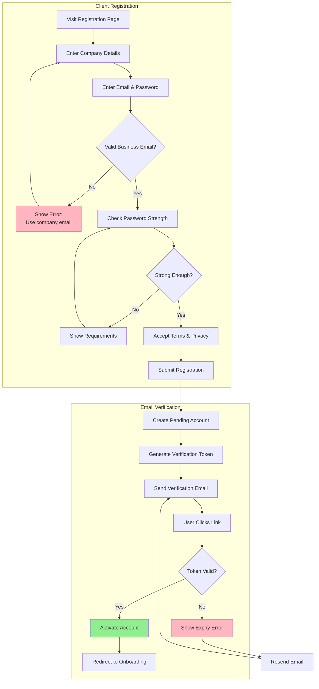
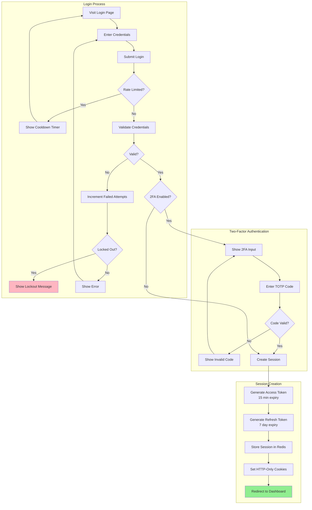
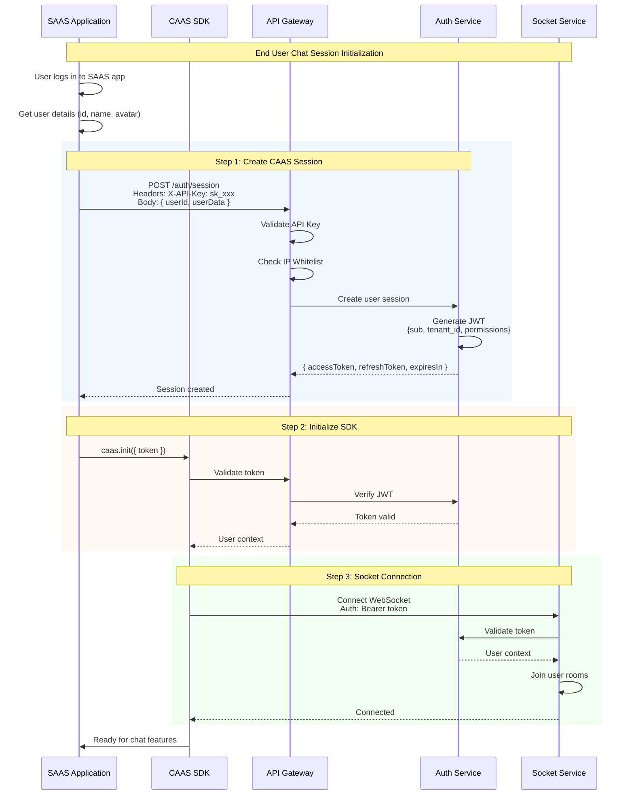
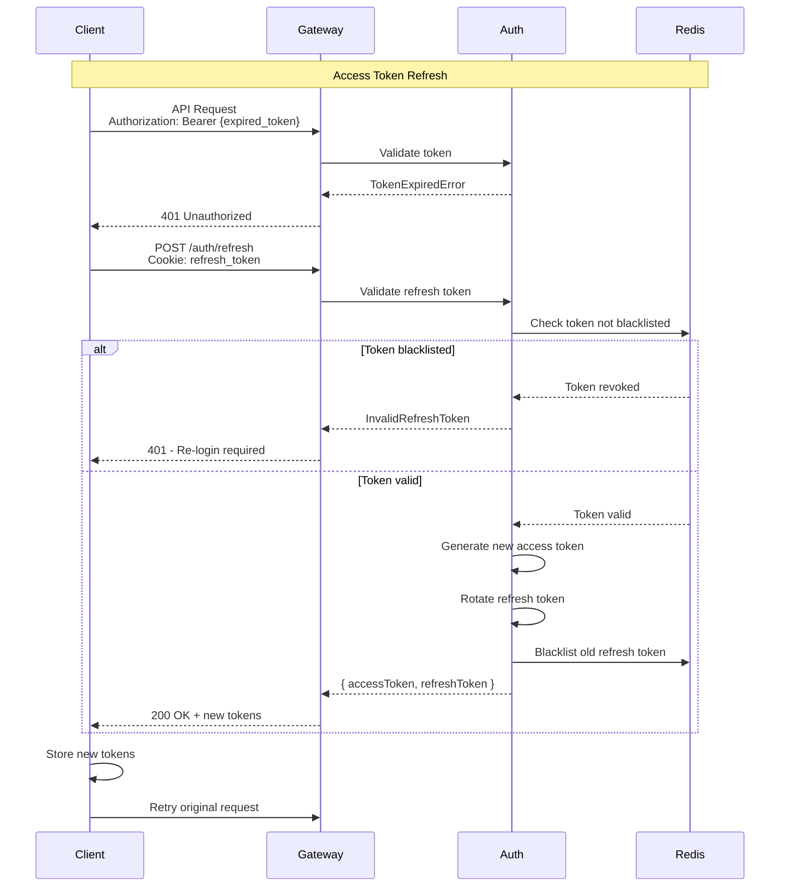
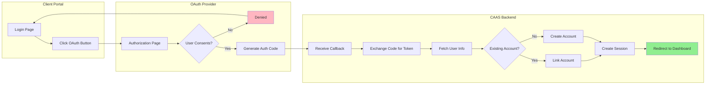
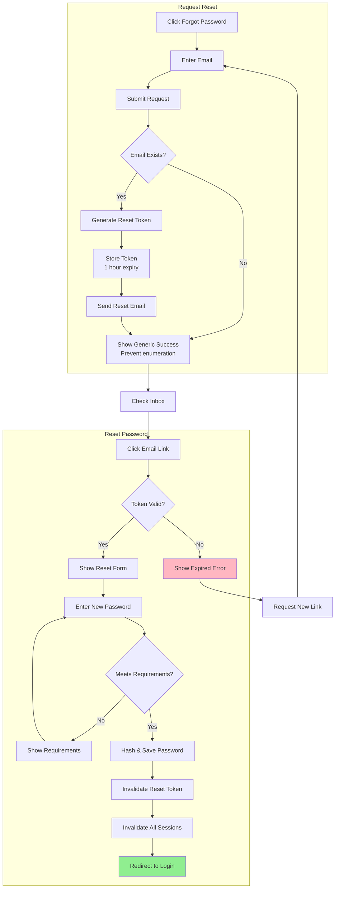

# Flow Diagram: Authentication Flow

> **Related Roadmaps**: 
> - [Client Facing UI](../roadmaps/1_clientFacingUI.md)
> - [Auth, Authorization & Security](../roadmaps/3_AuthAutorizeSecurity.md)
> - [API Gateway](../roadmaps/2_publicalllyExposedGateway.md)

---

## Overview

Complete authentication flows for both SAAS clients (dashboard access) and end users (chat access).

---

## 1. SAAS Client Registration Flow



---

## 2. SAAS Client Login Flow



---

## 3. End User Authentication Flow



---

## 4. Token Refresh Flow



---

## 5. OAuth Integration Flow



---

## 6. Password Reset Flow



---

## 7. Session Lifecycle

```
┌─────────────────────────────────────────────────────────────────┐
│                     SESSION LIFECYCLE                            │
├─────────────────────────────────────────────────────────────────┤
│                                                                  │
│  ┌──────────┐   ┌──────────┐   ┌──────────┐   ┌──────────┐     │
│  │  CREATE  │──▶│  ACTIVE  │──▶│ EXPIRING │──▶│ EXPIRED  │     │
│  └──────────┘   └──────────┘   └──────────┘   └──────────┘     │
│       │              │              │              │             │
│       ▼              ▼              ▼              ▼             │
│  [Login/Register]  [Active Use]  [Near Timeout]  [Timed Out]   │
│                        │              │                          │
│                        │              ▼                          │
│                        │       ┌──────────┐                      │
│                        │       │ REFRESHED │                     │
│                        │       └───────────┘                     │
│                        │              │                          │
│                        ◀──────────────┘                          │
│                                                                  │
│  Special States:                                                 │
│  ┌──────────┐   ┌──────────┐   ┌──────────┐                     │
│  │ REVOKED  │   │ SUSPENDED│   │ FORCE    │                     │
│  │          │   │          │   │ LOGOUT   │                     │
│  └──────────┘   └──────────┘   └──────────┘                     │
│       ▲              ▲              ▲                            │
│       │              │              │                            │
│  [Admin Action]  [Security]   [User Action]                     │
│                                                                  │
└─────────────────────────────────────────────────────────────────┘

TOKEN TIMINGS:
┌─────────────────────────────────────────────────────────────────┐
│ Access Token:  [████████████████░░░░░░░░░]  15 minutes         │
│ Refresh Token: [██████████████████████████████████████] 7 days │
│ Session Max:   [██████████████████████████████████████] 30 days│
└─────────────────────────────────────────────────────────────────┘
```

---

## Related Documents

- [Client UI Authentication Flow](../deepDive/clientFacingUI/authentication-flow.md)
- [Gateway Security Implementation](../deepDive/publicGateway/security-implementation.md)
- [API Key Security](../rnd/api-key-security.md)
