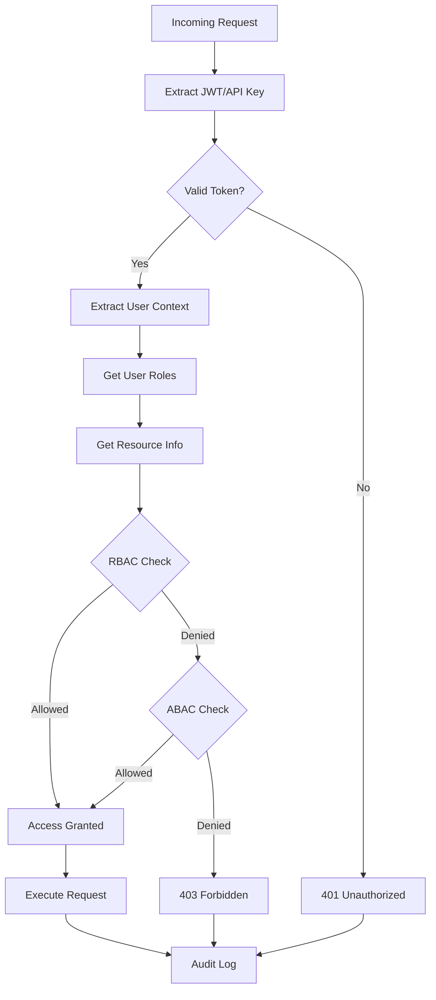
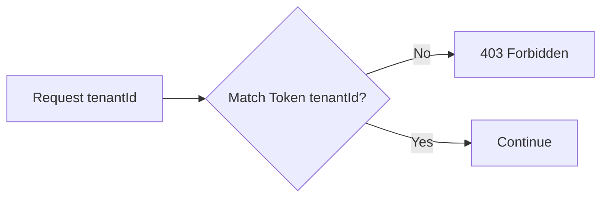

# Authorization Decision Flow

> Visual flow diagram for permission checking and access control decisions.

---

## Overview

How authorization decisions are made for each API request.

---

## Flow Diagram



---

## Decision Layers

### Layer 1: Authentication
- Token validation (JWT signature, expiry)
- API key verification
- Session validation

### Layer 2: RBAC (Role-Based)
```typescript
const rolePermissions = {
  admin: ['read', 'write', 'delete', 'manage'],
  member: ['read', 'write'],
  viewer: ['read'],
  guest: ['read:public']
};

function checkRBAC(userRole: string, action: string): boolean {
  return rolePermissions[userRole]?.includes(action) ?? false;
}
```

### Layer 3: ABAC (Attribute-Based)
```typescript
interface PolicyContext {
  subject: { userId, role, department };
  resource: { type, id, ownerId, tenantId };
  action: string;
  environment: { time, ip, location };
}

// Example policies
const policies = [
  {
    effect: 'allow',
    condition: (ctx) => ctx.resource.ownerId === ctx.subject.userId,
    actions: ['read', 'write', 'delete']
  },
  {
    effect: 'deny',
    condition: (ctx) => ctx.environment.time.getHours() < 9,
    actions: ['*'],
    description: 'No access before 9 AM'
  }
];
```

---

## Tenant Isolation Check



---

## Related Documents
- [Authentication Flow](./authentication-flow.md)
- [Auth & Security Roadmap](../roadmaps/3_AuthAutorizeSecurity.md)
