# Billing Flow

> Visual flow for the complete billing lifecycle.

---

## Flow Diagram

```mermaid
flowchart TD
    subgraph Setup["Subscription Setup"]
        A[Client Signs Up] --> B[Select Plan]
        B --> C[Enter Payment Method]
        C --> D[Create Stripe Customer]
        D --> E[Create Subscription]
        E --> F[Provision Resources]
    end
    
    subgraph Monthly["Monthly Cycle"]
        G[Billing Period Start] --> H[Track Usage]
        H --> I[End of Period]
        I --> J[Calculate Usage]
        J --> K[Generate Invoice]
        K --> L{Auto-Pay?}
        L -->|Yes| M[Charge Card]
        L -->|No| N[Send Invoice]
        M --> O{Success?}
        O -->|Yes| P[Invoice Paid]
        O -->|No| Q[Retry Flow]
    end
    
    subgraph Upgrade["Plan Changes"]
        R[Request Upgrade] --> S[Calculate Proration]
        S --> T[Update Subscription]
        T --> U[Charge/Credit Difference]
    end
    
    subgraph Cancellation["Cancellation"]
        V[Request Cancel] --> W{Immediate?}
        W -->|Yes| X[Cancel Now]
        W -->|No| Y[Cancel at Period End]
        X --> Z[Final Invoice]
        Y --> AA[Continue Until End]
        AA --> Z
    end
```



---

## Billing States

```typescript
type SubscriptionStatus = 
  | 'trialing'      // In trial period
  | 'active'        // Paying customer
  | 'past_due'      // Payment failed, retrying
  | 'unpaid'        // All retries failed
  | 'canceled'      // Subscription ended
  | 'paused';       // Temporarily paused

type InvoiceStatus = 
  | 'draft'         // Being prepared
  | 'open'          // Awaiting payment
  | 'paid'          // Successfully paid
  | 'void'          // Canceled
  | 'uncollectible'; // Write-off
```

---

## Usage Aggregation

```typescript
// Daily aggregation job
async function aggregateDailyUsage(tenantId: string, date: Date) {
  const usage = {
    messages: await countMessages(tenantId, date),
    apiCalls: await countApiCalls(tenantId, date),
    activeUsers: await countActiveUsers(tenantId, date),
    storageBytes: await calculateStorage(tenantId)
  };
  
  await db.usageRecords.insertOne({
    tenantId,
    date,
    usage,
    aggregatedAt: new Date()
  });
}

// End of month billing
async function generateMonthlyInvoice(tenantId: string) {
  const subscription = await getSubscription(tenantId);
  const usage = await getMonthlyUsage(tenantId);
  
  const lineItems = [
    { description: 'Base Plan', amount: subscription.plan.price },
    ...calculateOverages(subscription.plan, usage)
  ];
  
  const invoice = await stripe.invoices.create({
    customer: subscription.stripeCustomerId,
    auto_advance: true,
    collection_method: 'charge_automatically'
  });
  
  for (const item of lineItems) {
    await stripe.invoiceItems.create({
      customer: subscription.stripeCustomerId,
      invoice: invoice.id,
      ...item
    });
  }
  
  return invoice;
}
```

---

## Proration Calculation

```typescript
function calculateProration(
  oldPlan: Plan,
  newPlan: Plan,
  daysRemaining: number,
  totalDays: number
): number {
  const oldDailyRate = oldPlan.price / totalDays;
  const newDailyRate = newPlan.price / totalDays;
  
  // Credit for unused old plan
  const credit = oldDailyRate * daysRemaining;
  
  // Charge for new plan remainder
  const charge = newDailyRate * daysRemaining;
  
  // Net proration (positive = charge, negative = credit)
  return charge - credit;
}
```

---

## Related Documents
- [Billing Architecture](../deepDive/billingPricing/billing-architecture.md)
- [Payment Flow](./payment-flow.md)
- [Usage Metering](./usage-metering.md)
