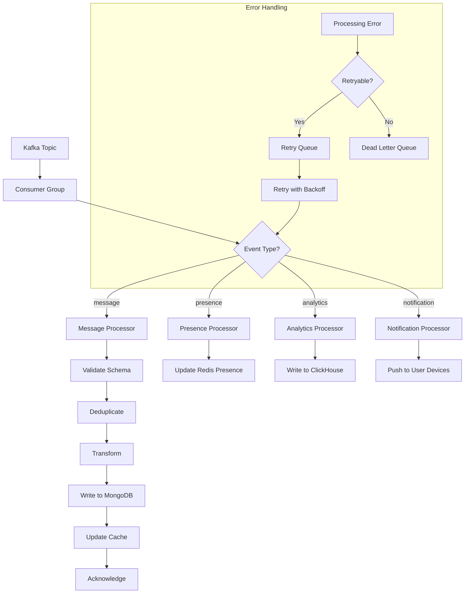

# Consumer Pipeline Flow

> Visual flow for Kafka consumer message processing.

---

## Flow Diagram



---

## Consumer Configuration

```typescript
const consumerConfig = {
  groupId: 'message-processor',
  maxBytesPerPartition: 1048576,  // 1MB
  maxWaitTimeInMs: 100,
  sessionTimeout: 30000,
  heartbeatInterval: 3000,
  rebalanceTimeout: 60000
};
```

---

## Processing Pipeline

```typescript
class MessageConsumer {
  async processMessage(message: KafkaMessage): Promise<void> {
    const event = this.deserialize(message);
    
    // 1. Validate
    this.validateSchema(event);
    
    // 2. Deduplicate
    if (await this.isDuplicate(event.id)) {
      return;
    }
    
    // 3. Process based on type
    switch (event.type) {
      case 'message:created':
        await this.handleMessageCreated(event);
        break;
      case 'message:edited':
        await this.handleMessageEdited(event);
        break;
      case 'message:deleted':
        await this.handleMessageDeleted(event);
        break;
    }
    
    // 4. Mark as processed
    await this.markProcessed(event.id);
  }
}
```

---

## Parallel Processing

```
Partition 0 ──→ Consumer Instance 1
Partition 1 ──→ Consumer Instance 1
Partition 2 ──→ Consumer Instance 2
Partition 3 ──→ Consumer Instance 2
Partition 4 ──→ Consumer Instance 3
Partition 5 ──→ Consumer Instance 3
```

---

## Related Documents
- [Consumer Patterns](../deepDive/kafkaService/consumer-patterns.md)
- [Kafka Topic Architecture](./kafka-topic-architecture.md)
