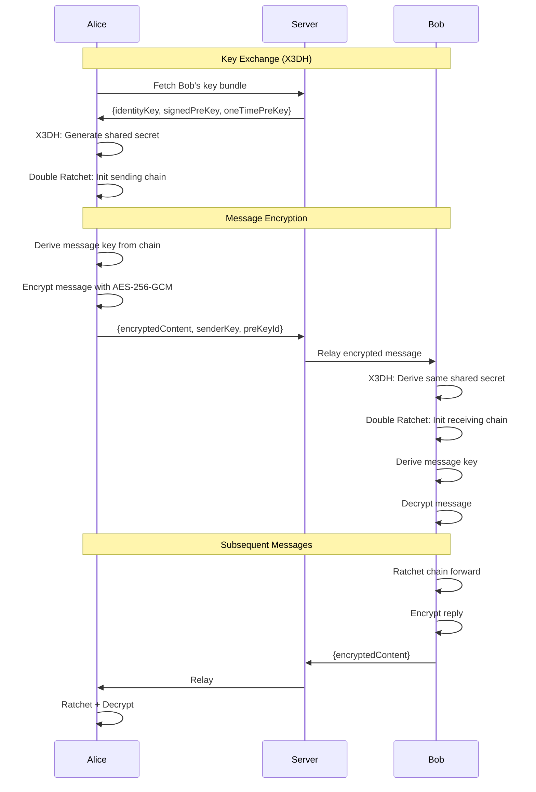

# E2E Encryption Flow

> Visual flow for end-to-end encrypted message exchange.

---

## Flow Diagram



---

## Encryption Steps

### 1. Key Bundle Generation (Per User)
```typescript
const keyBundle = {
  identityKey: Ed25519.generateKeyPair(),      // Long-term
  signedPreKey: X25519.generateKeyPair(),      // Rotated monthly
  oneTimePreKeys: Array(100).fill(0).map(() => 
    X25519.generateKeyPair()                    // One-time use
  )
};
```

### 2. X3DH Key Agreement
```typescript
// Sender (Alice) initiates
const sharedSecret = X3DH.sender({
  senderIdentity: aliceIdentity,
  senderEphemeral: generateEphemeralKey(),
  recipientIdentity: bobBundle.identityKey,
  recipientSignedPreKey: bobBundle.signedPreKey,
  recipientOneTimePreKey: bobBundle.oneTimePreKeys[0] // consumed
});
```

### 3. Double Ratchet
```typescript
// Provides forward secrecy
// Each message derives new keys
const messageKey = doubleRatchet.deriveMessageKey();
const encrypted = AES256GCM.encrypt(message, messageKey);
```

---

## Key Properties

| Property | Implementation |
|----------|----------------|
| Confidentiality | AES-256-GCM encryption |
| Forward Secrecy | Double Ratchet key derivation |
| Post-Compromise | Key rotation, new pre-keys |
| Deniability | Ephemeral keys, no signatures |

---

## Server Role
- **Zero Knowledge**: Server never sees plaintext
- **Key Distribution**: Stores public keys only
- **Message Relay**: Passes encrypted blobs

---

## Related Documents
- [E2E Key Management](../deepDive/authSecurity/e2e-key-management.md)
- [Signal Protocol R&D](../rnd/signal-protocol-implementation.md)
