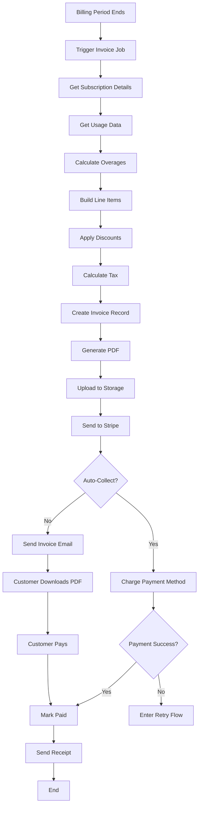

# Invoice Generation Flow

> Visual flow for invoice creation and delivery.

---

## Flow Diagram



---

## Invoice Lifecycle

```typescript
type InvoiceStatus = 
  | 'draft'        // Being prepared
  | 'open'         // Sent to customer
  | 'paid'         // Successfully paid
  | 'past_due'     // Payment overdue
  | 'void'         // Canceled
  | 'uncollectible'; // Write-off
```

---

## Invoice Number Format

```typescript
function generateInvoiceNumber(tenantId: string): string {
  const year = new Date().getFullYear();
  const sequence = await getNextSequence(tenantId, year);
  
  return `INV-${year}-${String(sequence).padStart(5, '0')}`;
  // Example: INV-2024-00042
}
```

---

## Line Item Types

| Type | Description | Example |
|------|-------------|---------|
| `subscription` | Base plan fee | Pro Plan - $199/mo |
| `usage` | Usage overage | 50K extra messages @ $0.001 |
| `one_time` | One-time charge | Setup fee |
| `credit` | Applied credit | Referral credit |
| `tax` | Tax amount | Sales Tax (8.25%) |

---

## Related Documents
- [Invoice System](../deepDive/billingPricing/invoice-system.md)
- [Billing Flow](./billing-flow.md)
