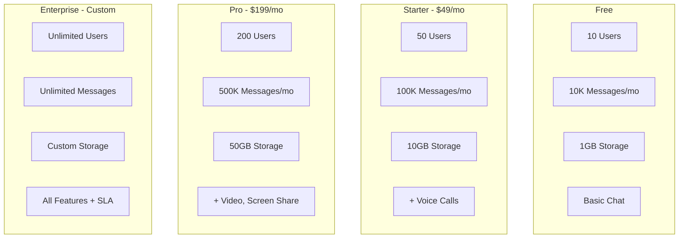

# Pricing Model Structure

> Visual representation of CAAS pricing tiers and calculations.

---

## Pricing Tiers



---

## Feature Matrix

| Feature | Free | Starter | Pro | Enterprise |
|---------|------|---------|-----|------------|
| Text Chat | ✅ | ✅ | ✅ | ✅ |
| File Sharing | 5MB | 25MB | 100MB | Custom |
| Voice Calls | ❌ | ✅ | ✅ | ✅ |
| Video Calls | ❌ | ❌ | ✅ | ✅ |
| Screen Share | ❌ | ❌ | ✅ | ✅ |
| E2E Encryption | ❌ | ✅ | ✅ | ✅ |
| Analytics | Basic | Standard | Advanced | Custom |
| Support | Community | Email | Priority | Dedicated |
| SLA | ❌ | 99% | 99.9% | 99.99% |

---

## Overage Pricing

```typescript
const overagePricing = {
  starter: {
    perExtraUser: 2.00,      // $/user/month
    per1000Messages: 0.50,    // $ per 1000+
    perGBStorage: 0.10        // $/GB/month
  },
  pro: {
    perExtraUser: 1.50,
    per1000Messages: 0.30,
    perGBStorage: 0.08
  }
};

function calculateOverage(plan: Plan, usage: Usage): number {
  let overage = 0;
  
  if (usage.users > plan.limits.users) {
    overage += (usage.users - plan.limits.users) * plan.overage.perExtraUser;
  }
  
  if (usage.messages > plan.limits.messages) {
    const extraMessages = usage.messages - plan.limits.messages;
    overage += Math.ceil(extraMessages / 1000) * plan.overage.per1000Messages;
  }
  
  if (usage.storageGB > plan.limits.storageGB) {
    overage += (usage.storageGB - plan.limits.storageGB) * plan.overage.perGBStorage;
  }
  
  return overage;
}
```

---

## Billing Calculation

```
Monthly Invoice
├── Base Plan: $199.00
├── Overage:
│   ├── +50 Users × $1.50 = $75.00
│   ├── +100K Messages × $0.30/1K = $30.00
│   └── +20GB Storage × $0.08 = $1.60
├── Subtotal: $305.60
├── Annual Discount (20%): -$61.12
├── Tax (10%): $24.45
└── Total: $268.93
```

---

## Related Documents
- [Billing Architecture](../deepDive/billingPricing/billing-architecture.md)
- [Usage Metering](./usage-metering.md)
