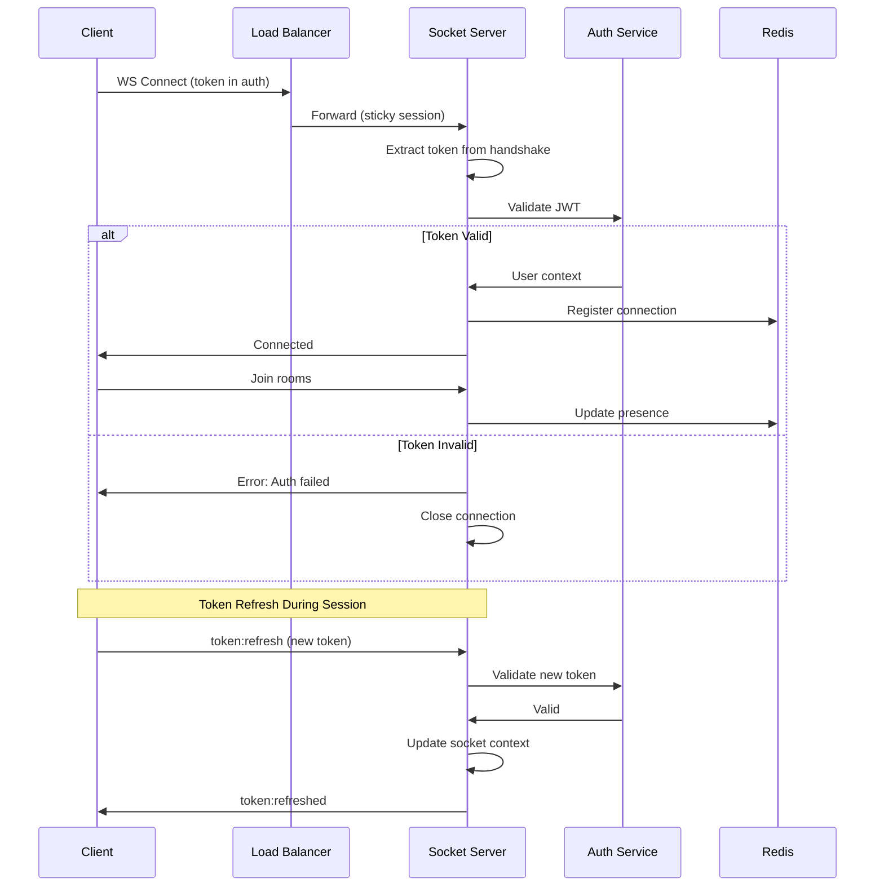

# Socket Authentication Flow

> Visual flow for WebSocket connection authentication.

---

## Flow Diagram



---

## Authentication Middleware

```typescript
io.use(async (socket, next) => {
  try {
    const token = socket.handshake.auth.token;
    
    if (!token) {
      return next(new Error('No token provided'));
    }
    
    // Validate JWT
    const decoded = await authService.verifyToken(token);
    
    // Check token not revoked
    const isRevoked = await redis.get(`revoked:${decoded.jti}`);
    if (isRevoked) {
      return next(new Error('Token revoked'));
    }
    
    // Attach user context to socket
    socket.userId = decoded.sub;
    socket.tenantId = decoded.tenant_id;
    socket.permissions = decoded.permissions;
    socket.tokenExp = decoded.exp;
    
    next();
  } catch (error) {
    next(new Error('Authentication failed'));
  }
});
```

---

## Token Refresh Over Socket

```typescript
socket.on('token:refresh', async (newToken, callback) => {
  try {
    const decoded = await authService.verifyToken(newToken);
    
    // Verify same user
    if (decoded.sub !== socket.userId) {
      return callback({ error: 'User mismatch' });
    }
    
    // Update socket context
    socket.permissions = decoded.permissions;
    socket.tokenExp = decoded.exp;
    
    callback({ success: true });
  } catch (error) {
    callback({ error: 'Invalid token' });
    socket.disconnect();
  }
});
```

---

## Related Documents
- [Authentication Flow](./authentication-flow.md)
- [Connection Management](../deepDive/sockets/connection-management.md)
