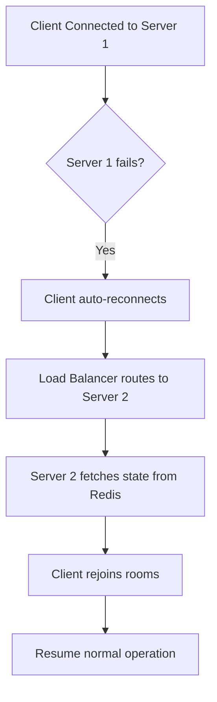

# Socket Cluster Architecture

> Visual architecture for horizontally scaled WebSocket infrastructure.

---

## Architecture Diagram

```
                         ┌──────────────┐
                         │ Load Balancer│
                         │(Sticky/WsHash)│
                         └──────┬───────┘
                                │
         ┌──────────────────────┼──────────────────────┐
         │                      │                      │
    ┌────▼────┐            ┌────▼────┐            ┌────▼────┐
    │Socket   │            │Socket   │            │Socket   │
    │Server 1 │◀──────────▶│Server 2 │◀──────────▶│Server 3 │
    └────┬────┘            └────┬────┘            └────┬────┘
         │                      │                      │
         │        ┌─────────────┴─────────────┐        │
         │        │                           │        │
         └────────┴───────────────────────────┴────────┘
                              │
                    ┌─────────┴─────────┐
                    │   Redis Cluster   │
                    │   (Pub/Sub +      │
                    │    Connection     │
                    │    Registry)      │
                    └───────────────────┘
```

---

## Components

### Load Balancer
```nginx
# nginx.conf for WebSocket load balancing
upstream socket_servers {
    ip_hash; # Sticky sessions by IP
    server socket-1:3000;
    server socket-2:3000;
    server socket-3:3000;
}

server {
    location /socket.io/ {
        proxy_pass http://socket_servers;
        proxy_http_version 1.1;
        proxy_set_header Upgrade $http_upgrade;
        proxy_set_header Connection "upgrade";
        proxy_set_header X-Forwarded-For $proxy_add_x_forwarded_for;
    }
}
```

### Redis Adapter
```typescript
import { createAdapter } from '@socket.io/redis-adapter';
import { createClient } from 'redis';

const pubClient = createClient({ url: redisUrl });
const subClient = pubClient.duplicate();

await Promise.all([pubClient.connect(), subClient.connect()]);

io.adapter(createAdapter(pubClient, subClient));
```

---

## Scaling Strategy

| Connections | Servers | Redis Nodes |
|-------------|---------|-------------|
| < 10K | 1 | 1 |
| 10K - 50K | 3 | 3 (cluster) |
| 50K - 200K | 5-10 | 6 (cluster) |
| 200K+ | 10+ | 6+ (cluster) |

---

## Failover Handling



---

## Related Documents
- [Connection Management](../deepDive/sockets/connection-management.md)
- [Message Routing](../deepDive/sockets/message-routing.md)
