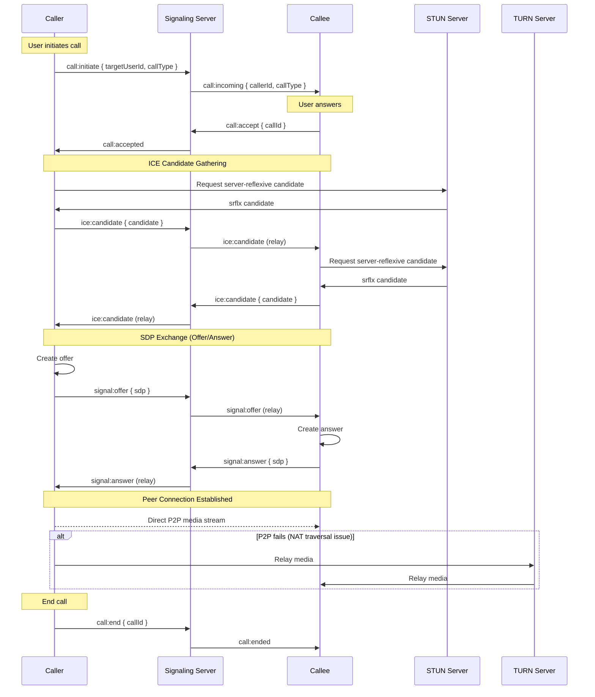

# WebRTC Call Flow

> Visual flow for voice/video call establishment and media streaming.

---

## Flow Diagram



---

## Call States

```typescript
type CallState = 
  | 'idle'
  | 'initiating'
  | 'ringing'
  | 'connecting'
  | 'connected'
  | 'reconnecting'
  | 'ended'
  | 'failed';

interface Call {
  id: string;
  state: CallState;
  type: 'audio' | 'video';
  participants: Participant[];
  startedAt?: Date;
  endedAt?: Date;
  duration?: number;
}
```

---

## RTCPeerConnection Setup

```typescript
async function createPeerConnection(): Promise<RTCPeerConnection> {
  const pc = new RTCPeerConnection({
    iceServers: [
      { urls: 'stun:stun.caas.io:3478' },
      {
        urls: 'turn:turn.caas.io:3478',
        username: turnCredentials.username,
        credential: turnCredentials.password
      }
    ]
  });
  
  pc.onicecandidate = (event) => {
    if (event.candidate) {
      socket.emit('ice:candidate', {
        callId,
        candidate: event.candidate
      });
    }
  };
  
  pc.ontrack = (event) => {
    remoteVideo.srcObject = event.streams[0];
  };
  
  return pc;
}
```

---

## Media Handling

```typescript
async function startLocalMedia(type: 'audio' | 'video') {
  const constraints = {
    audio: true,
    video: type === 'video' ? {
      width: { ideal: 1280 },
      height: { ideal: 720 },
      facingMode: 'user'
    } : false
  };
  
  const stream = await navigator.mediaDevices.getUserMedia(constraints);
  
  stream.getTracks().forEach(track => {
    pc.addTrack(track, stream);
  });
  
  return stream;
}
```

---

## Related Documents
- [Socket Authentication Flow](./socket-auth-flow.md)
- [Socket Service Roadmap](../roadmaps/5_sockets.md)
