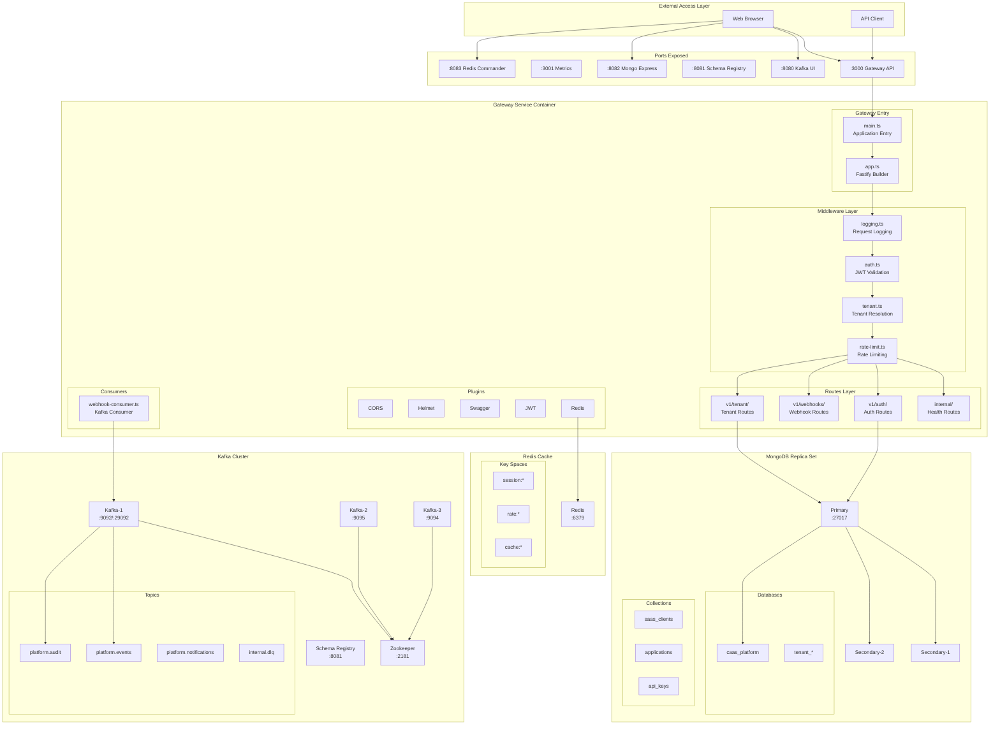
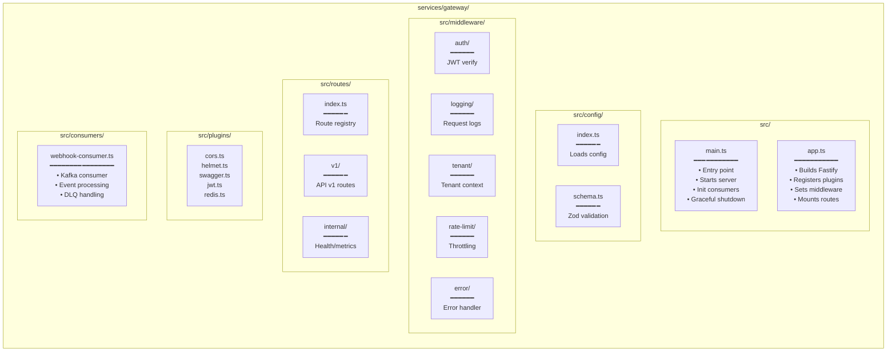
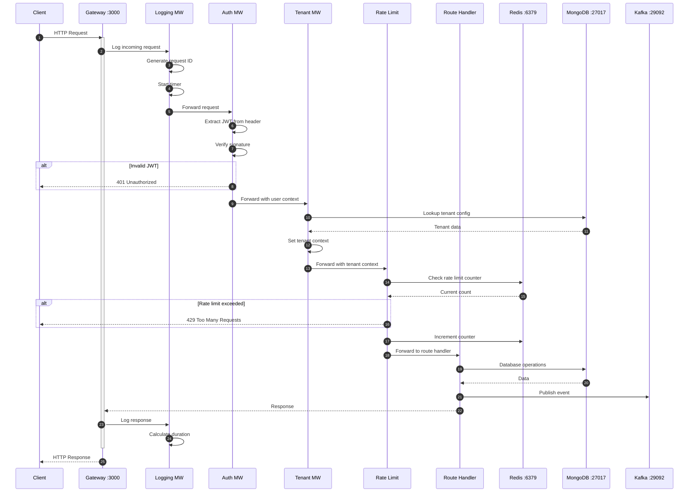
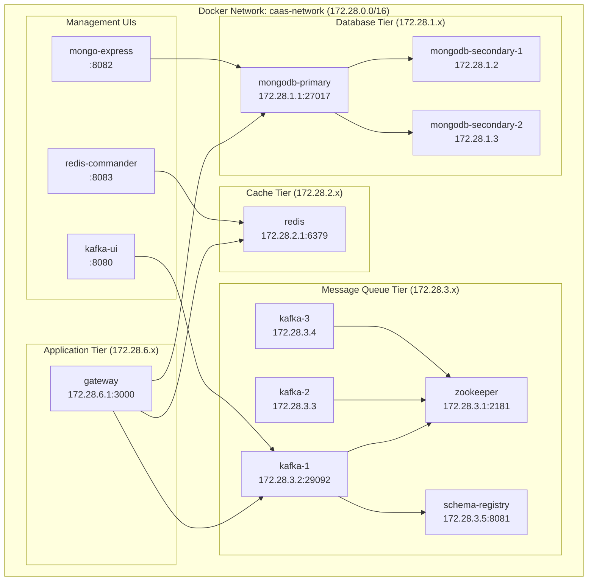
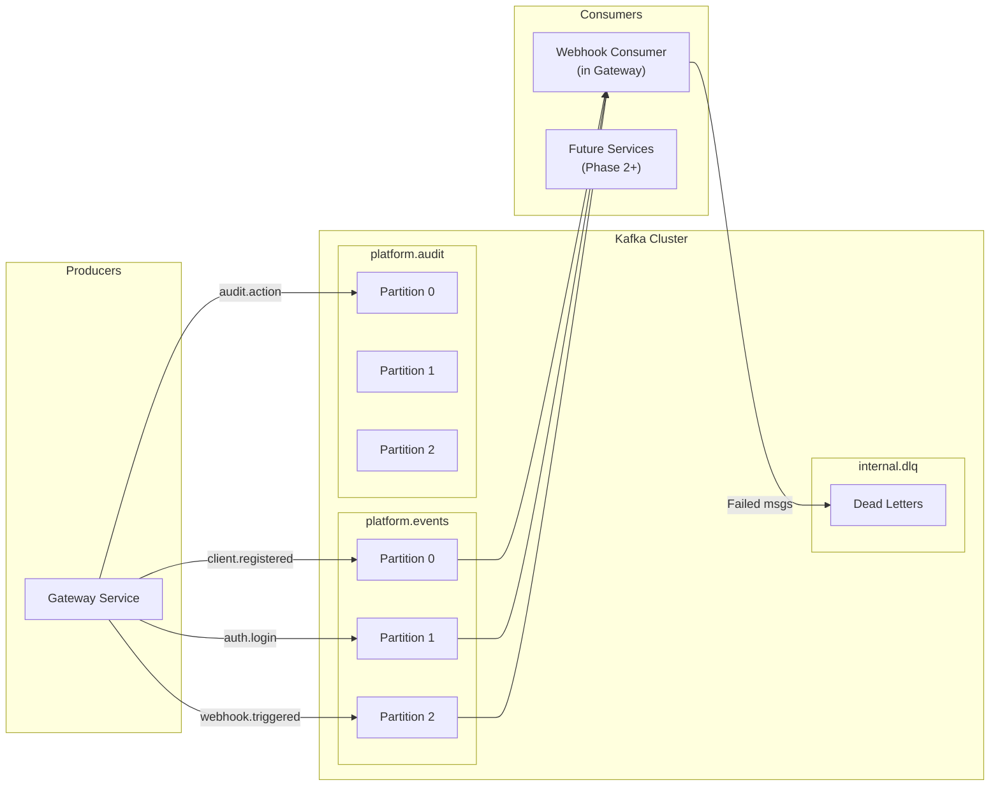
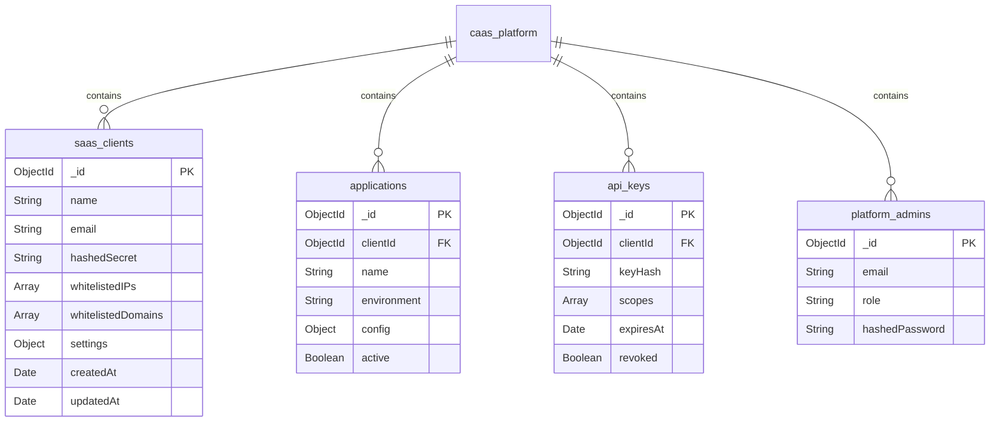
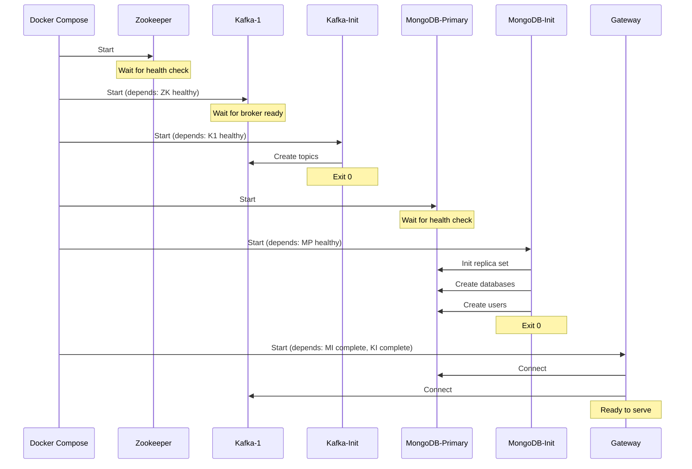
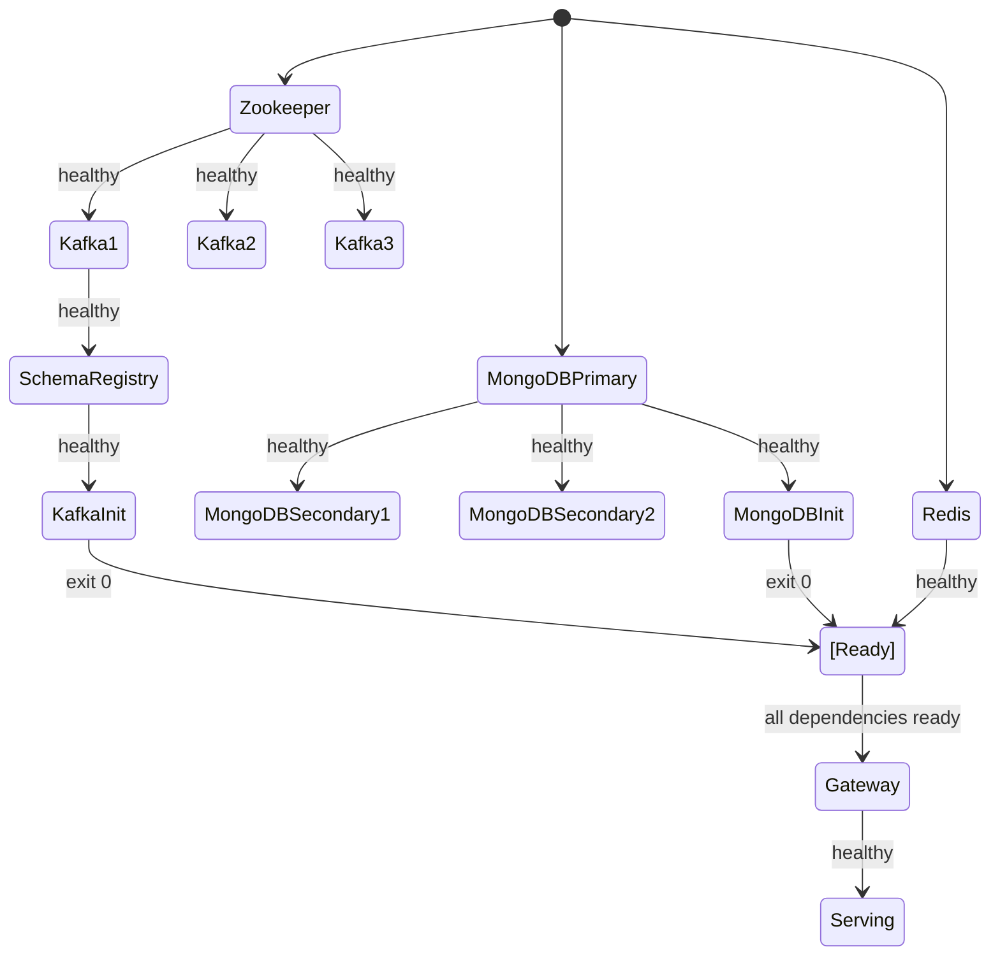

# CAAS Phase 1 - Detailed Architecture & Data Flow

**Generated:** 2026-02-04

## 🏗️ Complete System Architecture

## 📁 Gateway Service File Structure & Roles

## 🔄 Request Processing Flow

## 🗃️ Docker Container Relationships

## 📊 Kafka Message Flow

## 🔐 MongoDB Database Structure

## 🔄 Init Container Sequence

## 📈 Service Health Dependencies

