# CAAS Platform - Complete Visual Guide

> **Chat-As-A-Service: The Complete Picture for Everyone**
> 
> This document explains EVERY feature of the CAAS platform using visual diagrams that anyone can understand!

---

## Table of Contents

1. [What is CAAS?](#1-what-is-caas)
2. [The Big Picture](#2-the-big-picture)
3. [Who Uses CAAS?](#3-who-uses-caas)
4. [How SAAS Companies Join CAAS](#4-how-saas-companies-join-caas)
5. [How End Users Connect](#5-how-end-users-connect)
6. [All Chat Features](#6-all-chat-features)
7. [Security and Protection](#7-security-and-protection)
8. [Behind the Scenes - Technical Infrastructure](#8-behind-the-scenes---technical-infrastructure)
9. [Developer Tools](#9-developer-tools)
10. [Billing and Pricing](#10-billing-and-pricing)
11. [Monitoring and Analytics](#11-monitoring-and-analytics)
12. [Complete Data Flow](#12-complete-data-flow)

---

# 1. What is CAAS?

## The Simple Explanation

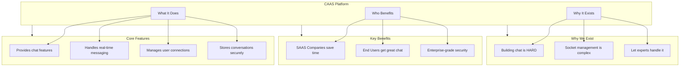
```mermaid
flowchart TB
    subgraph CAAS["CAAS Platform"]
        direction TB
        WhatItDoes["What It Does"]
        WhoBenefits["Who Benefits"]
        WhyExists["Why It Exists"]
    end
    
    subgraph Features["Core Features"]
        F1["Provides chat features"]
        F2["Handles real-time messaging"]
        F3["Manages user connections"]
        F4["Stores conversations securely"]
    end
    
    subgraph Benefits["Key Benefits"]
        B1["SAAS Companies save time"]
        B2["End Users get great chat"]
        B3["Enterprise-grade security"]
    end
    
    subgraph Reasons["Why We Exist"]
        R1["Building chat is HARD"]
        R2["Socket management is complex"]
        R3["Let experts handle it"]
    end
    
    CAAS --> Features
    CAAS --> Benefits
    CAAS --> Reasons
    
    WhatItDoes --> F1 & F2 & F3 & F4
    WhoBenefits --> B1 & B2 & B3
    WhyExists --> R1 & R2 & R3
```

## The Problem We Solve

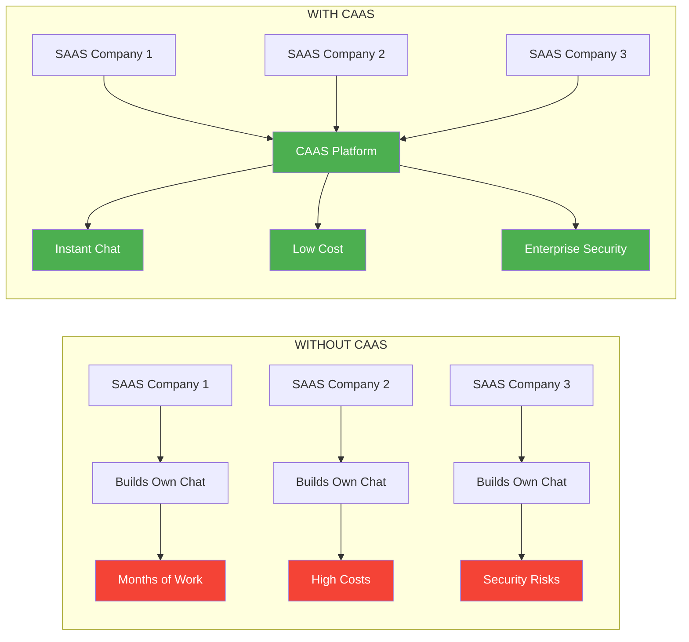
```mermaid
flowchart LR
    subgraph Without["WITHOUT CAAS"]
        A1["SAAS Company 1"] --> B1["Builds Own Chat"]
        A2["SAAS Company 2"] --> B2["Builds Own Chat"]
        A3["SAAS Company 3"] --> B3["Builds Own Chat"]
        B1 --> C1["Months of Work"]
        B2 --> C2["High Costs"]
        B3 --> C3["Security Risks"]
    end
    
    subgraph With["WITH CAAS"]
        D1["SAAS Company 1"] --> E["CAAS Platform"]
        D2["SAAS Company 2"] --> E
        D3["SAAS Company 3"] --> E
        E --> F1["Instant Chat"]
        E --> F2["Low Cost"]
        E --> F3["Enterprise Security"]
    end
    
    style E fill:#4CAF50,color:#fff
    style C1 fill:#f44336,color:#fff
    style C2 fill:#f44336,color:#fff
    style C3 fill:#f44336,color:#fff
    style F1 fill:#4CAF50,color:#fff
    style F2 fill:#4CAF50,color:#fff
    style F3 fill:#4CAF50,color:#fff
```

---

# 2. The Big Picture

## Complete Platform Overview

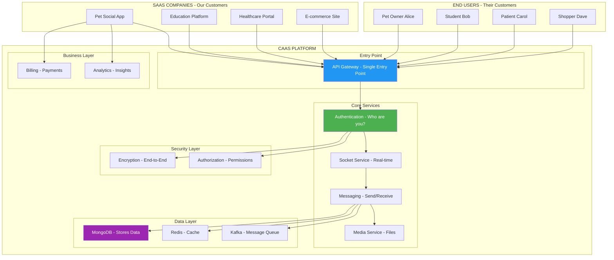
```mermaid
flowchart TB
    subgraph Customers["SAAS COMPANIES - Our Customers"]
        S1["Pet Social App"]
        S2["Education Platform"]
        S3["Healthcare Portal"]
        S4["E-commerce Site"]
    end
    
    subgraph Users["END USERS - Their Customers"]
        U1["Pet Owner Alice"]
        U2["Student Bob"]
        U3["Patient Carol"]
        U4["Shopper Dave"]
    end
    
    subgraph Platform["CAAS PLATFORM"]
        subgraph Entry["Entry Point"]
            GW["API Gateway - Single Entry Point"]
        end
        
        subgraph Core["Core Services"]
            AUTH["Authentication - Who are you?"]
            SOCKET["Socket Service - Real-time"]
            MSG["Messaging - Send/Receive"]
            MEDIA["Media Service - Files"]
        end
        
        subgraph Security["Security Layer"]
            CRYPTO["Encryption - End-to-End"]
            AUTHZ["Authorization - Permissions"]
        end
        
        subgraph Data["Data Layer"]
            MONGO["MongoDB - Stores Data"]
            REDIS["Redis - Cache"]
            KAFKA["Kafka - Message Queue"]
        end
        
        subgraph Business["Business Layer"]
            BILLING["Billing - Payments"]
            ANALYTICS["Analytics - Insights"]
        end
    end
    
    S1 & S2 & S3 & S4 --> GW
    U1 & U2 & U3 & U4 --> GW
    
    GW --> AUTH
    AUTH --> SOCKET
    SOCKET --> MSG
    MSG --> MEDIA
    
    AUTH --> CRYPTO
    AUTH --> AUTHZ
    
    MSG --> MONGO
    MSG --> REDIS
    MSG --> KAFKA
    
    S1 --> BILLING
    S1 --> ANALYTICS
    
    style GW fill:#2196F3,color:#fff
    style AUTH fill:#4CAF50,color:#fff
    style MONGO fill:#9C27B0,color:#fff
```

---

# 3. Who Uses CAAS?

## User Types Explained

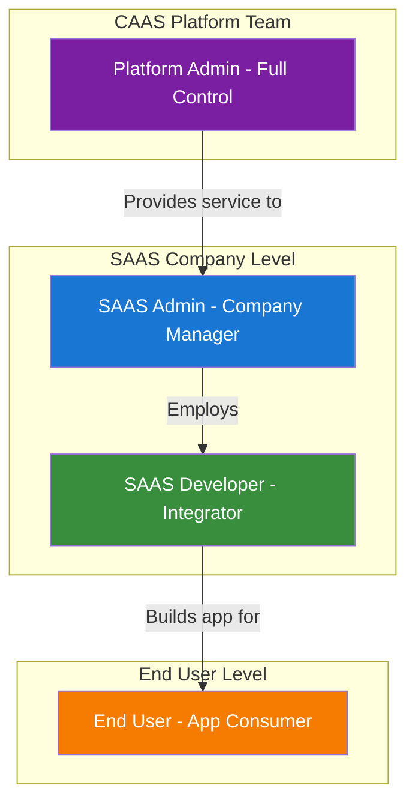
```mermaid
flowchart TB
    subgraph PlatformTeam["CAAS Platform Team"]
        ADMIN["Platform Admin - Full Control"]
    end
    
    subgraph SAASLevel["SAAS Company Level"]
        SAAS_ADMIN["SAAS Admin - Company Manager"]
        DEVELOPER["SAAS Developer - Integrator"]
    end
    
    subgraph EndUserLevel["End User Level"]
        END_USER["End User - App Consumer"]
    end
    
    ADMIN -->|"Provides service to"| SAAS_ADMIN
    SAAS_ADMIN -->|"Employs"| DEVELOPER
    DEVELOPER -->|"Builds app for"| END_USER
    
    style ADMIN fill:#7B1FA2,color:#fff
    style SAAS_ADMIN fill:#1976D2,color:#fff
    style DEVELOPER fill:#388E3C,color:#fff
    style END_USER fill:#F57C00,color:#fff
```

## Platform Admin Responsibilities

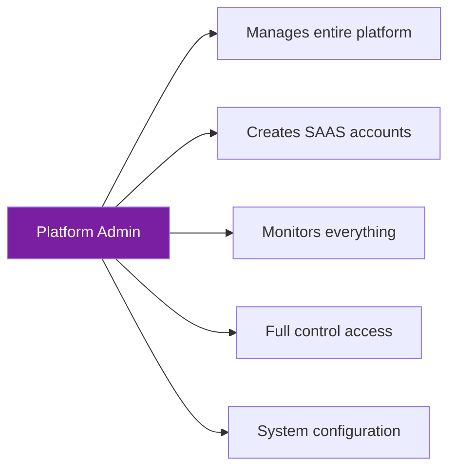
```mermaid
flowchart LR
    ADMIN["Platform Admin"]
    
    ADMIN --> M1["Manages entire platform"]
    ADMIN --> M2["Creates SAAS accounts"]
    ADMIN --> M3["Monitors everything"]
    ADMIN --> M4["Full control access"]
    ADMIN --> M5["System configuration"]
    
    style ADMIN fill:#7B1FA2,color:#fff
```

## SAAS Admin Responsibilities

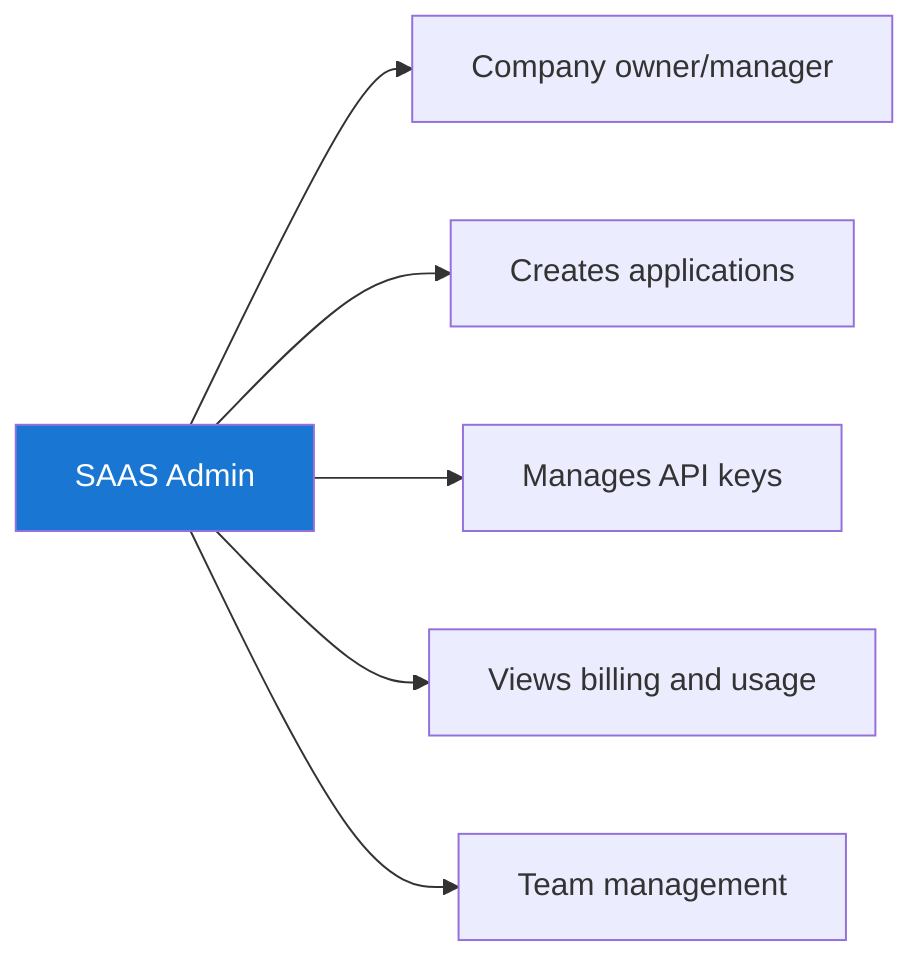
```mermaid
flowchart LR
    SAAS["SAAS Admin"]
    
    SAAS --> S1["Company owner/manager"]
    SAAS --> S2["Creates applications"]
    SAAS --> S3["Manages API keys"]
    SAAS --> S4["Views billing and usage"]
    SAAS --> S5["Team management"]
    
    style SAAS fill:#1976D2,color:#fff
```

## Developer Responsibilities

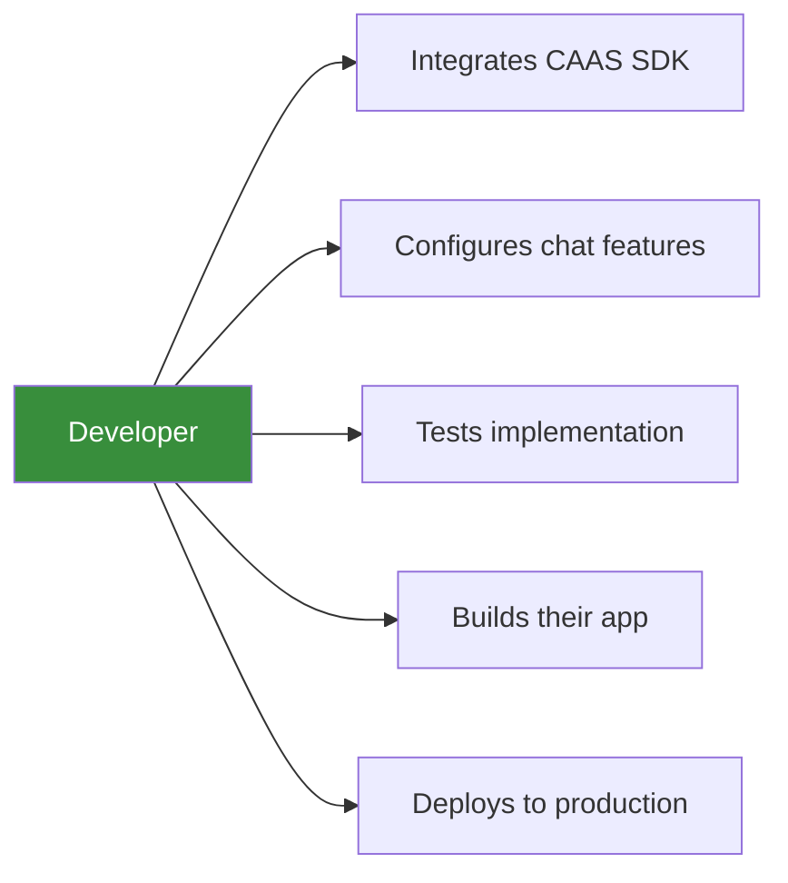
```mermaid
flowchart LR
    DEV["Developer"]
    
    DEV --> D1["Integrates CAAS SDK"]
    DEV --> D2["Configures chat features"]
    DEV --> D3["Tests implementation"]
    DEV --> D4["Builds their app"]
    DEV --> D5["Deploys to production"]
    
    style DEV fill:#388E3C,color:#fff
```

## End User Experience

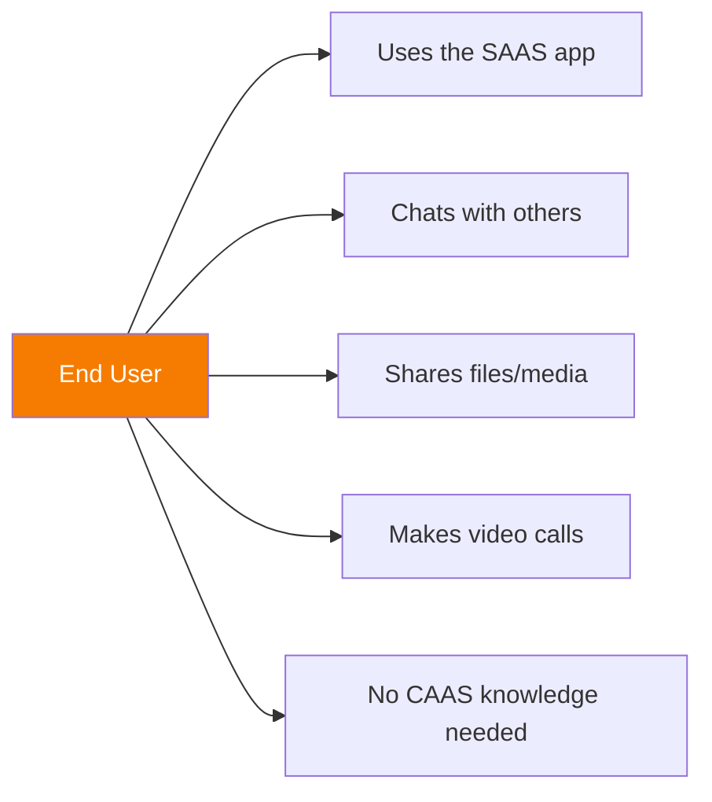
```mermaid
flowchart LR
    USER["End User"]
    
    USER --> U1["Uses the SAAS app"]
    USER --> U2["Chats with others"]
    USER --> U3["Shares files/media"]
    USER --> U4["Makes video calls"]
    USER --> U5["No CAAS knowledge needed"]
    
    style USER fill:#F57C00,color:#fff
```

---

# 4. How SAAS Companies Join CAAS

## Complete Onboarding Flow

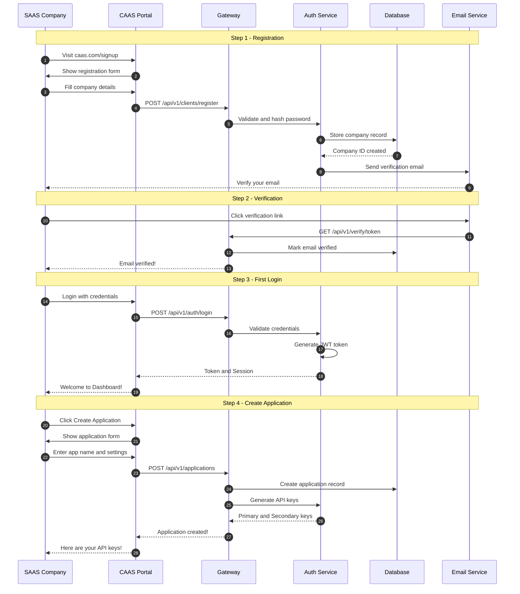
```mermaid
sequenceDiagram
    autonumber
    participant SC as SAAS Company
    participant WEB as CAAS Portal
    participant GW as Gateway
    participant AUTH as Auth Service
    participant DB as Database
    participant EMAIL as Email Service
    
    Note over SC,EMAIL: Step 1 - Registration
    SC->>WEB: Visit caas.com/signup
    WEB->>SC: Show registration form
    SC->>WEB: Fill company details
    WEB->>GW: POST /api/v1/clients/register
    GW->>AUTH: Validate and hash password
    AUTH->>DB: Store company record
    DB-->>AUTH: Company ID created
    AUTH->>EMAIL: Send verification email
    EMAIL-->>SC: Verify your email
    
    Note over SC,EMAIL: Step 2 - Verification
    SC->>EMAIL: Click verification link
    EMAIL->>GW: GET /api/v1/verify/token
    GW->>DB: Mark email verified
    GW-->>SC: Email verified!
    
    Note over SC,EMAIL: Step 3 - First Login
    SC->>WEB: Login with credentials
    WEB->>GW: POST /api/v1/auth/login
    GW->>AUTH: Validate credentials
    AUTH->>AUTH: Generate JWT token
    AUTH-->>WEB: Token and Session
    WEB-->>SC: Welcome to Dashboard!
    
    Note over SC,EMAIL: Step 4 - Create Application
    SC->>WEB: Click Create Application
    WEB->>SC: Show application form
    SC->>WEB: Enter app name and settings
    WEB->>GW: POST /api/v1/applications
    GW->>DB: Create application record
    GW->>AUTH: Generate API keys
    AUTH-->>GW: Primary and Secondary keys
    GW-->>WEB: Application created!
    WEB-->>SC: Here are your API keys!
```

## What SAAS Companies Get - Dashboard

```mermaid
flowchart TB
    subgraph Dashboard["SAAS Company Dashboard"]
        OVERVIEW["Overview"]
        APPS["Applications"]
        KEYS["API Keys"]
        WEBHOOKS["Webhooks"]
        TEAM["Team"]
        BILLING["Billing"]
        ANALYTICS["Analytics"]
    end
    
    OVERVIEW --> O1["Active users count"]
    OVERVIEW --> O2["Messages sent today"]
    OVERVIEW --> O3["Storage used"]
    
    APPS --> A1["Create new apps"]
    APPS --> A2["Manage existing apps"]
    APPS --> A3["Environment settings"]
    
    KEYS --> K1["Primary key"]
    KEYS --> K2["Secondary key"]
    KEYS --> K3["Rotate keys"]
    
    WEBHOOKS --> W1["Event notifications"]
    WEBHOOKS --> W2["Delivery status"]
    
    TEAM --> T1["Invite developers"]
    TEAM --> T2["Manage roles"]
    
    BILLING --> B1["Current plan"]
    BILLING --> B2["Usage metrics"]
    BILLING --> B3["Invoices"]
    
    ANALYTICS --> AN1["User activity"]
    ANALYTICS --> AN2["Message volume"]
    ANALYTICS --> AN3["Trends"]
```

---

# 5. How End Users Connect

## The Connection Flow

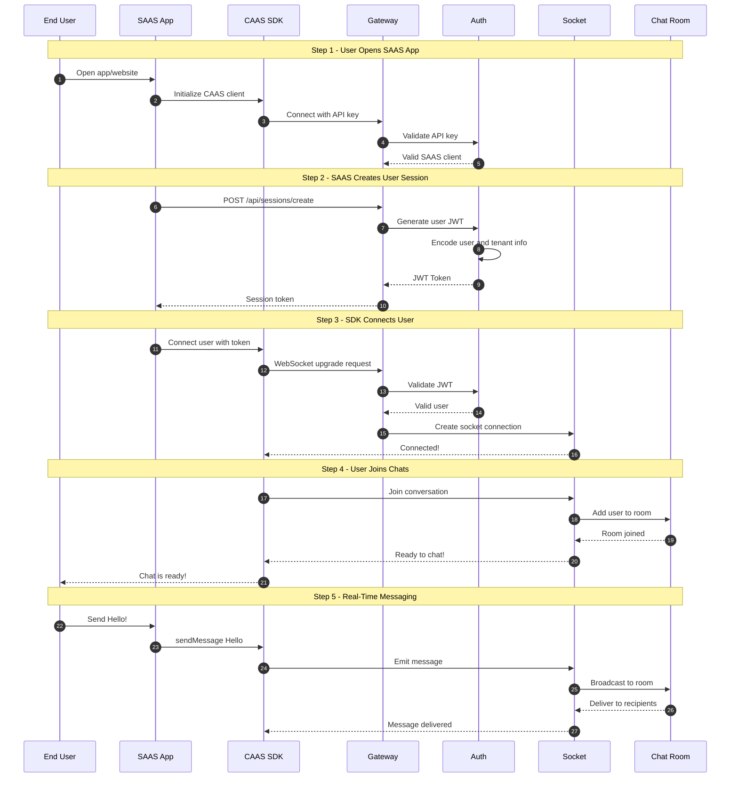
```mermaid
sequenceDiagram
    autonumber
    participant USER as End User
    participant APP as SAAS App
    participant SDK as CAAS SDK
    participant GW as Gateway
    participant AUTH as Auth
    participant SOCKET as Socket
    participant ROOM as Chat Room
    
    Note over USER,ROOM: Step 1 - User Opens SAAS App
    USER->>APP: Open app/website
    APP->>SDK: Initialize CAAS client
    SDK->>GW: Connect with API key
    GW->>AUTH: Validate API key
    AUTH-->>GW: Valid SAAS client
    
    Note over USER,ROOM: Step 2 - SAAS Creates User Session
    APP->>GW: POST /api/sessions/create
    GW->>AUTH: Generate user JWT
    AUTH->>AUTH: Encode user and tenant info
    AUTH-->>GW: JWT Token
    GW-->>APP: Session token
    
    Note over USER,ROOM: Step 3 - SDK Connects User
    APP->>SDK: Connect user with token
    SDK->>GW: WebSocket upgrade request
    GW->>AUTH: Validate JWT
    AUTH-->>GW: Valid user
    GW->>SOCKET: Create socket connection
    SOCKET-->>SDK: Connected!
    
    Note over USER,ROOM: Step 4 - User Joins Chats
    SDK->>SOCKET: Join conversation
    SOCKET->>ROOM: Add user to room
    ROOM-->>SOCKET: Room joined
    SOCKET-->>SDK: Ready to chat!
    SDK-->>USER: Chat is ready!
    
    Note over USER,ROOM: Step 5 - Real-Time Messaging
    USER->>APP: Send Hello!
    APP->>SDK: sendMessage Hello
    SDK->>SOCKET: Emit message
    SOCKET->>ROOM: Broadcast to room
    ROOM-->>SOCKET: Deliver to recipients
    SOCKET-->>SDK: Message delivered
```

## Connection States

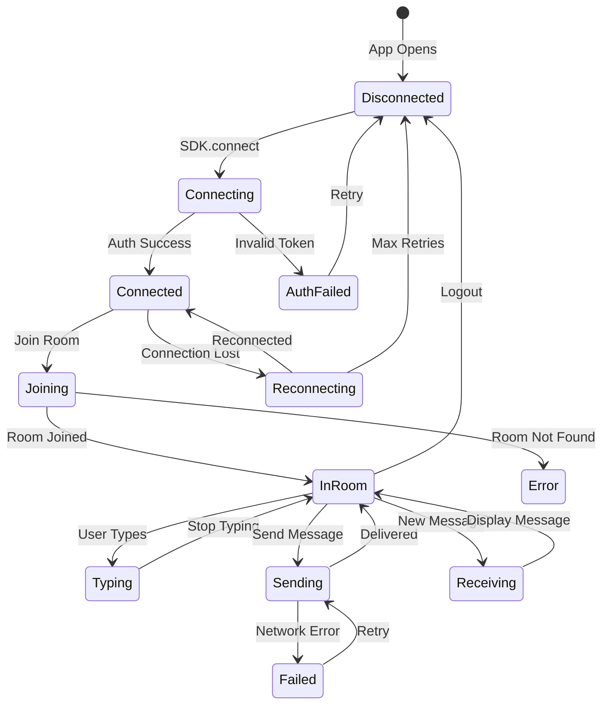
```mermaid
stateDiagram-v2
    [*] --> Disconnected: App Opens
    
    Disconnected --> Connecting: SDK.connect
    Connecting --> Connected: Auth Success
    Connecting --> AuthFailed: Invalid Token
    AuthFailed --> Disconnected: Retry
    
    Connected --> Joining: Join Room
    Joining --> InRoom: Room Joined
    Joining --> Error: Room Not Found
    
    InRoom --> Typing: User Types
    Typing --> InRoom: Stop Typing
    
    InRoom --> Sending: Send Message
    Sending --> InRoom: Delivered
    Sending --> Failed: Network Error
    Failed --> Sending: Retry
    
    InRoom --> Receiving: New Message
    Receiving --> InRoom: Display Message
    
    Connected --> Reconnecting: Connection Lost
    Reconnecting --> Connected: Reconnected
    Reconnecting --> Disconnected: Max Retries
    
    InRoom --> Disconnected: Logout
```

---

# 6. All Chat Features

## Complete Feature Map - Messaging

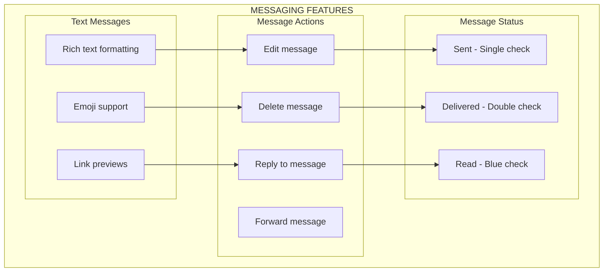
```mermaid
flowchart TB
    subgraph Messaging["MESSAGING FEATURES"]
        subgraph Text["Text Messages"]
            T1["Rich text formatting"]
            T2["Emoji support"]
            T3["Link previews"]
        end
        
        subgraph Actions["Message Actions"]
            A1["Edit message"]
            A2["Delete message"]
            A3["Reply to message"]
            A4["Forward message"]
        end
        
        subgraph Status["Message Status"]
            S1["Sent - Single check"]
            S2["Delivered - Double check"]
            S3["Read - Blue check"]
        end
    end
    
    T1 --> A1
    T2 --> A2
    T3 --> A3
    A1 --> S1
    A2 --> S2
    A3 --> S3
```

## Complete Feature Map - Conversations

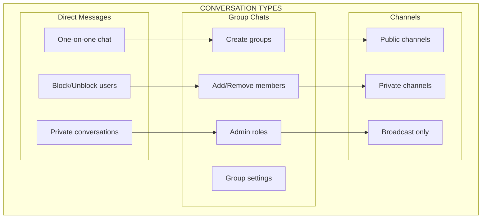
```mermaid
flowchart TB
    subgraph Conversations["CONVERSATION TYPES"]
        subgraph DM["Direct Messages"]
            D1["One-on-one chat"]
            D2["Block/Unblock users"]
            D3["Private conversations"]
        end
        
        subgraph Groups["Group Chats"]
            G1["Create groups"]
            G2["Add/Remove members"]
            G3["Admin roles"]
            G4["Group settings"]
        end
        
        subgraph Channels["Channels"]
            C1["Public channels"]
            C2["Private channels"]
            C3["Broadcast only"]
        end
    end
    
    D1 --> G1
    D2 --> G2
    D3 --> G3
    G1 --> C1
    G2 --> C2
    G3 --> C3
```

## Complete Feature Map - Media

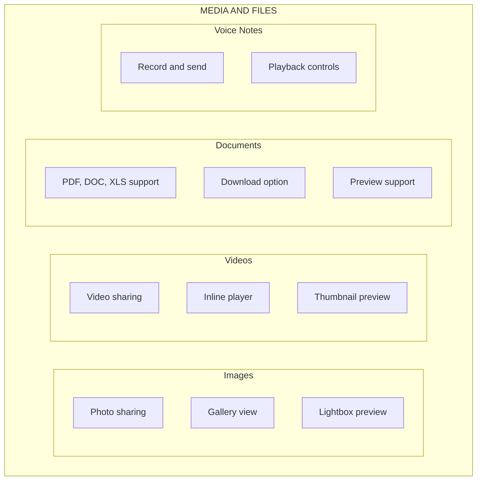
```mermaid
flowchart TB
    subgraph Media["MEDIA AND FILES"]
        subgraph Images["Images"]
            I1["Photo sharing"]
            I2["Gallery view"]
            I3["Lightbox preview"]
        end
        
        subgraph Videos["Videos"]
            V1["Video sharing"]
            V2["Inline player"]
            V3["Thumbnail preview"]
        end
        
        subgraph Docs["Documents"]
            DOC1["PDF, DOC, XLS support"]
            DOC2["Download option"]
            DOC3["Preview support"]
        end
        
        subgraph Voice["Voice Notes"]
            VO1["Record and send"]
            VO2["Playback controls"]
        end
    end
```

## Complete Feature Map - Real-Time

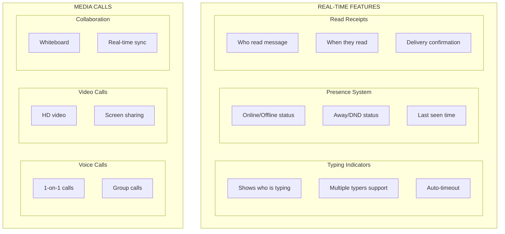
```mermaid
flowchart TB
    subgraph RealTime["REAL-TIME FEATURES"]
        subgraph Typing["Typing Indicators"]
            TY1["Shows who is typing"]
            TY2["Multiple typers support"]
            TY3["Auto-timeout"]
        end
        
        subgraph Presence["Presence System"]
            P1["Online/Offline status"]
            P2["Away/DND status"]
            P3["Last seen time"]
        end
        
        subgraph Receipts["Read Receipts"]
            R1["Who read message"]
            R2["When they read"]
            R3["Delivery confirmation"]
        end
    end
    
    subgraph Calls["MEDIA CALLS"]
        subgraph VoiceCalls["Voice Calls"]
            VC1["1-on-1 calls"]
            VC2["Group calls"]
        end
        
        subgraph VideoCalls["Video Calls"]
            VID1["HD video"]
            VID2["Screen sharing"]
        end
        
        subgraph Collab["Collaboration"]
            COL1["Whiteboard"]
            COL2["Real-time sync"]
        end
    end
```

## How Messages Flow

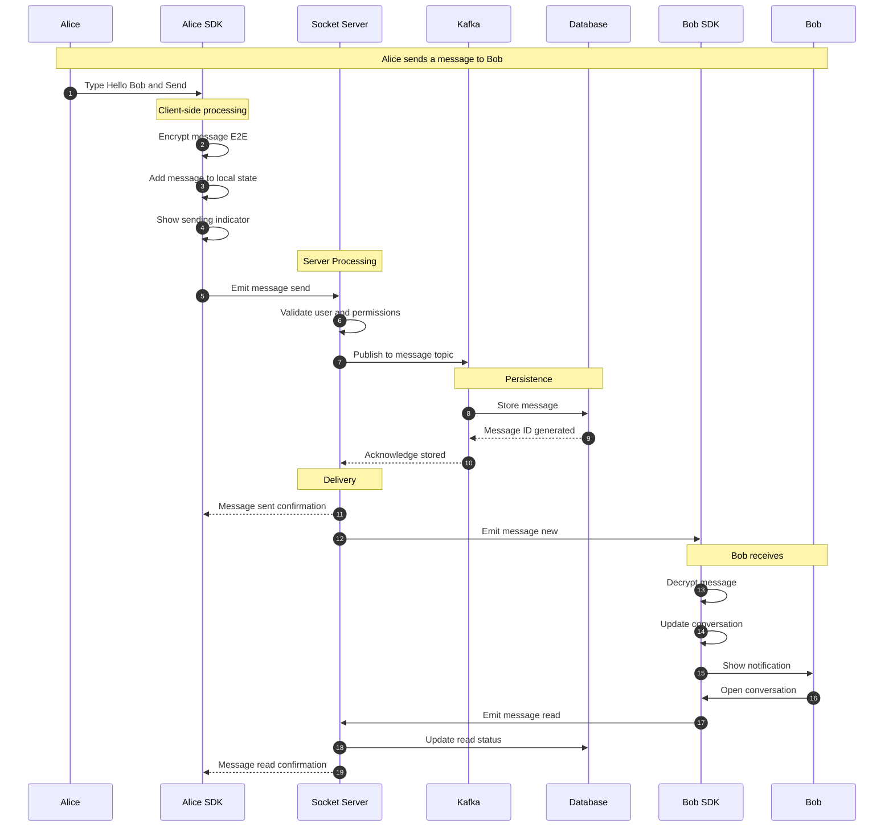
```mermaid
sequenceDiagram
    autonumber
    participant A as Alice
    participant SDK_A as Alice SDK
    participant SOCKET as Socket Server
    participant KAFKA as Kafka
    participant DB as Database
    participant SDK_B as Bob SDK
    participant B as Bob
    
    Note over A,B: Alice sends a message to Bob
    
    A->>SDK_A: Type Hello Bob and Send
    
    Note over SDK_A: Client-side processing
    SDK_A->>SDK_A: Encrypt message E2E
    SDK_A->>SDK_A: Add message to local state
    SDK_A->>SDK_A: Show sending indicator
    
    Note over SOCKET: Server Processing
    SDK_A->>SOCKET: Emit message send
    SOCKET->>SOCKET: Validate user and permissions
    SOCKET->>KAFKA: Publish to message topic
    
    Note over KAFKA,DB: Persistence
    KAFKA->>DB: Store message
    DB-->>KAFKA: Message ID generated
    KAFKA-->>SOCKET: Acknowledge stored
    
    Note over SOCKET: Delivery
    SOCKET-->>SDK_A: Message sent confirmation
    SOCKET->>SDK_B: Emit message new
    
    Note over SDK_B,B: Bob receives
    SDK_B->>SDK_B: Decrypt message
    SDK_B->>SDK_B: Update conversation
    SDK_B->>B: Show notification
    
    B->>SDK_B: Open conversation
    SDK_B->>SOCKET: Emit message read
    SOCKET->>DB: Update read status
    SOCKET-->>SDK_A: Message read confirmation
```

## Typing Indicators Flow

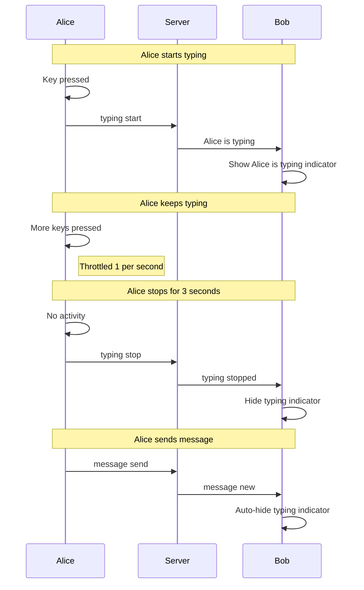
```mermaid
sequenceDiagram
    participant A as Alice
    participant SERVER as Server
    participant B as Bob
    
    Note over A,B: Alice starts typing
    A->>A: Key pressed
    A->>SERVER: typing start
    SERVER->>B: Alice is typing
    B->>B: Show Alice is typing indicator
    
    Note over A,B: Alice keeps typing
    A->>A: More keys pressed
    Note right of A: Throttled 1 per second
    
    Note over A,B: Alice stops for 3 seconds
    A->>A: No activity
    A->>SERVER: typing stop
    SERVER->>B: typing stopped
    B->>B: Hide typing indicator
    
    Note over A,B: Alice sends message
    A->>SERVER: message send
    SERVER->>B: message new
    B->>B: Auto-hide typing indicator
```

## Group Chat Features

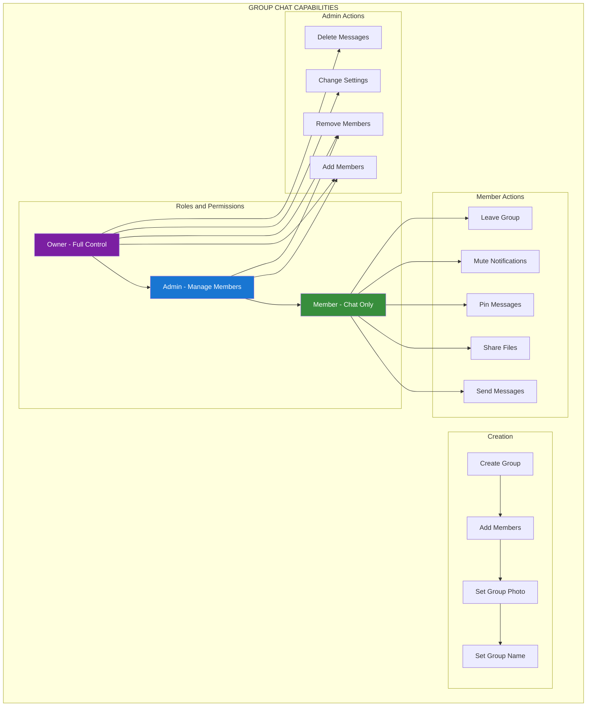
```mermaid
flowchart TB
    subgraph GroupChat["GROUP CHAT CAPABILITIES"]
        subgraph Creation["Creation"]
            C1["Create Group"]
            C2["Add Members"]
            C3["Set Group Photo"]
            C4["Set Group Name"]
        end
        
        subgraph Roles["Roles and Permissions"]
            R1["Owner - Full Control"]
            R2["Admin - Manage Members"]
            R3["Member - Chat Only"]
        end
        
        subgraph MemberActions["Member Actions"]
            A1["Send Messages"]
            A2["Share Files"]
            A3["Pin Messages"]
            A4["Mute Notifications"]
            A5["Leave Group"]
        end
        
        subgraph AdminActions["Admin Actions"]
            AD1["Add Members"]
            AD2["Remove Members"]
            AD3["Change Settings"]
            AD4["Delete Messages"]
        end
    end
    
    C1 --> C2 --> C3 --> C4
    R1 --> R2 --> R3
    
    R1 --> AD1 & AD2 & AD3 & AD4
    R2 --> AD1 & AD2
    R3 --> A1 & A2 & A3 & A4 & A5
    
    style R1 fill:#7B1FA2,color:#fff
    style R2 fill:#1976D2,color:#fff
    style R3 fill:#388E3C,color:#fff
```

---

# 7. Security and Protection

## Security Layers

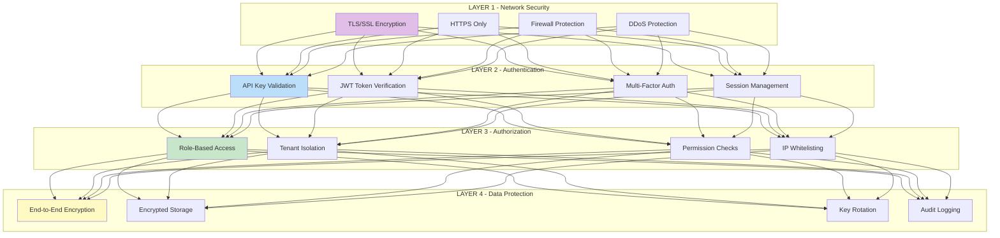
```mermaid
flowchart TB
    subgraph Layer1["LAYER 1 - Network Security"]
        L1A["TLS/SSL Encryption"]
        L1B["HTTPS Only"]
        L1C["Firewall Protection"]
        L1D["DDoS Protection"]
    end
    
    subgraph Layer2["LAYER 2 - Authentication"]
        L2A["API Key Validation"]
        L2B["JWT Token Verification"]
        L2C["Multi-Factor Auth"]
        L2D["Session Management"]
    end
    
    subgraph Layer3["LAYER 3 - Authorization"]
        L3A["Role-Based Access"]
        L3B["Tenant Isolation"]
        L3C["Permission Checks"]
        L3D["IP Whitelisting"]
    end
    
    subgraph Layer4["LAYER 4 - Data Protection"]
        L4A["End-to-End Encryption"]
        L4B["Encrypted Storage"]
        L4C["Key Rotation"]
        L4D["Audit Logging"]
    end
    
    L1A & L1B & L1C & L1D --> L2A & L2B & L2C & L2D
    L2A & L2B & L2C & L2D --> L3A & L3B & L3C & L3D
    L3A & L3B & L3C & L3D --> L4A & L4B & L4C & L4D
    
    style L1A fill:#e1bee7
    style L2A fill:#bbdefb
    style L3A fill:#c8e6c9
    style L4A fill:#fff9c4
```

## Authentication Flow

```mermaid
sequenceDiagram
    autonumber
    participant USER as User
    participant APP as SAAS App
    participant GW as Gateway
    participant AUTH as Auth Service
    participant MFA as MFA Service
    participant SESSION as Session Store
    
    Note over USER,SESSION: Step 1 - Initial Login
    USER->>APP: Enter email and password
    APP->>GW: POST /auth/login
    GW->>AUTH: Validate credentials
    AUTH->>AUTH: Hash and compare password
    
    alt Invalid Credentials
        AUTH-->>GW: Invalid
        GW-->>APP: 401 Unauthorized
        APP-->>USER: Wrong email/password
    end
    
    Note over USER,SESSION: Step 2 - MFA Challenge if enabled
    AUTH->>MFA: Check MFA status
    MFA-->>AUTH: MFA required
    AUTH-->>GW: MFA challenge
    GW-->>APP: Need 2FA code
    APP-->>USER: Enter 2FA code
    
    USER->>APP: Enter code from authenticator app
    APP->>GW: POST /auth/mfa/verify
    GW->>MFA: Validate TOTP code
    MFA-->>GW: Valid
    
    Note over USER,SESSION: Step 3 - Create Session
    GW->>AUTH: Generate tokens
    AUTH->>AUTH: Create JWT 15 min expiry
    AUTH->>AUTH: Create Refresh 7 days expiry
    AUTH->>SESSION: Store session
    SESSION-->>AUTH: Session ID
    AUTH-->>GW: Tokens and Session
    GW-->>APP: Login successful!
    APP-->>USER: Welcome!
```

## End-to-End Encryption Explained

```mermaid
flowchart LR
    subgraph Alice["ALICE DEVICE"]
        A1["Type Message - Hello Bob!"]
        A2["Her Private Key"]
        A3["Encrypt with Bob Public Key"]
        A4["Send Encrypted - aX7mK9..."]
    end
    
    subgraph Server["CAAS SERVERS"]
        S1["Receive aX7mK9..."]
        S2["Store Encrypted - Cannot Read!"]
        S3["Deliver to Bob"]
    end
    
    subgraph Bob["BOB DEVICE"]
        B1["Receive aX7mK9..."]
        B2["His Private Key"]
        B3["Decrypt Message"]
        B4["Read - Hello Bob!"]
    end
    
    A1 --> A3
    A2 --> A3
    A3 --> A4
    A4 --> S1
    S1 --> S2
    S2 --> S3
    S3 --> B1
    B1 --> B3
    B2 --> B3
    B3 --> B4
    
    style A3 fill:#4CAF50,color:#fff
    style S2 fill:#2196F3,color:#fff
    style B3 fill:#4CAF50,color:#fff
```

## Multi-Tenant Isolation

```mermaid
flowchart TB
    subgraph Multitenancy["CAAS MULTI-TENANCY"]
        subgraph CompanyA["Company A - Pet Social App"]
            A_USERS["Company A Users"]
            A_DATA["Company A Data"]
            A_KEYS["Company A Keys"]
        end
        
        subgraph CompanyB["Company B - Education Platform"]
            B_USERS["Company B Users"]
            B_DATA["Company B Data"]
            B_KEYS["Company B Keys"]
        end
        
        subgraph CompanyC["Company C - Healthcare Portal"]
            C_USERS["Company C Users"]
            C_DATA["Company C Data"]
            C_KEYS["Company C Keys"]
        end
    end
    
    A_USERS --> A_DATA
    A_DATA --> A_KEYS
    
    B_USERS --> B_DATA
    B_DATA --> B_KEYS
    
    C_USERS --> C_DATA
    C_DATA --> C_KEYS
    
    A_DATA -.-x B_DATA
    B_DATA -.-x C_DATA
    A_DATA -.-x C_DATA
    
    style A_DATA fill:#e3f2fd
    style B_DATA fill:#e8f5e9
    style C_DATA fill:#fff3e0
```

---

# 8. Behind the Scenes - Technical Infrastructure

## Complete System Architecture

```mermaid
flowchart TB
    subgraph External["EXTERNAL WORLD"]
        WEB["Web Browsers"]
        MOBILE["Mobile Apps"]
        API_CLIENT["API Clients"]
    end
    
    subgraph EntryLayer["ENTRY LAYER"]
        LB["Load Balancer"]
        GW["API Gateway Port 3000"]
    end
    
    subgraph SecurityLayer["SECURITY LAYER"]
        AUTH["Auth Service - JWT Sessions MFA"]
        CRYPTO["Crypto Service - E2E Encryption"]
        AUTHZ["Authorization - RBAC ABAC"]
    end
    
    subgraph RealtimeLayer["REAL-TIME LAYER"]
        SOCKET1["Socket Server 1"]
        SOCKET2["Socket Server 2"]
        SOCKET3["Socket Server 3"]
        PRESENCE["Presence Service"]
    end
    
    subgraph BusinessLayer["BUSINESS LAYER"]
        MSG["Messaging Service"]
        CONV["Conversation Service"]
        MEDIA["Media Service"]
        SEARCH["Search Service"]
    end
    
    subgraph MessageQueue["MESSAGE QUEUE"]
        K1["Kafka Broker 1"]
        K2["Kafka Broker 2"]
        K3["Kafka Broker 3"]
        SR["Schema Registry"]
    end
    
    subgraph DataLayer["DATA LAYER"]
        M1["MongoDB Primary"]
        M2["MongoDB Secondary"]
        M3["MongoDB Secondary"]
        REDIS["Redis Cache"]
        ES["Elasticsearch"]
    end
    
    subgraph Observability["OBSERVABILITY"]
        LOGS["Logging - Loki"]
        METRICS["Metrics - Prometheus"]
        ALERTS["Alerts - Alertmanager"]
    end
    
    WEB & MOBILE & API_CLIENT --> LB
    LB --> GW
    
    GW --> AUTH & CRYPTO & AUTHZ
    GW --> SOCKET1 & SOCKET2 & SOCKET3
    
    SOCKET1 & SOCKET2 & SOCKET3 --> PRESENCE
    SOCKET1 & SOCKET2 & SOCKET3 --> MSG
    
    MSG --> CONV & MEDIA & SEARCH
    
    MSG --> K1 & K2 & K3
    K1 & K2 & K3 --> SR
    
    MSG --> M1
    M1 --> M2 & M3
    MSG --> REDIS
    SEARCH --> ES
    
    GW --> LOGS & METRICS & ALERTS
    
    style GW fill:#2196F3,color:#fff
    style AUTH fill:#4CAF50,color:#fff
    style K1 fill:#FF5722,color:#fff
    style M1 fill:#9C27B0,color:#fff
```

## Docker Container Map

```mermaid
flowchart TB
    subgraph Docker["DOCKER ENVIRONMENT"]
        subgraph DatabaseTier["Database Tier"]
            MP["MongoDB Primary - 172.28.1.1:27017"]
            MS1["MongoDB Secondary 1 - 172.28.1.2"]
            MS2["MongoDB Secondary 2 - 172.28.1.3"]
        end
        
        subgraph CacheTier["Cache Tier"]
            REDIS["Redis - 172.28.2.1:6379"]
        end
        
        subgraph MQTier["Message Queue Tier"]
            ZK["Zookeeper - 172.28.3.1:2181"]
            K1["Kafka 1 - 172.28.3.2:29092"]
            K2["Kafka 2 - 172.28.3.3"]
            K3["Kafka 3 - 172.28.3.4"]
            SR["Schema Registry - 172.28.3.5:8081"]
        end
        
        subgraph AppTier["Application Tier"]
            GW["Gateway - 172.28.6.1:3000"]
        end
        
        subgraph MonitoringUIs["Monitoring UIs"]
            KUI["Kafka UI - Port 8080"]
            MEX["Mongo Express - Port 8082"]
            RCMD["Redis Commander - Port 8083"]
        end
    end
    
    MP <--> MS1 & MS2
    K1 & K2 & K3 --> ZK
    K1 --> SR
    
    GW --> MP & REDIS & K1
    KUI --> K1
    MEX --> MP
    RCMD --> REDIS
    
    style MP fill:#9C27B0,color:#fff
    style REDIS fill:#f44336,color:#fff
    style K1 fill:#FF5722,color:#fff
    style GW fill:#2196F3,color:#fff
```

## Service Startup Order

```mermaid
sequenceDiagram
    autonumber
    participant DC as Docker Compose
    participant ZK as Zookeeper
    participant KAFKA as Kafka Cluster
    participant SR as Schema Registry
    participant MONGO as MongoDB Cluster
    participant REDIS as Redis
    participant GW as Gateway
    
    Note over DC,GW: Phase 1 - Foundation Services
    DC->>ZK: Start Zookeeper
    activate ZK
    ZK-->>DC: Ready port 2181
    
    DC->>REDIS: Start Redis
    activate REDIS
    REDIS-->>DC: Ready port 6379
    
    Note over DC,GW: Phase 2 - Message Queue
    DC->>KAFKA: Start Kafka 1 2 3
    activate KAFKA
    KAFKA->>ZK: Register brokers
    KAFKA-->>DC: Ready ports 9092 9093 9094
    
    DC->>SR: Start Schema Registry
    activate SR
    SR->>KAFKA: Connect to brokers
    SR-->>DC: Ready port 8081
    
    Note over DC,GW: Phase 3 - Database
    DC->>MONGO: Start MongoDB Primary
    activate MONGO
    MONGO-->>DC: Primary ready
    DC->>MONGO: Start Secondary 1 and 2
    MONGO->>MONGO: Form replica set
    MONGO-->>DC: Replica set ready
    
    Note over DC,GW: Phase 4 - Initialization
    DC->>KAFKA: Create topics
    DC->>MONGO: Create databases and users
    
    Note over DC,GW: Phase 5 - Application
    DC->>GW: Start Gateway
    activate GW
    GW->>MONGO: Connect to database
    GW->>KAFKA: Connect to brokers
    GW->>REDIS: Connect to cache
    GW-->>DC: Ready to serve port 3000
```

## How Data is Stored

```mermaid
erDiagram
    SAAS_CLIENTS ||--o{ APPLICATIONS : has
    SAAS_CLIENTS ||--o{ API_KEYS : has
    SAAS_CLIENTS ||--o{ SUBSCRIPTIONS : has
    
    APPLICATIONS ||--o{ USERS : contains
    
    USERS ||--o{ CONVERSATIONS : participates
    USERS ||--o{ USER_DEVICES : has
    USERS ||--o{ USER_RELATIONSHIPS : has
    
    CONVERSATIONS ||--o{ MESSAGES : contains
    CONVERSATIONS ||--o{ CONVERSATION_MEMBERS : has
    
    MESSAGES ||--o{ REACTIONS : has
    MESSAGES ||--o{ READ_RECEIPTS : has
    
    USERS ||--o{ FILES : uploads
    USERS ||--o{ ENCRYPTION_KEYS : owns
    
    SAAS_CLIENTS {
        string id PK
        string name
        string email
        string plan
        date created_at
    }
    
    APPLICATIONS {
        string id PK
        string client_id FK
        string name
        string environment
        boolean active
    }
    
    USERS {
        string id PK
        string tenant_id FK
        string external_id
        string display_name
        string avatar_url
        date last_seen
    }
    
    CONVERSATIONS {
        string id PK
        string tenant_id
        string type
        string name
        date updated_at
    }
    
    MESSAGES {
        string id PK
        string conversation_id FK
        string sender_id FK
        string content_encrypted
        string type
        date sent_at
    }
```

---

# 9. Developer Tools

## SDK Integration Flow

```mermaid
flowchart TB
    subgraph Step1["STEP 1 - Installation"]
        I1["npm install @caas/sdk"]
        I2["npm install @caas/react"]
    end
    
    subgraph Step2["STEP 2 - Configuration"]
        C1["Add API Key to .env"]
        C2["Initialize CAAS Client"]
        C3["Wrap app in Provider"]
    end
    
    subgraph Step3["STEP 3 - Add Components"]
        A1["ChatList Component"]
        A2["ChatWindow Component"]
        A3["MessageInput Component"]
        A4["UserPresence Component"]
    end
    
    subgraph Step4["STEP 4 - Custom Logic"]
        L1["Listen to events"]
        L2["Send messages"]
        L3["Manage conversations"]
    end
    
    subgraph Step5["STEP 5 - Deploy"]
        D1["Test in development"]
        D2["Switch to production keys"]
        D3["Deploy application"]
    end
    
    I1 --> I2 --> C1 --> C2 --> C3
    C3 --> A1 --> A2 --> A3 --> A4
    A4 --> L1 --> L2 --> L3
    L3 --> D1 --> D2 --> D3
    
    style I1 fill:#e3f2fd
    style C1 fill:#e8f5e9
    style A1 fill:#fff3e0
    style L1 fill:#fce4ec
    style D1 fill:#f3e5f5
```

## SDK Code Example Flow

```mermaid
sequenceDiagram
    autonumber
    participant DEV as Developer
    participant CODE as Code
    participant SDK as SDK
    participant CAAS as CAAS Cloud
    
    Note over DEV,CAAS: Step 1 - Initialize
    DEV->>CODE: Write initialization code
    CODE->>SDK: new CAASClient with apiKey
    SDK->>CAAS: Validate API key
    CAAS-->>SDK: Authenticated
    
    Note over DEV,CAAS: Step 2 - Connect User
    DEV->>CODE: client.connect with userToken
    CODE->>SDK: Establish connection
    SDK->>CAAS: WebSocket connect
    CAAS-->>SDK: Connected
    
    Note over DEV,CAAS: Step 3 - Listen to Events
    DEV->>CODE: client.on message handler
    CODE->>SDK: Register event handler
    SDK->>SDK: Store handler
    
    Note over DEV,CAAS: Step 4 - Send Message
    DEV->>CODE: client.messages.send
    CODE->>SDK: Prepare message
    SDK->>CAAS: Send via socket
    CAAS->>CAAS: Process and deliver
    CAAS-->>SDK: Delivered
    SDK-->>CODE: Success callback
    
    Note over DEV,CAAS: Step 5 - Receive Message
    CAAS->>SDK: Push new message
    SDK->>CODE: Trigger message event
    CODE->>DEV: Handler executed
```

## UI Components Available

```mermaid
flowchart TB
    subgraph CoreProviders["CORE PROVIDERS"]
        CP1["CaasProvider - Context setup"]
        CP2["ThemeProvider - Light/Dark mode"]
        CP3["LocalizationProvider - Multi-language"]
    end
    
    subgraph ChatComponents["CHAT COMPONENTS"]
        CC1["ChatList - Conversation list"]
        CC2["ChatWindow - Message history"]
        CC3["MessageInput - Text input"]
        CC4["MessageBubble - Message display"]
    end
    
    subgraph UserComponents["USER COMPONENTS"]
        UC1["Avatar - User photo"]
        UC2["UserProfile - Profile card"]
        UC3["PresenceIndicator - Online status"]
    end
    
    subgraph NotificationComponents["NOTIFICATION COMPONENTS"]
        NC1["NotificationBell - Badge count"]
        NC2["NotificationList - All notifications"]
        NC3["Toast - Success/Error alerts"]
    end
    
    subgraph BaseComponents["BASE COMPONENTS"]
        BC1["Button"]
        BC2["Input"]
        BC3["Modal"]
        BC4["Loader"]
        BC5["Badge"]
    end
    
    CoreProviders --> ChatComponents
    ChatComponents --> UserComponents
    UserComponents --> NotificationComponents
    NotificationComponents --> BaseComponents
```

---

# 10. Billing and Pricing

## Pricing Tiers

```mermaid
flowchart LR
    subgraph Free["FREE PLAN"]
        F1["1000 monthly users"]
        F2["10000 messages"]
        F3["1 GB storage"]
        F4["Community support"]
        F5["$0/month"]
    end
    
    subgraph Starter["STARTER PLAN"]
        S1["10000 monthly users"]
        S2["100000 messages"]
        S3["10 GB storage"]
        S4["Email support"]
        S5["$49/month"]
    end
    
    subgraph Pro["PRO PLAN"]
        P1["100000 monthly users"]
        P2["1M messages"]
        P3["100 GB storage"]
        P4["Priority support"]
        P5["$299/month"]
    end
    
    subgraph Enterprise["ENTERPRISE PLAN"]
        E1["Unlimited users"]
        E2["Unlimited messages"]
        E3["Unlimited storage"]
        E4["24/7 support"]
        E5["Custom pricing"]
    end
    
    Free --> Starter --> Pro --> Enterprise
    
    style F5 fill:#e3f2fd
    style S5 fill:#e8f5e9
    style P5 fill:#fff3e0
    style E5 fill:#f3e5f5
```

## Usage Metering Flow

```mermaid
flowchart TB
    subgraph UsageEvents["USAGE EVENTS"]
        E1["New User Connected"]
        E2["Message Sent"]
        E3["File Uploaded"]
        E4["Call Started"]
    end
    
    subgraph MeteringService["METERING SERVICE"]
        M1["Receive Event"]
        M2["Increment Counter"]
        M3["Store Usage Record"]
        M4["Aggregate Hourly"]
    end
    
    subgraph BillingCalc["BILLING CALCULATION"]
        B1["Sum Monthly Usage"]
        B2["Compare to Plan Limits"]
        B3["Calculate Overage"]
        B4["Generate Invoice"]
    end
    
    subgraph Notifications["NOTIFICATIONS"]
        N1["80% Usage Warning"]
        N2["100% Limit Reached"]
        N3["Invoice Ready"]
    end
    
    E1 & E2 & E3 & E4 --> M1
    M1 --> M2 --> M3 --> M4
    M4 --> B1 --> B2 --> B3 --> B4
    B2 --> N1 & N2
    B4 --> N3
    
    style M1 fill:#2196F3,color:#fff
    style B1 fill:#4CAF50,color:#fff
    style N1 fill:#FF9800,color:#fff
```

## Invoice Generation

```mermaid
sequenceDiagram
    autonumber
    participant METER as Metering
    participant BILLING as Billing Service
    participant STRIPE as Stripe
    participant CLIENT as SAAS Client
    
    Note over METER,CLIENT: End of Billing Period
    
    METER->>BILLING: Monthly usage summary
    BILLING->>BILLING: Calculate charges
    
    Note over BILLING: Calculate base plan plus overages
    
    BILLING->>BILLING: Apply discounts and credits
    BILLING->>BILLING: Add taxes
    BILLING->>BILLING: Create invoice
    
    BILLING->>STRIPE: Create payment intent
    STRIPE->>STRIPE: Charge payment method
    STRIPE-->>BILLING: Payment successful
    
    BILLING->>BILLING: Mark invoice paid
    BILLING->>CLIENT: Invoice and Receipt email
    
    CLIENT->>CLIENT: Download PDF invoice
```

---

# 11. Monitoring and Analytics

## What We Monitor

```mermaid
flowchart TB
    subgraph Performance["PERFORMANCE"]
        PERF1["Response Times - API latency"]
        PERF2["Throughput - Requests/second"]
        PERF3["Errors - Error rate and types"]
    end
    
    subgraph Resources["RESOURCES"]
        RES1["CPU Usage - Per service"]
        RES2["Memory - Heap usage"]
        RES3["Disk - Storage used"]
        RES4["Network - Bandwidth"]
    end
    
    subgraph Business["BUSINESS METRICS"]
        BUS1["Active Users - Real-time count"]
        BUS2["Messages - Sent today"]
        BUS3["Conversations - Active chats"]
        BUS4["Media - Files uploaded"]
    end
    
    subgraph Alerts["ALERTS"]
        ALT1["Critical - Service down"]
        ALT2["Warning - High latency"]
        ALT3["Info - New deployments"]
    end
    
    Performance --> Resources --> Business --> Alerts
```

## Analytics Dashboard

```mermaid
flowchart TB
    subgraph Dashboard["SAAS CLIENT ANALYTICS DASHBOARD"]
        subgraph OverviewCards["Overview Cards"]
            C1["Active Users - 1234"]
            C2["Messages Today - 45678"]
            C3["Files Shared - 890"]
            C4["Engagement - 78%"]
        end
        
        subgraph Charts["Charts"]
            CH1["User Growth - Line Chart"]
            CH2["Message Volume - Bar Chart"]
            CH3["User Devices - Pie Chart"]
            CH4["User Locations - Map"]
        end
        
        subgraph Tables["Tables"]
            T1["Top Conversations"]
            T2["Most Active Users"]
            T3["Peak Hours"]
        end
        
        subgraph RealTimeFeed["Real-Time Feed"]
            F1["Live Activity"]
            F2["Recent Events"]
        end
    end
    
    C1 & C2 & C3 & C4 --> CH1 & CH2 & CH3 & CH4
    CH1 & CH2 & CH3 & CH4 --> T1 & T2 & T3
    T1 & T2 & T3 --> F1 & F2
```

## Alert Flow

```mermaid
sequenceDiagram
    autonumber
    participant SVC as Service
    participant METRICS as Prometheus
    participant ALERT as Alertmanager
    participant SLACK as Slack
    participant EMAIL as Email
    participant ONCALL as On-Call
    
    Note over SVC,ONCALL: Normal Operation
    SVC->>METRICS: Send metrics
    METRICS->>METRICS: Store and evaluate rules
    
    Note over SVC,ONCALL: Issue Detected!
    SVC->>METRICS: Error rate spike!
    METRICS->>METRICS: Threshold breached
    METRICS->>ALERT: Fire alert
    
    ALERT->>ALERT: Group similar alerts
    ALERT->>ALERT: Check severity
    
    alt Critical P1
        ALERT->>ONCALL: Page on-call engineer
        ALERT->>SLACK: Post to incidents channel
        ALERT->>EMAIL: Incident report
    else Warning P2
        ALERT->>SLACK: Post to alerts channel
        ALERT->>EMAIL: Alert notification
    else Info P3
        ALERT->>SLACK: Post to monitoring channel
    end
    
    Note over SVC,ONCALL: Issue Resolved
    SVC->>METRICS: Metrics normal
    METRICS->>ALERT: Alert resolved
    ALERT->>SLACK: Resolved notification
```

---

# 12. Complete Data Flow

## End-to-End Message Journey

```mermaid
flowchart TB
    subgraph Sender["SENDER - Alice"]
        A1["Type Message"]
        A2["Encrypt Message"]
        A3["Send via SDK"]
    end
    
    subgraph Network["NETWORK"]
        N1["TLS Encrypted"]
        N2["Load Balancer"]
    end
    
    subgraph Gateway["GATEWAY"]
        G1["Receive Request"]
        G2["Validate JWT"]
        G3["Check Permissions"]
        G4["Rate Limit Check"]
    end
    
    subgraph SocketServer["SOCKET SERVER"]
        S1["Process Message"]
        S2["Add Metadata"]
        S3["Validate Content"]
    end
    
    subgraph KafkaLayer["KAFKA"]
        K1["Receive Event"]
        K2["Partition by Conversation"]
        K3["Persist Message"]
        K4["Notify Consumers"]
    end
    
    subgraph Database["DATABASE"]
        D1["Store in MongoDB"]
        D2["Index for Search"]
        D3["Update Analytics"]
    end
    
    subgraph Delivery["DELIVERY"]
        R1["Find Recipients"]
        R2["Locate Socket Connections"]
        R3["Push to Recipients"]
    end
    
    subgraph Receiver["RECEIVER - Bob"]
        B1["Receive via Socket"]
        B2["Decrypt Message"]
        B3["Show Notification"]
        B4["Display Message"]
    end
    
    A1 --> A2 --> A3 --> N1 --> N2 --> G1
    G1 --> G2 --> G3 --> G4 --> S1
    S1 --> S2 --> S3 --> K1
    K1 --> K2 --> K3 --> K4
    K4 --> D1 & R1
    D1 --> D2 --> D3
    R1 --> R2 --> R3 --> B1
    B1 --> B2 --> B3 --> B4
    
    style A2 fill:#4CAF50,color:#fff
    style G2 fill:#2196F3,color:#fff
    style K3 fill:#FF5722,color:#fff
    style B2 fill:#4CAF50,color:#fff
```

## Complete Platform Ecosystem

```mermaid
flowchart TB
    subgraph Customers["CUSTOMERS"]
        C1["SAAS Company 1"]
        C2["SAAS Company 2"]
        C3["SAAS Company N"]
    end
    
    subgraph EndUsers["THEIR END USERS"]
        U1["Thousands of Users"]
        U2["Thousands of Users"]
        U3["Thousands of Users"]
    end
    
    subgraph Integration["INTEGRATION LAYER"]
        SDK["JavaScript SDK"]
        UI["React Components"]
        API["REST API"]
        WS["WebSocket"]
    end
    
    subgraph CorePlatform["CAAS CORE PLATFORM"]
        GW["API Gateway"]
        
        subgraph Services["Services"]
            AUTH["Authentication"]
            SOCKET["Real-Time"]
            MSG["Messaging"]
            MEDIA["Media"]
            CRYPTO["Encryption"]
        end
        
        subgraph Data["Data"]
            MONGO["MongoDB"]
            REDIS["Redis"]
            KAFKA["Kafka"]
            ES["Search"]
        end
        
        subgraph Operations["Operations"]
            BILLING["Billing"]
            ANALYTICS["Analytics"]
            MONITOR["Monitoring"]
        end
    end
    
    subgraph AdminPortal["ADMIN PORTAL"]
        ADMIN["Admin Dashboard"]
    end
    
    C1 --> U1
    C2 --> U2
    C3 --> U3
    
    C1 & C2 & C3 --> SDK & UI & API
    U1 & U2 & U3 --> SDK & UI & WS
    
    SDK & UI & API & WS --> GW
    GW --> AUTH & SOCKET & MSG & MEDIA & CRYPTO
    AUTH & SOCKET & MSG & MEDIA --> MONGO & REDIS & KAFKA
    MSG --> ES
    
    GW --> BILLING & ANALYTICS & MONITOR
    
    C1 & C2 & C3 --> ADMIN
    
    style GW fill:#2196F3,color:#fff
    style AUTH fill:#4CAF50,color:#fff
    style MONGO fill:#9C27B0,color:#fff
    style KAFKA fill:#FF5722,color:#fff
```

---

# Summary

## What CAAS Provides

```mermaid
pie title CAAS Value Distribution
    "Time Saved" : 25
    "Cost Reduction" : 20
    "Security" : 20
    "Scalability" : 15
    "Features" : 12
    "Support" : 8
```

## Key Takeaways

```mermaid
flowchart LR
    A["Your Company"] --> B["Install SDK"]
    B --> C["Add API Key"]
    C --> D["Add Components"]
    D --> E["Launch Chat!"]
    
    style A fill:#e3f2fd
    style B fill:#e8f5e9
    style C fill:#fff3e0
    style D fill:#fce4ec
    style E fill:#c8e6c9
```

---

> **Document Version:** 1.0.1  
> **Last Updated:** 2026-02-05  
> **Mermaid Version:** Compatible with 10.2.3+  
> **Generated for:** Non-Technical Stakeholders, Business Users, and Everyone Curious About CAAS!
