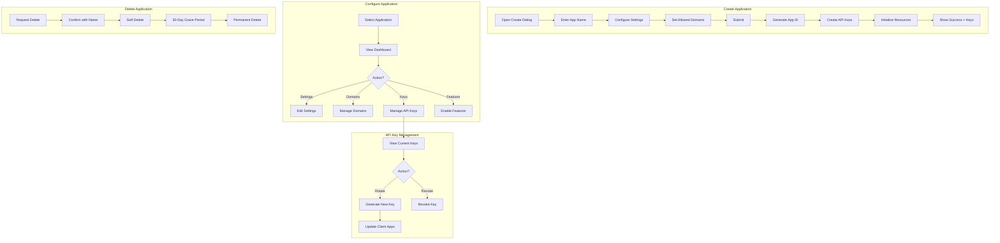

# Application Management Flow

> Visual flow for creating and managing applications.

---

## Flow Diagram



---

## Application States

```typescript
type ApplicationStatus = 
  | 'active'       // Normal operation
  | 'suspended'    // Admin suspended
  | 'pending'      // Awaiting setup
  | 'deleted';     // Soft deleted

interface Application {
  id: string;
  tenantId: string;
  name: string;
  status: ApplicationStatus;
  
  settings: {
    allowedDomains: string[];
    ipWhitelist: string[];
    features: string[];
    webhookUrl?: string;
  };
  
  keys: {
    primary: { hash: string; createdAt: Date };
    secondary: { hash: string; createdAt: Date };
  };
  
  createdAt: Date;
  deletedAt?: Date;
}
```

---

## Domain Validation

```typescript
async function validateDomain(domain: string): Promise<boolean> {
  // Check DNS TXT record
  const records = await dns.resolveTxt(`_caas.${domain}`);
  
  const expectedValue = `caas-verify=${appId}`;
  return records.some(r => r.join('') === expectedValue);
}
```

---

## Related Documents
- [Client Onboarding Flow](./client-onboarding-flow.md)
- [Client Facing UI Roadmap](../roadmaps/1_clientFacingUI.md)
