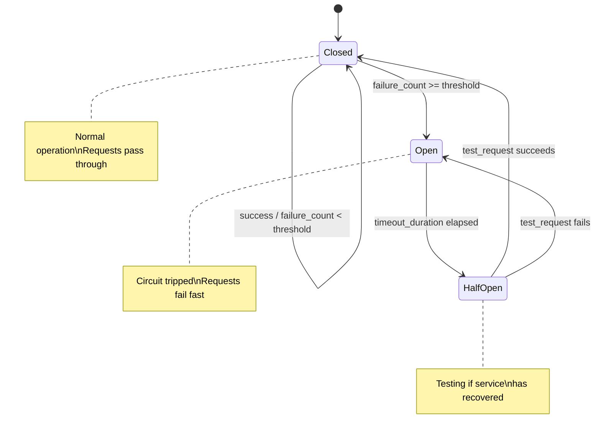

# Circuit Breaker Pattern

> Visual flow for implementing resilience patterns in CAAS services.

---

## Flow Diagram



---

## Implementation

```typescript
enum CircuitState {
  CLOSED = 'closed',
  OPEN = 'open',
  HALF_OPEN = 'half_open'
}

class CircuitBreaker {
  private state = CircuitState.CLOSED;
  private failureCount = 0;
  private lastFailureTime?: Date;
  
  constructor(
    private options: {
      failureThreshold: number;     // Failures before opening
      successThreshold: number;     // Successes to close
      timeout: number;              // ms before trying again
    }
  ) {}
  
  async execute<T>(fn: () => Promise<T>): Promise<T> {
    if (this.state === CircuitState.OPEN) {
      if (this.shouldAttemptReset()) {
        this.state = CircuitState.HALF_OPEN;
      } else {
        throw new CircuitOpenError('Circuit is open');
      }
    }
    
    try {
      const result = await fn();
      this.onSuccess();
      return result;
    } catch (error) {
      this.onFailure();
      throw error;
    }
  }
  
  private shouldAttemptReset(): boolean {
    return Date.now() - (this.lastFailureTime?.getTime() || 0) 
           >= this.options.timeout;
  }
  
  private onSuccess(): void {
    if (this.state === CircuitState.HALF_OPEN) {
      this.state = CircuitState.CLOSED;
    }
    this.failureCount = 0;
  }
  
  private onFailure(): void {
    this.failureCount++;
    this.lastFailureTime = new Date();
    
    if (this.failureCount >= this.options.failureThreshold) {
      this.state = CircuitState.OPEN;
    }
  }
}
```

---

## Usage

```typescript
const dbCircuit = new CircuitBreaker({
  failureThreshold: 5,
  successThreshold: 2,
  timeout: 30000
});

// Wrap database calls
async function queryDatabase(query: Query) {
  return dbCircuit.execute(() => db.collection.find(query));
}
```

---

## Bulkhead Pattern (Complementary)

```typescript
// Isolate resources to prevent cascade failures
const httpPool = new Semaphore(100);    // Max 100 concurrent HTTP requests
const dbPool = new Semaphore(50);       // Max 50 concurrent DB connections

async function makeRequest(url: string) {
  await httpPool.acquire();
  try {
    return await fetch(url);
  } finally {
    httpPool.release();
  }
}
```

---

## Related Documents
- [Gateway HA Architecture](./gateway-ha-architecture.md)
- [Rate Limiting](../deepDive/publicGateway/rate-limiting.md)
