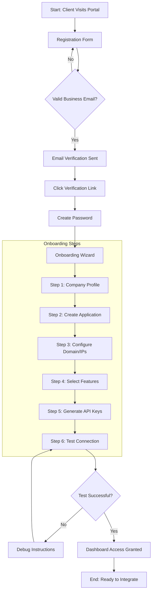

# Client Onboarding Flow

> Visual flow diagram for SAAS client registration and onboarding process.

---

## Overview

Step-by-step flow from initial registration to first API call.

---

## Flow Diagram



---

## Step Details

### 1. Registration
- Company name, business email required
- Terms of Service acceptance
- Anti-bot verification (CAPTCHA)

### 2. Email Verification
- Verification link valid 24 hours
- Resend option available
- Security: One-time use token

### 3. Onboarding Wizard

| Step | Purpose | Data Collected |
|------|---------|----------------|
| Company Profile | Complete business details | Address, size, industry |
| Create Application | Register first app | App name, description |
| Configure Domain | Security setup | Domains, IP whitelist |
| Select Features | Enable capabilities | Chat, voice, video, etc. |
| Generate API Keys | Get credentials | API key + secret |
| Test Connection | Verify integration | SDK handshake test |

### 4. Test Connection
```typescript
// Test connection from client's server
const caas = new CaasClient({
  apiKey: 'generated-key',
  apiSecret: 'generated-secret'
});

const result = await caas.test.ping();
// Returns: { success: true, latency: 45 }
```

---

## Related Documents
- [Authentication Flow](./authentication-flow.md)
- [Client Facing UI Roadmap](../roadmaps/1_clientFacingUI.md)
