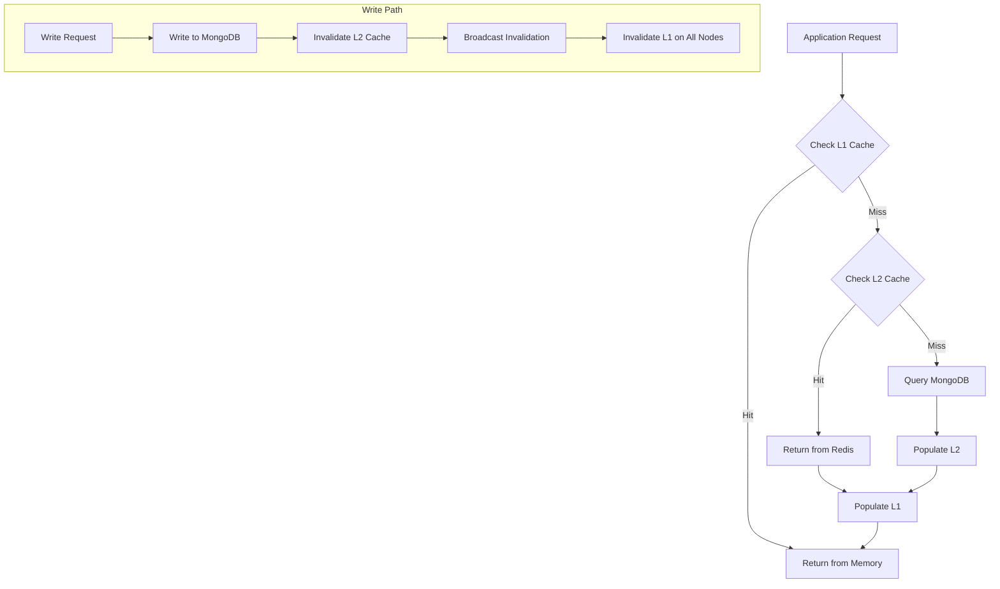

# Data Access Flow

> Visual flow for cache-aside pattern and database access.

---

## Flow Diagram



---

## Implementation

### Read Pattern
```typescript
async function getData<T>(key: string, fetcher: () => Promise<T>): Promise<T> {
  // L1: In-memory cache (per-instance)
  const l1Value = memoryCache.get(key);
  if (l1Value) {
    metrics.cacheHit('l1', key);
    return l1Value as T;
  }
  
  // L2: Redis (shared)
  const l2Value = await redis.get(key);
  if (l2Value) {
    metrics.cacheHit('l2', key);
    const parsed = JSON.parse(l2Value) as T;
    memoryCache.set(key, parsed, { ttl: 10000 }); // 10s L1 TTL
    return parsed;
  }
  
  // Database fetch
  metrics.cacheMiss(key);
  const data = await fetcher();
  
  // Populate caches
  await redis.setex(key, 300, JSON.stringify(data)); // 5min L2 TTL
  memoryCache.set(key, data, { ttl: 10000 });
  
  return data;
}
```

### Write Pattern
```typescript
async function writeData<T>(
  key: string, 
  data: T, 
  writer: (data: T) => Promise<void>
): Promise<void> {
  // Write to database first
  await writer(data);
  
  // Invalidate caches
  memoryCache.delete(key);
  await redis.del(key);
  
  // Broadcast invalidation to other instances
  await redis.publish('cache:invalidate', key);
}

// Listen for invalidations
redis.subscribe('cache:invalidate', (key) => {
  memoryCache.delete(key);
});
```

---

## Cache Key Patterns

| Entity | Key Pattern | TTL (L2) |
|--------|-------------|----------|
| User | `user:{userId}` | 5 min |
| Conversation | `conv:{convId}` | 5 min |
| Conversation List | `conv_list:{userId}` | 1 min |
| Messages | `msgs:{convId}:{page}` | 30 sec |
| Tenant Config | `tenant:{tenantId}` | 15 min |

---

## Stampede Prevention

```typescript
// Prevent cache stampede with locking
async function getWithLock<T>(
  key: string, 
  fetcher: () => Promise<T>
): Promise<T> {
  const cached = await redis.get(key);
  if (cached) return JSON.parse(cached);
  
  const lockKey = `lock:${key}`;
  const acquired = await redis.set(lockKey, '1', 'NX', 'EX', 10);
  
  if (!acquired) {
    // Another process is fetching, wait and retry
    await sleep(100);
    return getWithLock(key, fetcher);
  }
  
  try {
    const data = await fetcher();
    await redis.setex(key, 300, JSON.stringify(data));
    return data;
  } finally {
    await redis.del(lockKey);
  }
}
```

---

## Related Documents
- [Caching Strategy](../deepDive/mongodbService/caching-strategy.md)
- [Query Optimization](../deepDive/mongodbService/query-optimization.md)
