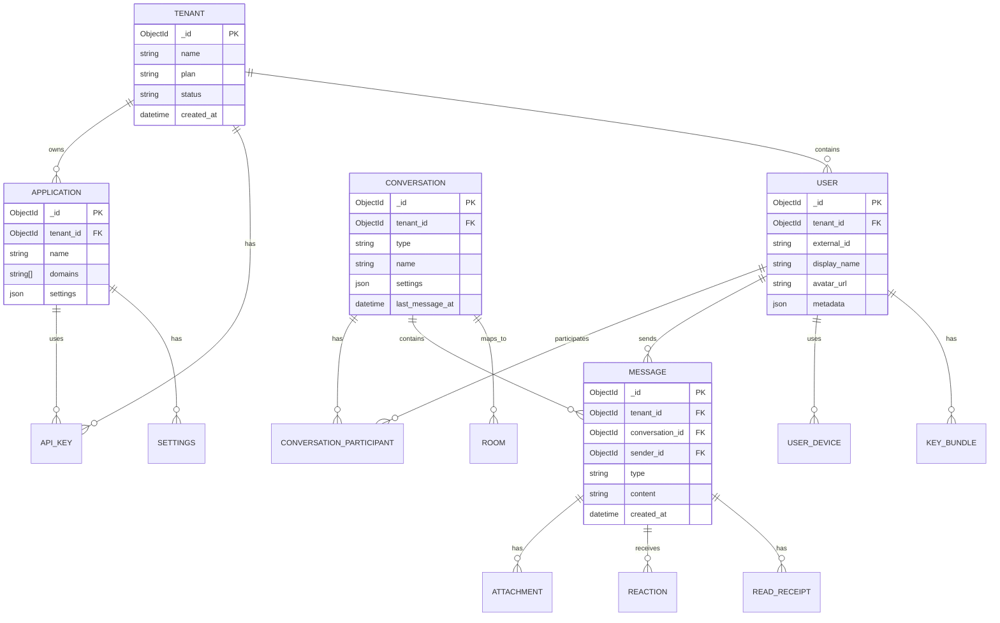

# Data Model Relationships

> Entity relationship diagram for CAAS database structure.

---

## ER Diagram



---

## Collection Relationships

### Tenant Hierarchy
```
Tenant
├── Applications[]
│   ├── API Keys[]
│   └── Settings
├── Users[]
│   ├── Devices[]
│   └── Key Bundles[]
└── Conversations[]
    ├── Participants[]
    └── Messages[]
```

---

## Index Strategy

| Collection | Indexes | Purpose |
|------------|---------|---------|
| users | `{tenant_id: 1, external_id: 1}` | Unique user per tenant |
| conversations | `{tenant_id: 1, participants.user_id: 1}` | Find user's conversations |
| messages | `{tenant_id: 1, conversation_id: 1, created_at: -1}` | Message pagination |
| messages | `{tenant_id: 1, sender_id: 1, created_at: -1}` | User's sent messages |

---

## Sharding Strategy

```
// Shard key for messages collection
{ tenant_id: 1, conversation_id: 1 }

// This ensures:
// 1. All messages for a tenant are colocated
// 2. Messages within a conversation are on same shard
// 3. Queries by tenant+conversation are efficient
```

---

## Related Documents
- [MongoDB Service Roadmap](../roadmaps/4_mongodbService.md)
- [Caching Strategy](../deepDive/mongodbService/caching-strategy.md)
