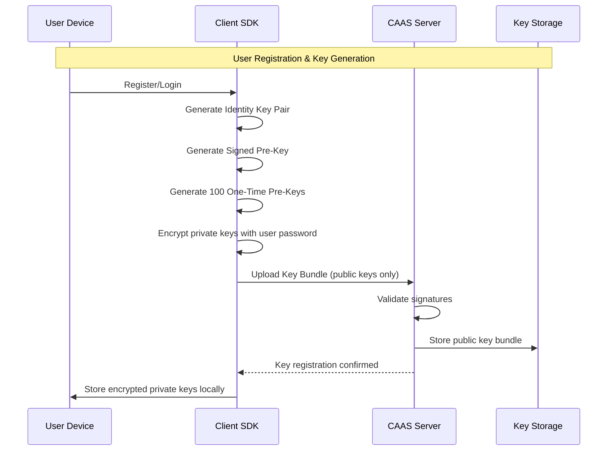
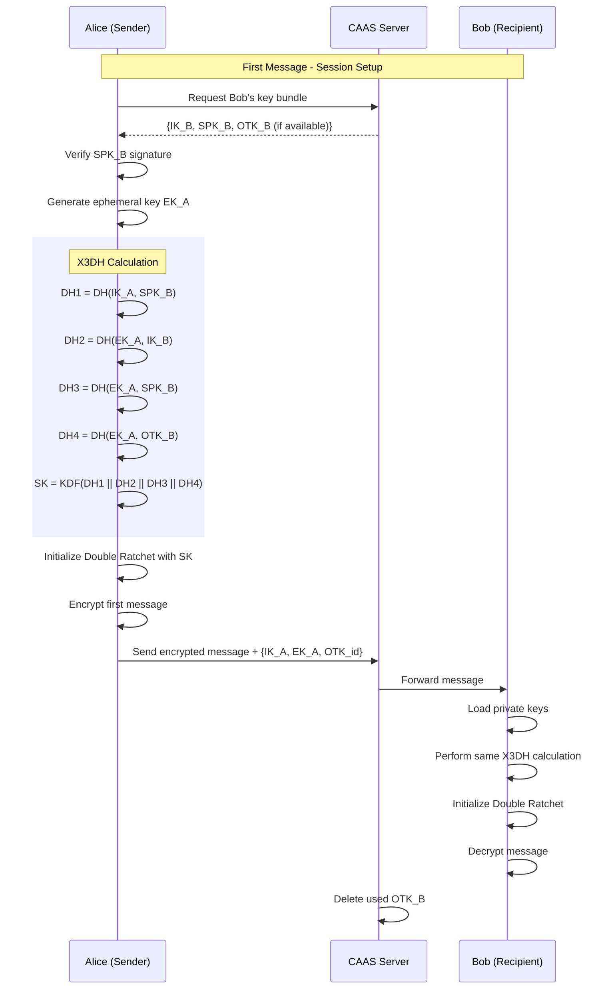
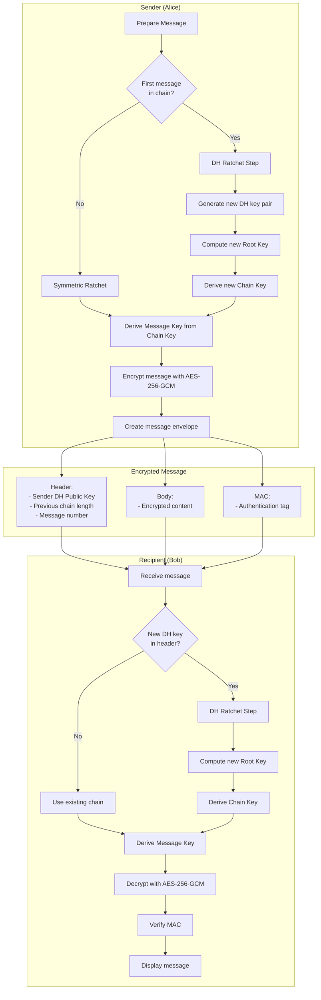
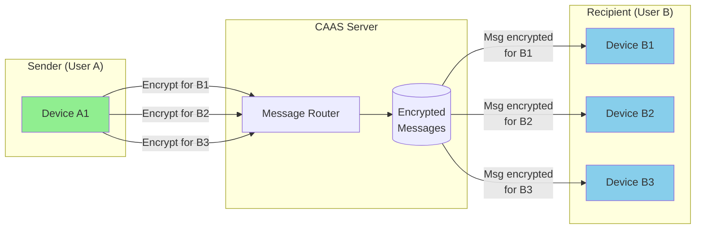
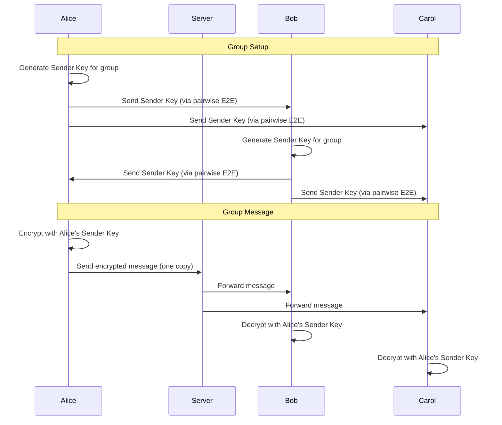
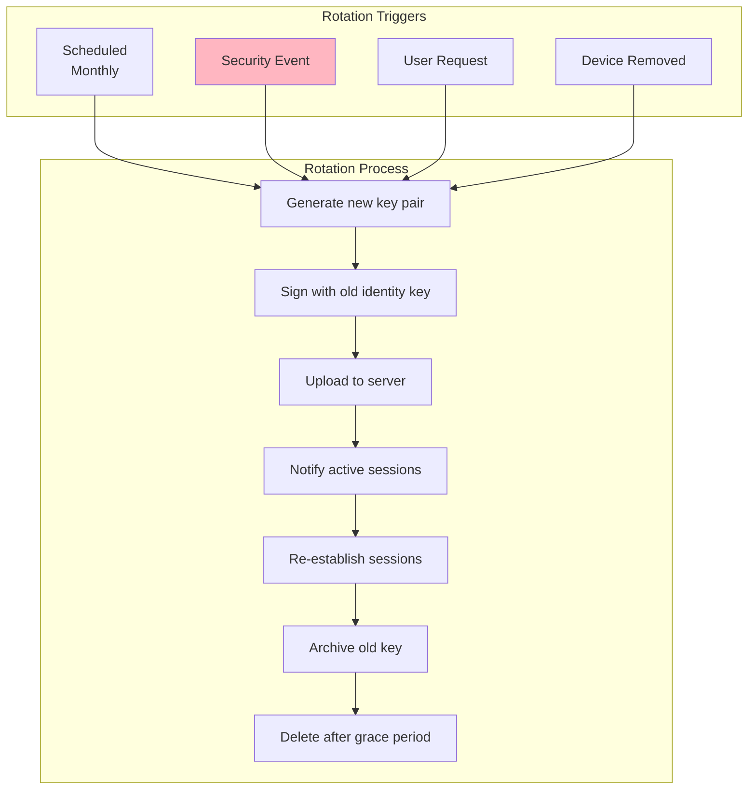

# Flow Diagram: E2E Encryption Flow

> **Related Roadmaps**: 
> - [Auth, Authorization & Security](../roadmaps/3_AuthAutorizeSecurity.md)
> - [Socket Service](../roadmaps/5_sockets.md)

---

## Overview

This diagram illustrates the complete end-to-end encryption flow from key generation to message encryption/decryption.

---

## 1. Initial Key Setup



---

## 2. Session Establishment (X3DH)



---

## 3. Message Encryption (Double Ratchet)



---

## 4. Multi-Device Message Distribution



---

## 5. Group Encryption (Sender Keys)



---

## 6. Key Rotation Flow



---

## 7. Key Storage Architecture

```
┌─────────────────────────────────────────────────────────────────┐
│                    CLIENT DEVICE                                 │
├─────────────────────────────────────────────────────────────────┤
│                                                                  │
│  ┌──────────────────────────────────────────────────────────┐   │
│  │                    IndexedDB (Encrypted)                  │   │
│  │                                                           │   │
│  │  ┌─────────────────┐  ┌─────────────────────────────┐   │   │
│  │  │  Identity Key   │  │       Session Store         │   │   │
│  │  │  (encrypted)    │  │  - Per-contact sessions     │   │   │
│  │  └─────────────────┘  │  - Root keys, chain keys    │   │   │
│  │                       └─────────────────────────────┘   │   │
│  │  ┌─────────────────┐  ┌─────────────────────────────┐   │   │
│  │  │   Pre-Keys      │  │       Message Keys          │   │   │
│  │  │   (encrypted)   │  │  (derived, ephemeral)       │   │   │
│  │  └─────────────────┘  └─────────────────────────────┘   │   │
│  └──────────────────────────────────────────────────────────┘   │
│                                                                  │
│  Master Key derived from: User Password + Device Salt (Argon2)  │
│                                                                  │
└─────────────────────────────────────────────────────────────────┘

┌─────────────────────────────────────────────────────────────────┐
│                      CAAS SERVER                                 │
├─────────────────────────────────────────────────────────────────┤
│                                                                  │
│  Public Keys Only - Server Cannot Decrypt Messages!             │
│                                                                  │
│  ┌──────────────────────────────────────────────────────────┐   │
│  │                    MongoDB                                │   │
│  │                                                           │   │
│  │  users.key_bundle: {                                     │   │
│  │    identity_key: "PUBLIC KEY",                           │   │
│  │    signed_pre_key: { id, public, signature },            │   │
│  │    one_time_pre_keys: [{ id, public }, ...]              │   │
│  │  }                                                        │   │
│  └──────────────────────────────────────────────────────────┘   │
│                                                                  │
└─────────────────────────────────────────────────────────────────┘
```

---

## Security Properties Summary

| Property | How Achieved |
|----------|--------------|
| **Confidentiality** | AES-256-GCM encryption |
| **Integrity** | GCM authentication tag |
| **Authentication** | Digital signatures on pre-keys |
| **Forward Secrecy** | DH ratchet on each exchange |
| **Post-Compromise Security** | Key rotation & ratcheting |
| **Deniability** | No third-party verifiable signatures |

---

## Related Documents

- [Signal Protocol Implementation](../rnd/signal-protocol-implementation.md)
- [E2E Key Management Deep Dive](../deepDive/authSecurity/e2e-key-management.md)
