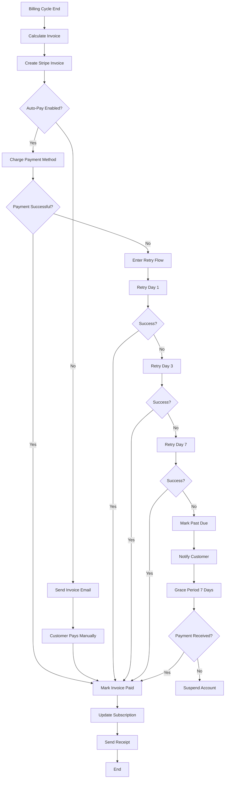

# Payment Processing Flow

> Visual flow diagram for payment lifecycle from initiation to completion.

---

## Flow Diagram



---

## Payment States

| State | Description | Action |
|-------|-------------|--------|
| pending | Invoice created | Await payment |
| processing | Payment in progress | Wait for webhook |
| paid | Successfully charged | Activate features |
| failed | Payment declined | Enter retry |
| past_due | All retries failed | Grace period |
| refunded | Money returned | Adjust records |

---

## Stripe Webhook Events

```typescript
const paymentWebhooks = {
  'payment_intent.succeeded': handlePaymentSuccess,
  'payment_intent.payment_failed': handlePaymentFailure,
  'invoice.paid': handleInvoicePaid,
  'invoice.payment_failed': handleInvoicePaymentFailed,
  'charge.refunded': handleRefund
};
```

---

## Related Documents
- [Billing Architecture](../deepDive/billingPricing/billing-architecture.md)
- [Invoice Generation](./invoice-generation.md)
