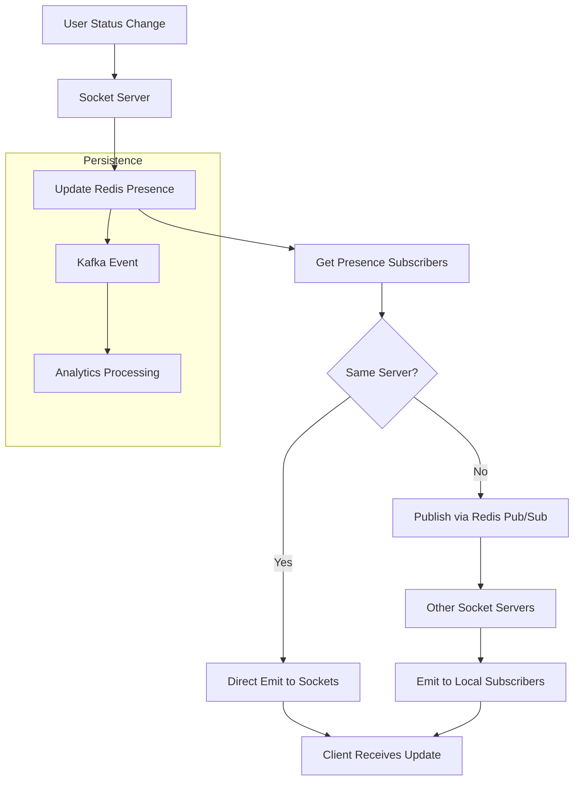

# Presence Distribution Flow

> Visual flow for real-time presence updates across the system.

---

## Flow Diagram



---

## Presence States

```typescript
type PresenceStatus = 'online' | 'offline' | 'away' | 'dnd';

interface PresenceUpdate {
  userId: string;
  status: PresenceStatus;
  customMessage?: string;
  lastSeen: Date;
  deviceType: 'mobile' | 'desktop' | 'web';
}
```

---

## Subscription Model

```typescript
// Client subscribes to contacts' presence
socket.emit('presence:subscribe', { userIds: ['user-1', 'user-2'] });

// Server manages subscriptions
class PresenceManager {
  async subscribe(subscriberId: string, targetUserIds: string[]) {
    for (const userId of targetUserIds) {
      await redis.sadd(`presence:subs:${userId}`, subscriberId);
    }
  }
  
  async getSubscribers(userId: string): Promise<string[]> {
    return redis.smembers(`presence:subs:${userId}`);
  }
  
  async broadcast(userId: string, status: PresenceStatus) {
    const subscribers = await this.getSubscribers(userId);
    
    for (const subId of subscribers) {
      await pubsub.publish(`user:${subId}`, {
        type: 'presence:update',
        data: { userId, status }
      });
    }
  }
}
```

---

## Aggregated Presence (Large Rooms)

```typescript
// For rooms with 100+ members
// Send aggregated presence instead of individual updates

interface AggregatedPresence {
  roomId: string;
  online: number;
  away: number;
  sample: Array<{ userId: string; name: string }>; // First 5 online
}

// Emit every 30 seconds instead of real-time
setInterval(() => {
  for (const room of largeRooms) {
    const aggregated = calculateAggregatedPresence(room);
    io.to(room.id).emit('presence:aggregated', aggregated);
  }
}, 30000);
```

---

## Related Documents
- [Socket Cluster Architecture](./socket-cluster-architecture.md)
- [Connection Management](../deepDive/sockets/connection-management.md)
