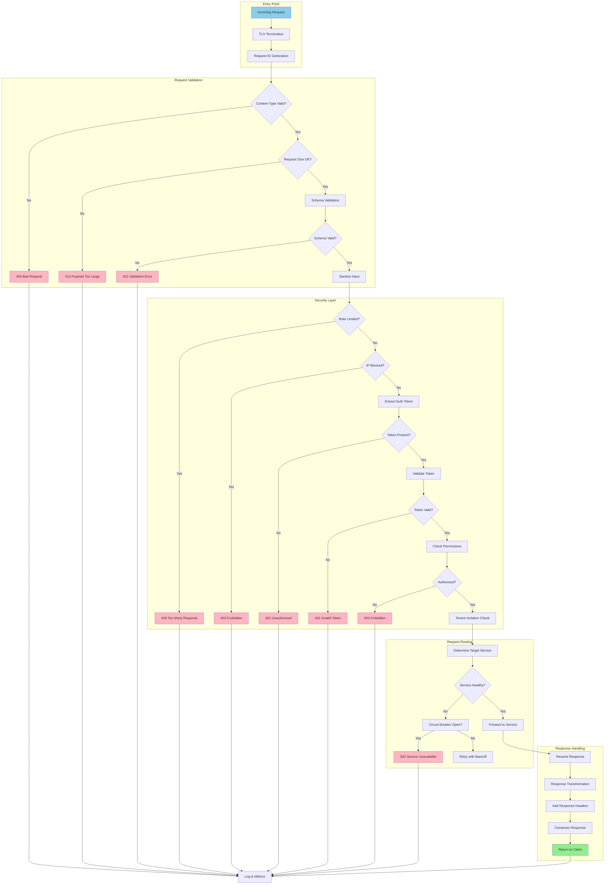
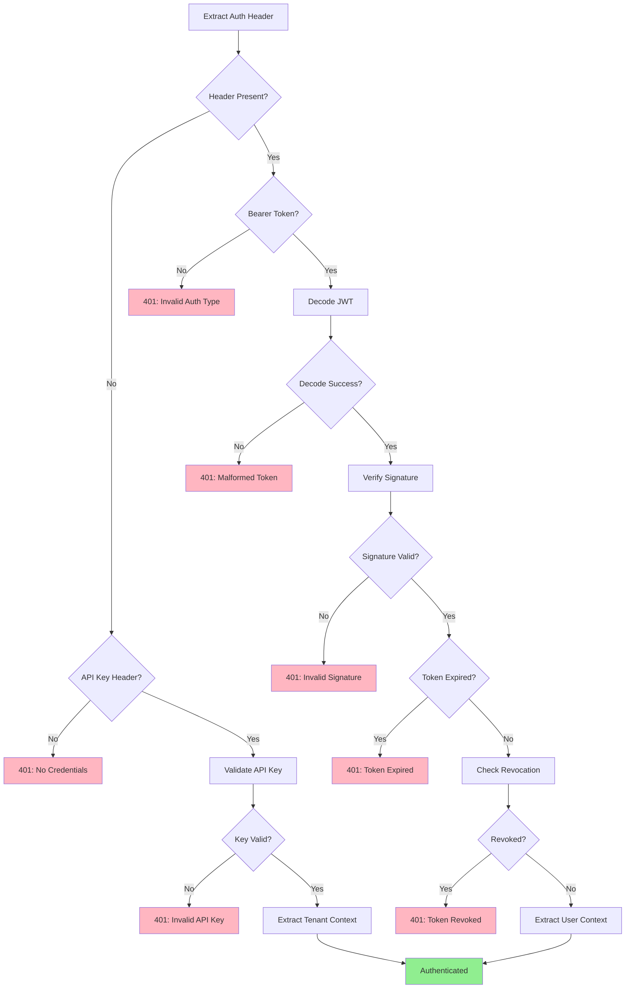
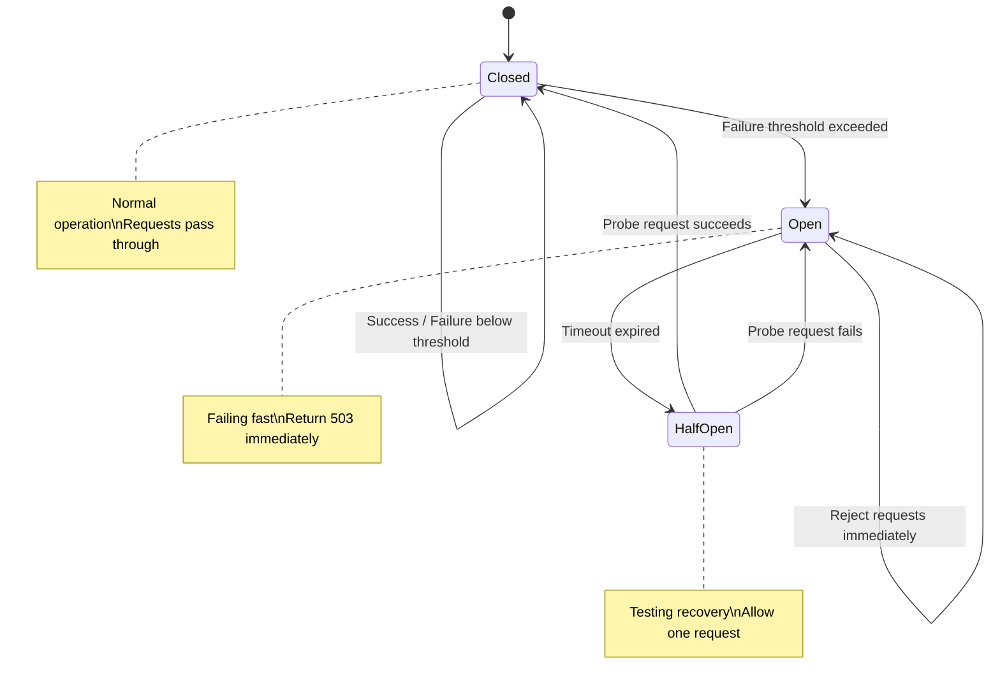
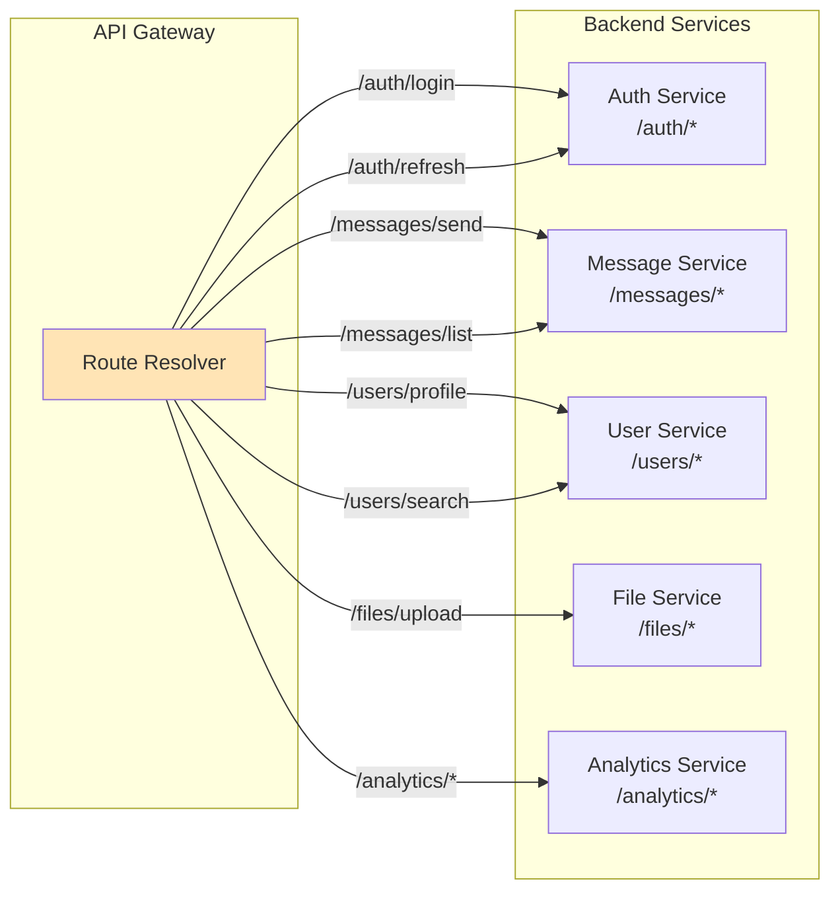

# Flow Diagram: Request Processing Pipeline

> **Related Roadmaps**: 
> - [Public Gateway](../roadmaps/2_publicalllyExposedGateway.md)
> - [Auth & Security](../roadmaps/3_AuthAutorizeSecurity.md)

---

## Overview

Complete request lifecycle through the API Gateway, showing all middleware stages and decision points.

---

## 1. Full Request Pipeline



---

## 2. Middleware Chain

```
┌─────────────────────────────────────────────────────────────────────────────┐
│                          MIDDLEWARE EXECUTION ORDER                          │
├─────────────────────────────────────────────────────────────────────────────┤
│                                                                              │
│  Request ──┬──▶ [1. Request Logger]                                         │
│            │        │                                                        │
│            │        ▼                                                        │
│            │    [2. Request ID]                                              │
│            │        │                                                        │
│            │        ▼                                                        │
│            │    [3. CORS Handler]                                            │
│            │        │                                                        │
│            │        ▼                                                        │
│            │    [4. Body Parser]                                             │
│            │        │                                                        │
│            │        ▼                                                        │
│            │    [5. Rate Limiter] ───▶ 429 if exceeded                      │
│            │        │                                                        │
│            │        ▼                                                        │
│            │    [6. IP Filter] ───▶ 403 if blocked                          │
│            │        │                                                        │
│            │        ▼                                                        │
│            │    [7. Auth Validator] ───▶ 401 if invalid                     │
│            │        │                                                        │
│            │        ▼                                                        │
│            │    [8. Permission Check] ───▶ 403 if denied                    │
│            │        │                                                        │
│            │        ▼                                                        │
│            │    [9. Tenant Resolver]                                         │
│            │        │                                                        │
│            │        ▼                                                        │
│            │    [10. Request Validator]                                      │
│            │        │                                                        │
│            │        ▼                                                        │
│            │    [11. Route Handler] ◀─── Business Logic                     │
│            │        │                                                        │
│            │        ▼                                                        │
│            │    [12. Response Transformer]                                   │
│            │        │                                                        │
│            │        ▼                                                        │
│            │    [13. Response Logger]                                        │
│            │        │                                                        │
│            ◀────────┘                                                        │
│  Response                                                                    │
│                                                                              │
└─────────────────────────────────────────────────────────────────────────────┘
```

---

## 3. Authentication Decision Tree



---

## 4. Rate Limiting Flow

```mermaid
flowchart TD
    subgraph RateCheck["Rate Limit Check"]
        A[Incoming Request] --> B[Extract Rate Limit Key]
        B --> C{Key Type}
        C -->|API Key| D[tenant:{tenantId}]
        C -->|JWT| E[user:{userId}]
        C -->|IP| F[ip:{ip}]
    end

    subgraph RedisCheck["Redis Lookup"]
        D --> G[Check Redis Counter]
        E --> G
        F --> G
        G --> H{Within Limit?}
    end

    subgraph Response["Rate Limit Response"]
        H -->|Yes| I[Increment Counter]
        I --> J[Set Headers]
        J --> K[Continue Pipeline]
        
        H -->|No| L[Check Burst Allowance]
        L --> M{Burst OK?}
        M -->|Yes| I
        M -->|No| N[Set Retry-After]
        N --> O[429 Response]
    end

    style K fill:#90EE90
    style O fill:#FFB6C1
```

---

## 5. Circuit Breaker States



```
CIRCUIT BREAKER CONFIGURATION:

┌─────────────────────────────────────────────────────────┐
│                                                          │
│  Thresholds:                                            │
│  ├── Failure Rate Threshold: 50%                        │
│  ├── Minimum Requests:       10 (in window)            │
│  ├── Window Duration:        10 seconds                │
│  └── Open State Duration:    30 seconds                │
│                                                          │
│  Counted as Failures:                                   │
│  ├── HTTP 5xx responses                                 │
│  ├── Connection timeouts                                │
│  ├── Connection refused                                 │
│  └── Request timeouts                                   │
│                                                          │
│  NOT Counted as Failures:                               │
│  ├── HTTP 4xx responses (client errors)                │
│  └── Successful responses with business errors         │
│                                                          │
└─────────────────────────────────────────────────────────┘
```

---

## 6. Service Routing



---

## 7. Error Response Standardization

```
STANDARDIZED ERROR RESPONSE FORMAT:

{
  "error": {
    "code": "VALIDATION_ERROR",
    "message": "Request validation failed",
    "details": [
      {
        "field": "email",
        "message": "Invalid email format"
      }
    ],
    "request_id": "req_abc123",
    "timestamp": "2024-01-15T10:30:00Z"
  }
}

ERROR CODE MAPPING:

┌─────────────────────────────────────────────────────────────────────┐
│ HTTP Status │ Error Code           │ Description                   │
├─────────────┼──────────────────────┼───────────────────────────────┤
│ 400         │ BAD_REQUEST          │ Malformed request             │
│ 400         │ VALIDATION_ERROR     │ Schema validation failed      │
│ 401         │ UNAUTHORIZED         │ No credentials                │
│ 401         │ INVALID_TOKEN        │ Token validation failed       │
│ 401         │ TOKEN_EXPIRED        │ Token has expired             │
│ 403         │ FORBIDDEN            │ Permission denied             │
│ 403         │ IP_BLOCKED           │ IP not whitelisted            │
│ 404         │ NOT_FOUND            │ Resource not found            │
│ 409         │ CONFLICT             │ Resource conflict             │
│ 413         │ PAYLOAD_TOO_LARGE    │ Request body too large        │
│ 429         │ RATE_LIMITED         │ Too many requests             │
│ 500         │ INTERNAL_ERROR       │ Unexpected server error       │
│ 502         │ BAD_GATEWAY          │ Upstream service error        │
│ 503         │ SERVICE_UNAVAILABLE  │ Circuit breaker open          │
│ 504         │ GATEWAY_TIMEOUT      │ Upstream timeout              │
└─────────────────────────────────────────────────────────────────────┘
```

---

## Related Documents

- [Gateway Security Implementation](../deepDive/publicGateway/security-implementation.md)
- [Rate Limiting Strategies](../deepDive/publicGateway/rate-limiting.md)
- [Gateway Roadmap](../roadmaps/2_publicalllyExposedGateway.md)
