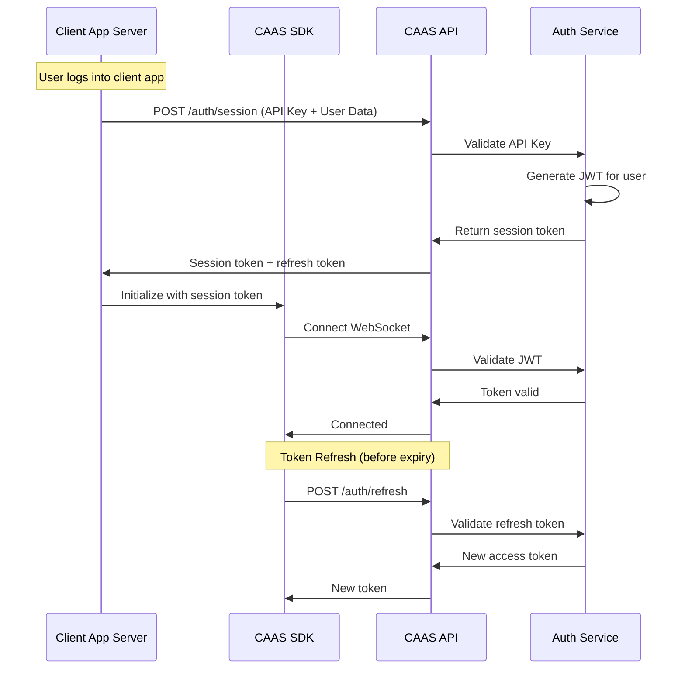

# SDK Authentication Flow

> Visual flow for SDK authentication process.

---

## Flow Diagram



---

## Server-Side Session Creation

```typescript
// Client's server creates session
const caas = CaasClient.initialize({
  apiKey: process.env.CAAS_API_KEY,
  apiSecret: process.env.CAAS_API_SECRET
});

const session = await caas.auth.createSession({
  externalUserId: user.id,
  userData: {
    name: user.name,
    avatar: user.avatarUrl,
    email: user.email
  }
});

// Return token to client-side
res.json({ token: session.accessToken });
```

---

## Client-Side Initialization

```typescript
// Client-side SDK init with token
const caas = new CaasClient({
  token: tokenFromServer
});

await caas.connect();
```

---

## Related Documents
- [Authentication Flow](./authentication-flow.md)
- [API SDK Roadmap](../roadmaps/7_apiSdk.md)
