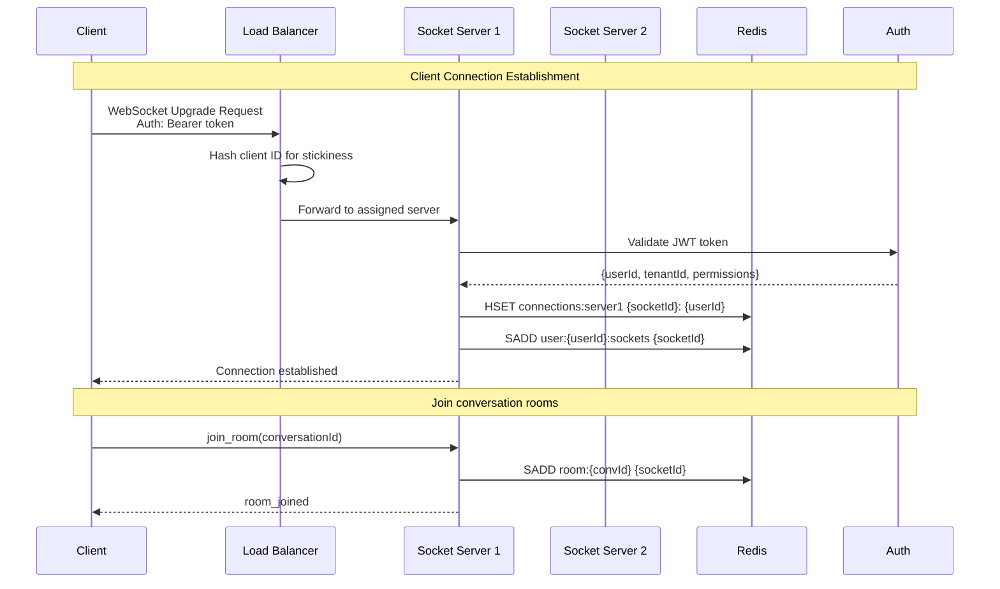
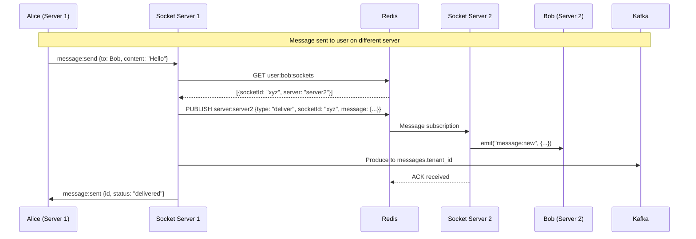
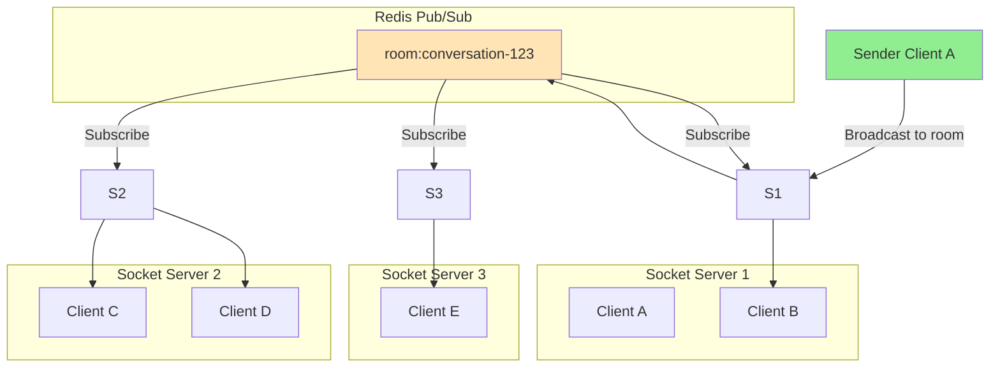
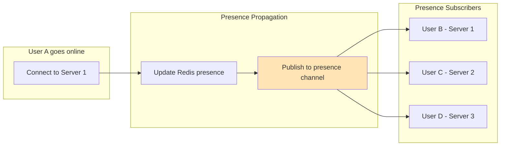
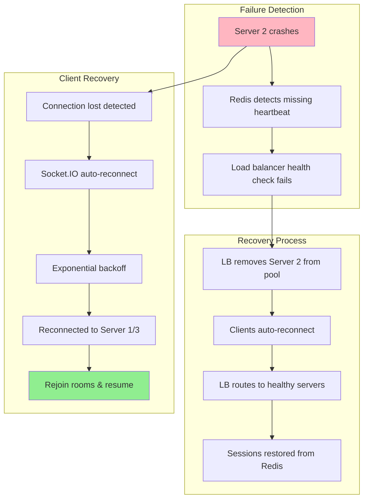

# Flow Diagram: Socket Cluster Architecture

> **Related Roadmaps**: 
> - [Socket Service](../roadmaps/5_sockets.md)
> - [Kafka Service](../roadmaps/8_kafkaService.md)

---

## Overview

High-level architecture of the distributed Socket.IO cluster with Redis Pub/Sub and Kafka integration.

---

## 1. High-Level Architecture

```
┌─────────────────────────────────────────────────────────────────────────────┐
│                              INTERNET                                        │
│                                  │                                          │
│                          ┌───────▼───────┐                                  │
│                          │   CDN / WAF   │                                  │
│                          │  (CloudFlare) │                                  │
│                          └───────┬───────┘                                  │
│                                  │                                          │
│                          ┌───────▼───────┐                                  │
│                          │ Load Balancer │                                  │
│                          │  (Nginx/AWS)  │                                  │
│                          │ Sticky Session│                                  │
│                          └───────┬───────┘                                  │
│                                  │                                          │
│         ┌────────────────────────┼────────────────────────┐                 │
│         │                        │                        │                 │
│   ┌─────▼─────┐           ┌─────▼─────┐           ┌─────▼─────┐            │
│   │  Socket   │           │  Socket   │           │  Socket   │            │
│   │ Server 1  │           │ Server 2  │           │ Server 3  │            │
│   │ (pod-1)   │           │ (pod-2)   │           │ (pod-3)   │            │
│   └─────┬─────┘           └─────┬─────┘           └─────┬─────┘            │
│         │                       │                       │                   │
│         └───────────────────────┼───────────────────────┘                   │
│                                 │                                           │
│                         ┌───────▼───────┐                                   │
│                         │ Redis Cluster │                                   │
│                         │   (Pub/Sub)   │                                   │
│                         └───────┬───────┘                                   │
│                                 │                                           │
│                         ┌───────▼───────┐                                   │
│                         │ Kafka Cluster │                                   │
│                         │ (Persistence) │                                   │
│                         └───────────────┘                                   │
│                                                                             │
└─────────────────────────────────────────────────────────────────────────────┘
```

---

## 2. Connection Flow



---

## 3. Cross-Server Message Routing



---

## 4. Room Broadcast Pattern



---

## 5. Presence Distribution



```
PRESENCE DATA FLOW:

1. User connects
   └─▶ SET presence:{userId} {status: "online", lastSeen: timestamp}
   
2. Notify subscribers
   └─▶ PUBLISH presence:updates {userId, status: "online"}
   
3. Each server with subscribers
   └─▶ Emit to local sockets subscribed to user's presence
   
4. Heartbeat (every 30s)
   └─▶ EXPIRE presence:{userId} 60
   
5. User disconnects
   └─▶ SET presence:{userId} {status: "offline", lastSeen: now}
   └─▶ PUBLISH presence:updates {userId, status: "offline"}
```

---

## 6. Scaling Events

```mermaid
flowchart TD
    subgraph ScaleUp["Scale Up Event"]
        N1[HPA detects high CPU]
        N2[Launch new pod: server-4]
        N3[Server-4 connects to Redis]
        N4[Subscribes to channels]
        N5[Ready for connections]
    end

    subgraph ScaleDown["Scale Down Event"]
        D1[HPA signals scale down]
        D2[Mark server as draining]
        D3[Stop accepting new connections]
        D4[Wait for graceful disconnect]
        D5[Move persistent rooms if needed]
        D6[Terminate pod]
    end

    N1 --> N2 --> N3 --> N4 --> N5
    D1 --> D2 --> D3 --> D4 --> D5 --> D6

    style N1 fill:#90EE90
    style D1 fill:#FFB6C1
```



---

## 7. Failure Handling



---

## 8. Data Stores Overview

```
┌────────────────────────────────────────────────────────────────────────────┐
│                           DATA STORE RESPONSIBILITIES                       │
├────────────────────────────────────────────────────────────────────────────┤
│                                                                             │
│  ┌──────────────────────────────────────────────────────────────────────┐  │
│  │                         REDIS CLUSTER                                 │  │
│  │                                                                       │  │
│  │  Purpose: Real-time state & Pub/Sub                                  │  │
│  │                                                                       │  │
│  │  ├── connections:{serverId}     → socketId:userId mapping           │  │
│  │  ├── user:{userId}:sockets      → All sockets for a user            │  │
│  │  ├── room:{roomId}              → All sockets in a room             │  │
│  │  ├── presence:{userId}          → Online status                      │  │
│  │  ├── typing:{conversationId}    → Currently typing users            │  │
│  │  └── offline:{userId}           → Queued offline messages           │  │
│  │                                                                       │  │
│  │  Pub/Sub Channels:                                                   │  │
│  │  ├── server:{serverId}          → Server-specific messages          │  │
│  │  ├── room:{roomId}              → Room broadcasts                   │  │
│  │  └── presence:updates           → Presence change notifications     │  │
│  └──────────────────────────────────────────────────────────────────────┘  │
│                                                                             │
│  ┌──────────────────────────────────────────────────────────────────────┐  │
│  │                         KAFKA CLUSTER                                 │  │
│  │                                                                       │  │
│  │  Purpose: Durable message persistence & event streaming              │  │
│  │                                                                       │  │
│  │  Topics:                                                              │  │
│  │  ├── messages.{tenant_id}       → Chat messages for persistence     │  │
│  │  ├── events.socket              → Socket events for analytics       │  │
│  │  ├── presence.changes           → Presence for history              │  │
│  │  └── notifications              → Push notification triggers        │  │
│  └──────────────────────────────────────────────────────────────────────┘  │
│                                                                             │
│  ┌──────────────────────────────────────────────────────────────────────┐  │
│  │                           MONGODB                                     │  │
│  │                                                                       │  │
│  │  Purpose: Persistent storage (consumed from Kafka)                   │  │
│  │                                                                       │  │
│  │  Collections:                                                         │  │
│  │  ├── messages                   → All chat messages                  │  │
│  │  ├── conversations              → Conversation metadata              │  │
│  │  └── users                      → User profiles & keys               │  │
│  └──────────────────────────────────────────────────────────────────────┘  │
│                                                                             │
└────────────────────────────────────────────────────────────────────────────┘
```

---

## Related Documents

- [Socket Service Roadmap](../roadmaps/5_sockets.md)
- [Message Routing Deep Dive](../deepDive/sockets/message-routing.md)
- [WebSocket vs Socket.IO R&D](../rnd/websocket-vs-socketio.md)
