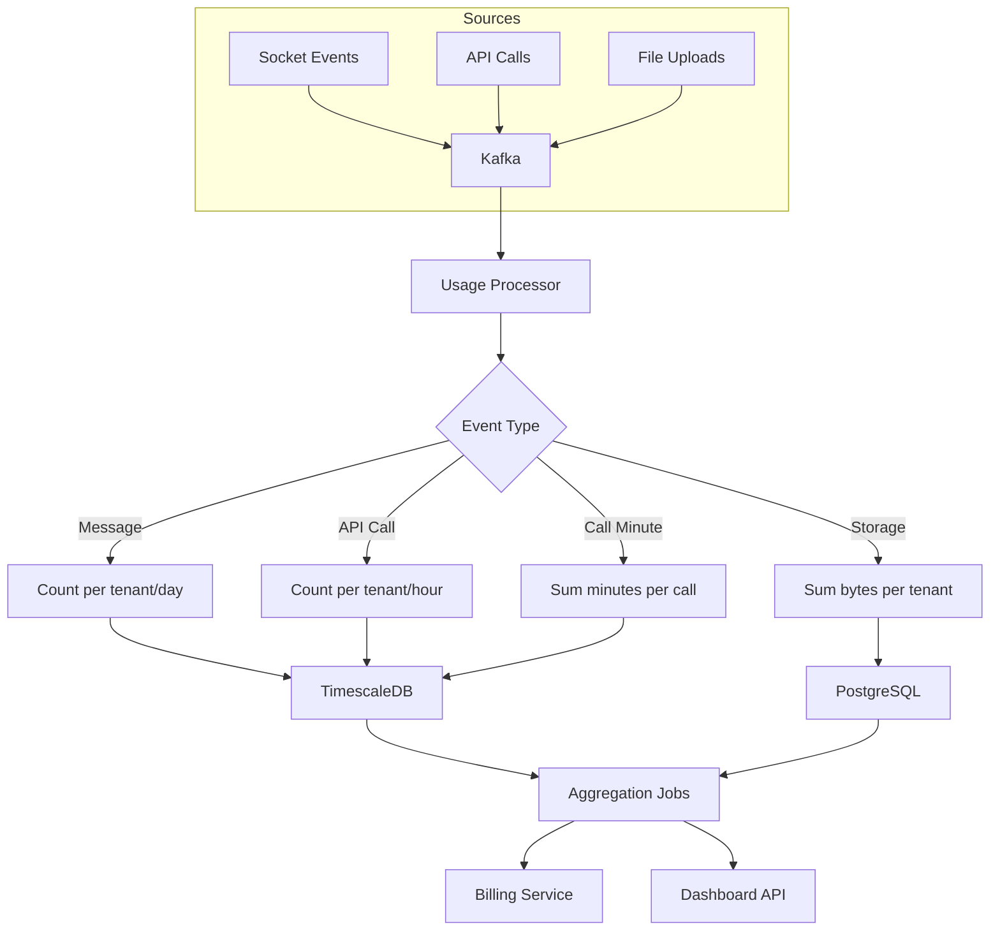

# Usage Metering Pipeline

> Visual flow for tracking and aggregating usage for billing.

---

## Flow Diagram



---

## Usage Event Schema

```typescript
interface UsageEvent {
  id: string;
  type: 'message' | 'api_call' | 'storage' | 'call_minute';
  tenantId: string;
  userId: string;
  timestamp: Date;
  quantity: number;
  metadata: {
    endpoint?: string;      // For API calls
    fileSize?: number;      // For storage
    conversationId?: string; // For messages
  };
}
```

---

## Aggregation Strategy

| Metric | Raw Granularity | Aggregation | Rollup |
|--------|-----------------|-------------|--------|
| Messages | Per event | Per hour | Daily/Monthly |
| API Calls | Per event | Per hour | Daily |
| Storage | Per event | Current sum | - |
| MAU | Per event | Daily unique | Monthly |

---

## Deduplication

```typescript
// Idempotent event processing
async function processUsageEvent(event: UsageEvent) {
  const eventKey = `usage:processed:${event.id}`;
  
  // Check if already processed
  const exists = await redis.exists(eventKey);
  if (exists) {
    return; // Skip duplicate
  }
  
  // Process event
  await aggregateUsage(event);
  
  // Mark as processed (expire after 24h)
  await redis.setex(eventKey, 86400, '1');
}
```

---

## Real-time Quota Check

```typescript
async function checkQuota(tenantId: string, metric: string): Promise<boolean> {
  const plan = await getPlan(tenantId);
  const current = await getCurrentUsage(tenantId, metric);
  
  return current < plan.limits[metric];
}

// Alert thresholds
async function checkThresholds(tenantId: string) {
  const usage = await getMonthlyUsage(tenantId);
  const plan = await getPlan(tenantId);
  
  const percentage = (usage.messages / plan.limits.messages) * 100;
  
  if (percentage >= 100) {
    await sendAlert(tenantId, 'quota_exceeded');
  } else if (percentage >= 90) {
    await sendAlert(tenantId, 'quota_warning_90');
  } else if (percentage >= 80) {
    await sendAlert(tenantId, 'quota_warning_80');
  }
}
```

---

## Related Documents
- [Billing Architecture](../deepDive/billingPricing/billing-architecture.md)
- [Pricing Model](./pricing-model.md)
