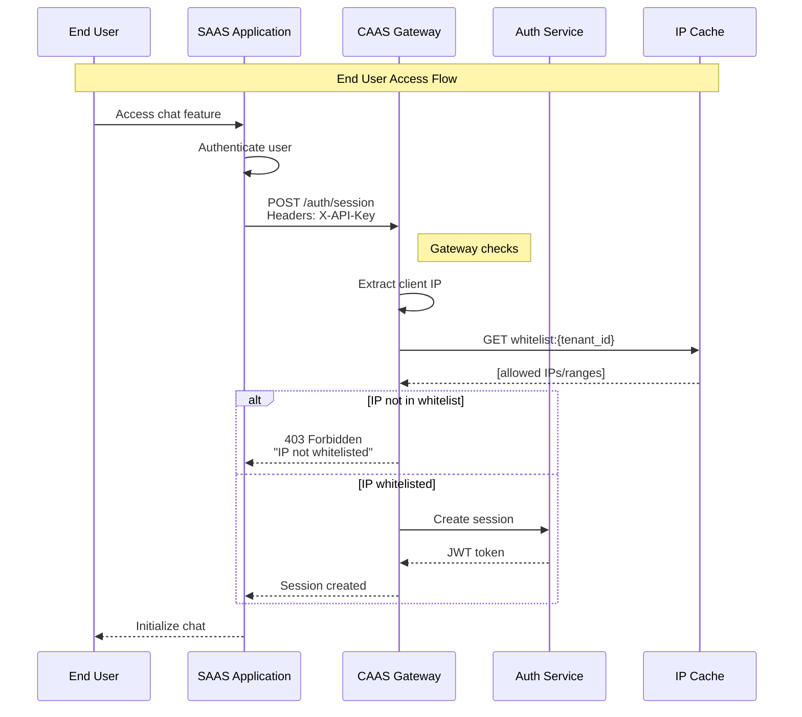

# R&D: IP Whitelisting & Geolocation Security

> **Related Roadmaps**: 
> - [Public Gateway](../roadmaps/2_publicalllyExposedGateway.md)
> - [Auth & Security](../roadmaps/3_AuthAutorizeSecurity.md)

---

## Executive Summary

This document covers IP whitelisting implementation for SAAS client verification, ensuring end users access CAAS only through authorized client applications.

---

## 1. IP Whitelisting Architecture

### 1.1 flow Overview



### 1.2 Configuration Model

```typescript
interface IpWhitelistConfig {
  tenant_id: string;
  entries: IpEntry[];
  settings: {
    enabled: boolean;
    allow_all_if_empty: boolean;  // If no entries, allow all
    log_blocked_attempts: boolean;
    alert_on_new_ip: boolean;
  };
  audit: {
    created_by: string;
    created_at: Date;
    last_modified_by: string;
    last_modified_at: Date;
  };
}

interface IpEntry {
  id: string;
  type: 'single' | 'range' | 'cidr';
  value: string;              // "192.168.1.1" or "192.168.1.0/24"
  description: string;        // "Production server"
  environment: 'production' | 'staging' | 'development' | 'all';
  added_by: string;
  added_at: Date;
  expires_at: Date | null;    // Optional expiration
}
```

---

## 2. Implementation

### 2.1 IP Extraction

```typescript
// Extract real client IP considering proxies
function extractClientIp(req: Request): string {
  // Check standard proxy headers
  const forwardedFor = req.headers['x-forwarded-for'];
  const realIp = req.headers['x-real-ip'];
  const cfConnectingIp = req.headers['cf-connecting-ip']; // Cloudflare
  
  if (cfConnectingIp) {
    return cfConnectingIp as string;
  }
  
  if (forwardedFor) {
    // X-Forwarded-For can have multiple IPs: client, proxy1, proxy2
    // Real client is first (leftmost)
    const ips = (forwardedFor as string).split(',').map(ip => ip.trim());
    return ips[0];
  }
  
  if (realIp) {
    return realIp as string;
  }
  
  return req.socket.remoteAddress || '';
}

// Validate IP format
function isValidIp(ip: string): boolean {
  // IPv4
  const ipv4Regex = /^(\d{1,3}\.){3}\d{1,3}$/;
  // IPv6
  const ipv6Regex = /^([0-9a-fA-F]{0,4}:){2,7}[0-9a-fA-F]{0,4}$/;
  
  return ipv4Regex.test(ip) || ipv6Regex.test(ip);
}
```

### 2.2 CIDR Range Matching

```typescript
import { Address4, Address6 } from 'ip-address';

function isIpInCidr(ip: string, cidr: string): boolean {
  try {
    // Try IPv4
    const address = new Address4(ip);
    const subnet = new Address4(cidr);
    return address.isInSubnet(subnet);
  } catch {
    try {
      // Try IPv6
      const address = new Address6(ip);
      const subnet = new Address6(cidr);
      return address.isInSubnet(subnet);
    } catch {
      return false;
    }
  }
}

// Check IP against all whitelist entries
async function checkIpWhitelist(
  tenantId: string,
  clientIp: string
): Promise<WhitelistResult> {
  // Get config from cache or database
  const config = await getWhitelistConfig(tenantId);
  
  if (!config.settings.enabled) {
    return { allowed: true, reason: 'whitelist_disabled' };
  }
  
  if (config.entries.length === 0 && config.settings.allow_all_if_empty) {
    return { allowed: true, reason: 'no_entries_configured' };
  }
  
  for (const entry of config.entries) {
    // Check expiration
    if (entry.expires_at && new Date() > entry.expires_at) {
      continue;
    }
    
    let matches = false;
    
    switch (entry.type) {
      case 'single':
        matches = clientIp === entry.value;
        break;
      case 'cidr':
        matches = isIpInCidr(clientIp, entry.value);
        break;
      case 'range':
        matches = isIpInRange(clientIp, entry.value);
        break;
    }
    
    if (matches) {
      return {
        allowed: true,
        reason: 'whitelist_match',
        matchedEntry: entry.id
      };
    }
  }
  
  return { allowed: false, reason: 'no_match' };
}
```

### 2.3 Caching Strategy

```typescript
// Redis caching for performance
class IpWhitelistCache {
  private redis: Redis;
  private ttl = 300; // 5 minutes
  
  async getWhitelist(tenantId: string): Promise<IpEntry[]> {
    const cacheKey = `ip:whitelist:${tenantId}`;
    
    // Try cache
    const cached = await this.redis.get(cacheKey);
    if (cached) {
      return JSON.parse(cached);
    }
    
    // Load from database
    const config = await db.ipWhitelists.findOne({ tenant_id: tenantId });
    const entries = config?.entries || [];
    
    // Cache with TTL
    await this.redis.setex(cacheKey, this.ttl, JSON.stringify(entries));
    
    return entries;
  }
  
  async invalidate(tenantId: string): Promise<void> {
    await this.redis.del(`ip:whitelist:${tenantId}`);
    // Also publish invalidation for other instances
    await this.redis.publish('ip:whitelist:invalidate', tenantId);
  }
}
```

---

## 3. Geolocation Security

### 3.1 GeoIP Integration

```typescript
import geoip from 'geoip-lite';
// Or use MaxMind for production
import { Reader } from '@maxmind/geoip2-node';

interface GeoLocation {
  country: string;
  region: string;
  city: string;
  timezone: string;
  coordinates: {
    latitude: number;
    longitude: number;
  };
}

async function getGeoLocation(ip: string): Promise<GeoLocation | null> {
  // Using MaxMind for production accuracy
  const reader = await Reader.open('/path/to/GeoLite2-City.mmdb');
  
  try {
    const response = reader.city(ip);
    
    return {
      country: response.country?.isoCode || 'Unknown',
      region: response.subdivisions?.[0]?.isoCode || 'Unknown',
      city: response.city?.names?.en || 'Unknown',
      timezone: response.location?.timeZone || 'Unknown',
      coordinates: {
        latitude: response.location?.latitude || 0,
        longitude: response.location?.longitude || 0
      }
    };
  } catch (error) {
    return null;
  }
}
```

### 3.2 Country-Based Access Control

```typescript
interface GeoRestrictionConfig {
  tenant_id: string;
  mode: 'allowlist' | 'blocklist';
  countries: string[];  // ISO country codes
  exceptions: {
    ips: string[];      // IPs that bypass geo restrictions
    users: string[];    // User IDs that bypass
  };
}

async function checkGeoRestrictions(
  tenantId: string,
  clientIp: string,
  userId?: string
): Promise<GeoCheckResult> {
  const config = await getGeoConfig(tenantId);
  
  if (!config) {
    return { allowed: true, reason: 'no_geo_restrictions' };
  }
  
  // Check exceptions
  if (config.exceptions.ips.includes(clientIp)) {
    return { allowed: true, reason: 'ip_exception' };
  }
  if (userId && config.exceptions.users.includes(userId)) {
    return { allowed: true, reason: 'user_exception' };
  }
  
  // Get geolocation
  const geo = await getGeoLocation(clientIp);
  if (!geo) {
    // Fail open or closed based on policy
    return { allowed: false, reason: 'geo_lookup_failed' };
  }
  
  const countryAllowed = config.mode === 'allowlist'
    ? config.countries.includes(geo.country)
    : !config.countries.includes(geo.country);
  
  return {
    allowed: countryAllowed,
    reason: countryAllowed ? 'geo_allowed' : 'geo_blocked',
    country: geo.country
  };
}
```

---

## 4. Dynamic IP Detection

### 4.1 Automatic IP Discovery for SAAS Clients

```typescript
// Help SAAS clients discover their server IPs
async function discoverClientIps(tenantId: string): Promise<void> {
  // Track IPs making requests with valid API key
  const key = `ip:discovery:${tenantId}`;
  
  // During discovery mode
  await redis.sadd(key, clientIp);
  await redis.expire(key, 86400); // 24 hours
}

// API for clients to view discovered IPs
router.get('/settings/ip-discovery', async (req, res) => {
  const discoveredIps = await redis.smembers(`ip:discovery:${req.tenantId}`);
  
  res.json({
    discoveredIps,
    message: 'Add these IPs to your whitelist if they match your servers'
  });
});
```

### 4.2 IP Change Notifications

```typescript
// Alert on requests from new IPs
async function checkAndAlertNewIp(
  tenantId: string,
  clientIp: string
): Promise<void> {
  const config = await getWhitelistConfig(tenantId);
  
  // Track known IPs
  const knownIpsKey = `ip:known:${tenantId}`;
  const isKnown = await redis.sismember(knownIpsKey, clientIp);
  
  if (!isKnown) {
    // Add to known IPs
    await redis.sadd(knownIpsKey, clientIp);
    
    // Send alert if configured
    if (config.settings.alert_on_new_ip) {
      await sendSecurityAlert({
        type: 'new_ip_detected',
        tenant_id: tenantId,
        ip: clientIp,
        geo: await getGeoLocation(clientIp),
        timestamp: new Date()
      });
    }
  }
}
```

---

## 5. UI/API for Management

### 5.1 Management API

```typescript
// IP Whitelist Management Endpoints
router.post('/settings/ip-whitelist', async (req, res) => {
  const { type, value, description, environment, expires_at } = req.body;
  
  // Validate IP/CIDR format
  if (!validateIpEntry(type, value)) {
    return res.status(400).json({ error: 'Invalid IP format' });
  }
  
  const entry: IpEntry = {
    id: generateId(),
    type,
    value,
    description,
    environment,
    added_by: req.user.id,
    added_at: new Date(),
    expires_at: expires_at ? new Date(expires_at) : null
  };
  
  await db.ipWhitelists.updateOne(
    { tenant_id: req.tenantId },
    { $push: { entries: entry } },
    { upsert: true }
  );
  
  // Invalidate cache
  await ipWhitelistCache.invalidate(req.tenantId);
  
  res.json({ success: true, entry });
});

router.delete('/settings/ip-whitelist/:entryId', async (req, res) => {
  await db.ipWhitelists.updateOne(
    { tenant_id: req.tenantId },
    { $pull: { entries: { id: req.params.entryId } } }
  );
  
  await ipWhitelistCache.invalidate(req.tenantId);
  
  res.json({ success: true });
});
```

---

## 6. Security Best Practices

### 6.1 Recommendations

1. **Always use CIDR for cloud providers** - Cloud IPs can change
2. **Set expiration on temporary entries** - Contractors, testing
3. **Monitor blocked attempts** - Detect configuration issues
4. **Have emergency bypass** - Prevent lockouts
5. **Use discovery mode initially** - Find all legitimate IPs
6. **Combine with geo-restrictions** - Defense in depth

### 6.2 Common CIDR Ranges for Cloud Providers

| Provider | Documentation |
|----------|--------------|
| AWS | [AWS IP Ranges](https://docs.aws.amazon.com/general/latest/gr/aws-ip-ranges.html) |
| GCP | [GCP IP Ranges](https://cloud.google.com/compute/docs/faq#find_ip_range) |
| Azure | [Azure IP Ranges](https://www.microsoft.com/en-us/download/details.aspx?id=56519) |
| Cloudflare | [Cloudflare IPs](https://www.cloudflare.com/ips/) |

---

## Related Documents

- [Gateway Security Implementation](../deepDive/publicGateway/security-implementation.md)
- [Authentication Flow](../flowdiagram/authentication-flow.md)
