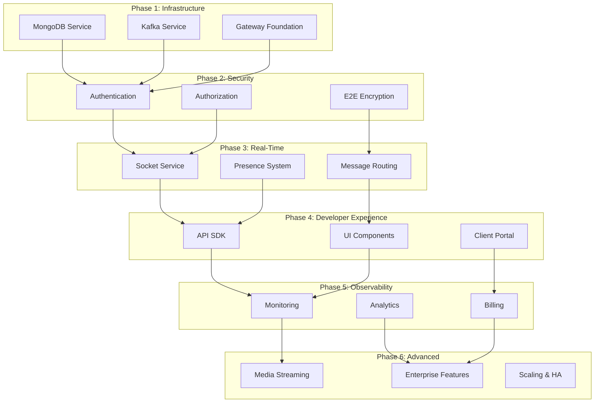

# CAAS Development Phases Overview

> **Purpose**: Master guide for understanding the development phases and their interdependencies.

---

## 📅 Phase Timeline

| Phase | Name | Duration | Focus Areas |
|-------|------|----------|-------------|
| **1** | Core Infrastructure | Weeks 1-4 | MongoDB, Kafka, Gateway Foundation |
| **2** | Security & Authentication | Weeks 5-8 | Auth, Authorization, E2E Encryption |
| **3** | Real-Time Communication | Weeks 9-12 | Sockets, Presence, Message Routing |
| **4** | Developer Experience | Weeks 13-18 | SDK, UI Components, Client Portal |
| **5** | Observability & Billing | Weeks 19-24 | Monitoring, Analytics, Payments |
| **6** | Advanced Features | Weeks 25+ | WebRTC, Enterprise, Scaling |

---

## 🔗 Phase Dependencies



---

## 📁 Phase Directory Structure

```
phases/
├── phase-1-infrastructure/
│   ├── README.md                    # Phase overview
│   ├── mongodb-service/
│   │   ├── README.md
│   │   ├── 01-setup.json           # MongoDB setup tasks
│   │   ├── 02-multi-tenancy.json   # Multi-tenancy implementation
│   │   ├── 03-schemas.json         # Schema implementation
│   │   └── 04-optimization.json    # Performance optimization
│   ├── kafka-service/
│   │   ├── README.md
│   │   ├── 01-cluster-setup.json
│   │   ├── 02-topics.json
│   │   └── 03-security.json
│   └── gateway-foundation/
│       ├── README.md
│       ├── 01-core-setup.json
│       ├── 02-middleware.json
│       └── 03-configuration.json
│
├── phase-2-security/
│   ├── README.md
│   ├── authentication/
│   │   ├── README.md
│   │   ├── 01-client-auth.json
│   │   ├── 02-user-auth.json
│   │   └── 03-session-management.json
│   ├── authorization/
│   │   ├── README.md
│   │   ├── 01-rbac.json
│   │   └── 02-abac.json
│   └── encryption/
│       ├── README.md
│       ├── 01-key-management.json
│       └── 02-signal-protocol.json
│
├── phase-3-realtime/
│   ├── README.md
│   ├── socket-service/
│   │   ├── README.md
│   │   ├── 01-infrastructure.json
│   │   ├── 02-connection-management.json
│   │   └── 03-protocol.json
│   ├── presence-system/
│   │   ├── README.md
│   │   └── 01-presence.json
│   └── message-routing/
│       ├── README.md
│       ├── 01-routing-logic.json
│       └── 02-delivery-guarantees.json
│
├── phase-4-developer-experience/
│   ├── README.md
│   ├── api-sdk/
│   │   ├── README.md
│   │   ├── 01-foundation.json
│   │   ├── 02-authentication-api.json
│   │   ├── 03-messaging-api.json
│   │   ├── 04-realtime-api.json
│   │   └── 05-react-integration.json
│   ├── ui-components/
│   │   ├── README.md
│   │   ├── 01-package-foundation.json
│   │   ├── 02-core-components.json
│   │   ├── 03-chat-components.json
│   │   ├── 04-media-components.json
│   │   └── 05-theming.json
│   └── client-portal/
│       ├── README.md
│       ├── 01-project-setup.json
│       ├── 02-authentication.json
│       ├── 03-dashboard.json
│       └── 04-application-management.json
│
├── phase-5-observability/
│   ├── README.md
│   ├── monitoring/
│   │   ├── README.md
│   │   ├── 01-logging.json
│   │   ├── 02-metrics.json
│   │   └── 03-tracing.json
│   ├── analytics/
│   │   ├── README.md
│   │   ├── 01-event-pipeline.json
│   │   └── 02-dashboards.json
│   └── billing/
│       ├── README.md
│       ├── 01-foundation.json
│       ├── 02-pricing-models.json
│       ├── 03-usage-metering.json
│       └── 04-stripe-integration.json
│
└── phase-6-advanced/
    ├── README.md
    ├── media-streaming/
    │   ├── README.md
    │   ├── 01-webrtc-signaling.json
    │   └── 02-voice-video.json
    ├── enterprise-features/
    │   ├── README.md
    │   └── 01-enterprise.json
    └── scaling/
        ├── README.md
        ├── 01-horizontal-scaling.json
        └── 02-multi-region.json
```

---

## 🎯 Key Deliverables by Phase

### Phase 1: Core Infrastructure
- ✅ MongoDB replica set with multi-tenancy
- ✅ Kafka cluster with essential topics
- ✅ API Gateway with basic routing
- ✅ Docker Compose for development

### Phase 2: Security & Authentication
- ✅ SAAS client registration and API keys
- ✅ End-user JWT authentication
- ✅ RBAC and ABAC systems
- ✅ E2E encryption with Signal Protocol

### Phase 3: Real-Time Communication
- ✅ Socket.IO server with Redis adapter
- ✅ Room and channel system
- ✅ Presence and typing indicators
- ✅ Message routing and delivery

### Phase 4: Developer Experience
- ✅ TypeScript SDK published to npm
- ✅ React component library
- ✅ Client onboarding portal
- ✅ Documentation site

### Phase 5: Observability & Billing
- ✅ Centralized logging (Loki)
- ✅ Metrics and dashboards (Prometheus/Grafana - internal platform only)
- ✅ Client-facing analytics (React/Recharts in Admin Portal)
- ✅ Distributed tracing (Jaeger)
- ✅ Stripe billing integration

### Phase 6: Advanced Features
- ✅ WebRTC voice/video calls
- ✅ Screen sharing and whiteboard
- ✅ Multi-region deployment
- ✅ Enterprise SSO and compliance

---

## 🔄 Execution Guidelines

### For Each Phase:

1. **Read Phase README** - Understand context and goals
2. **Review Dependencies** - Ensure previous phases are complete
3. **Start with Docker Setup** - Infrastructure first
4. **Implement Core Services** - Follow task order
5. **Write Tests** - Unit, integration, and E2E
6. **Update Documentation** - Keep docs in sync
7. **Mark Tasks Complete** - Track progress

### Task Prioritization:
- **Critical**: Blocking other tasks, must be done first
- **High**: Important for phase completion
- **Medium**: Enhances functionality
- **Low**: Nice-to-have, can be deferred

---

*Last Updated: 2026-01-26*
